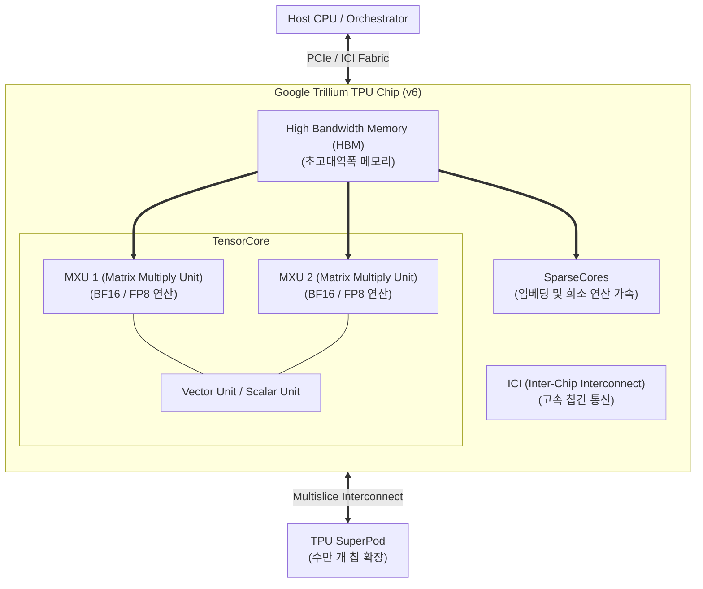

# TPU (Tensor Processing Unit)

---

## I. 대규모 딥러닝 연산 최적화 전용 맞춤형 ASIC 가속기, TPU의 개요

* **정의**: 구글이 인공신경망 연산(특히 행렬 곱셈)의 성능과 전력 효율을 극대화하기 위해 독자적으로 개발한 주문형 반도체(ASIC) 기반 [[인공지능]] 가속 프로세서
* 거대 언어 모델([[초거대 언어 모델|LLM]]) 학습 및 추론 가속, 범용 프로세서([[CPU]]/[[GPU]]) 대비 뛰어난 전력 당 연산 성능(TOPS/W) 제공 목적
* 특징: 행렬 연산 유닛(MXU) 중심 구조, JAX/TensorFlow 최적화, 최신 6세대 트릴륨(Trillium, v6) 기반 대규모 슈퍼포드 확장

---

## II. TPU의 아키텍처 및 핵심 구성요소

### 가. TPU (Trillium v6 기준)의 아키텍처 및 동작 원리

* 호스트 CPU에서 전달된 [[딥러닝]] 연산 요구를 받아, 내부의 대규모 MXU(행렬 연산 유닛)와 SparseCore를 통해 병렬 행렬 곱셈 및 임베딩 처리를 고속 수행하고, 고속 ICI를 통해 대규모 Pod 간 확장하는 구조

### 나. TPU의 핵심 기술 및 구성 요소

| 분류 | 요소기술(키워드) | 세부 설명 |
| --- | --- | --- |
| 핵심 연산 | MXU (Matrix Multiply Unit) | 수만 개의 [[MAC]] 연산기를 집적하여 행렬 곱셈 및 누산(MAC)을 초고속 처리 |
| 희소성 가속 | SparseCores | 대규모 임베딩 레이어의 무작위/비정형 접근 연산을 독립적으로 가속 |
| 메모리 구조 | [[HBM|HBM (High Bandwidth Memory)]] | 고대역폭을 지원하여 대규모 LLM 파라미터 로딩 시 대기 시간 최소화 |
| 통신 인터페이스 | ICI (Inter-Chip Interconnect) | 칩 간 고속 통신을 지원하여 멀티칩 동기화 오버헤드 감소 |
| 확장성 기술 | Multislice / SuperPod | 수만 개의 TPU 칩을 페타비트급 네트워크로 연결하여 거대 모델 분산 학습 지원 |
| 소프트웨어 [[프레임워크]] | JAX / TensorFlow | 구글 생태계에 최적화된 고성능 자동 미분 및 분산 컴파일 지원 |
| 최신 아키텍처 | Trillium (TPU v6e/v6p) | 6세대 아키텍처로 이전 세대 대비 전력 효율 및 연산 성능 대폭 향상 |
| 활용 영역 | Gemini 학습 및 서빙 | 구글 DeepMind의 최신 멀티모달 LLM(Gemini) 학습 및 대규모 추론에 핵심 활용 |

---

## III. TPU vs GPU 비교 및 최신 동향

| 비교 항목 | TPU (Tensor Processing Unit) | GPU (Graphics Processing Unit) |
| --- | --- | --- |
| **설계 철학** | 인공신경망(딥러닝) 연산 전용 주문형 반도체(ASIC) | 그래픽 렌더링 및 범용 병렬 연산 범용 프로세서(GPGPU) |
| **핵심 연산 유닛** | MXU (Matrix Multiply Unit) 중심 시스톨릭 구조 | CUDA Core 및 Tensor Core 병렬 복합 구조 |
| **생태계 및 유연성** | 구글 클라우드(GCP), JAX/TensorFlow 중심으로 최적화 | 범용 라이브러리(CUDA) 지원으로 전 산업 표준 생태계 구축 |
| **전력 및 비용 효율** | 특정 딥러닝 연산에서 탁월한 전력 효율 및 비용 경쟁력 | 뛰어난 범용성과 유연성으로 다양한 AI/HPC 워크로드 소화 |

* 최근 초거대 AI 모델의 급증과 함께, 구글의 6세대 트릴륨(Trillium) TPU 등 전용 ASIC은 고효율 대규모 LLM 학습·추론 영역에서 엔비디아 GPU의 강력한 대안으로 입지를 확고히 하고 있음

---

### 🔗 연관 토픽

- **소속 도메인**: [[00_컴퓨터구조_MOC|💻 컴퓨터구조]]
- **세부 분류**: `1. CPU 프로세서 & 마이크로아키텍처`
- **핵심 연관 토픽**:
  - [[GPU]]
  - [[CPU]]
  - [[시스톨릭 어레이]]
  - [[딥러닝]]
  - [[인공지능]]
