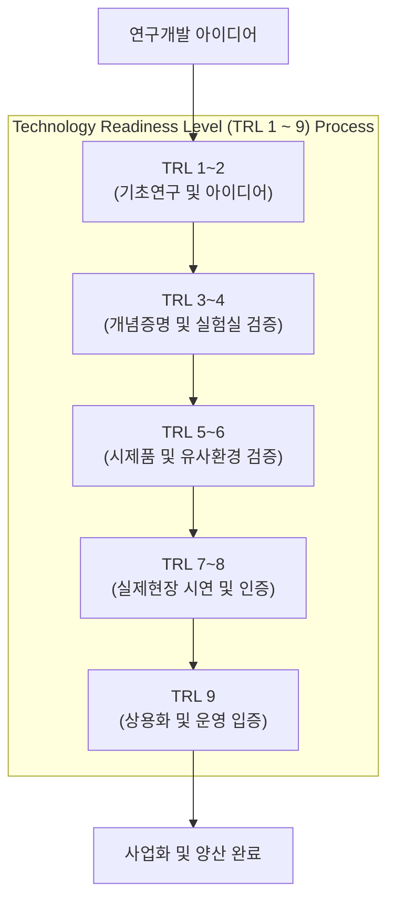

# TRL (Technology Readiness Level, 기술성숙도)

---

## I. 기술의 완성도 측정 및 R&D 효율성 제고를 위한 객관적 평가 지표, TRL의 개요

* **정의**: 신기술이나 아이디어가 기초 연구 단계를 거쳐 상용화에 이르기까지의 발전 과정을 1부터 9까지의 단계로 수치화하여 객관적으로 평가하는 표준화된 성숙도 측정 [[프레임워크]]
* R&D 과제의 단계별 진도 관리, 기술 도입에 따른 리스크 저감 및 국가 연구개발(R&D) 투자의사 결정 지원 목적
* 특징: 미 NASA 기원 표준 지표, 기초연구부터 양산까지의 9단계 세분화, 기술 유형별(소프트웨어, 시스템 등) 맞춤형 평가지표 적용

---

## II. TRL의 아키텍처 및 핵심 기술 요소

### 가. TRL의 9단계 발전 프로세스 및 동작 원리

* 과학적 원리 관찰(TRL 1)에서 출발하여 실험실 단위의 개념 증명(PoC)과 프로토타입 시연을 거쳐, 실제 환경에서의 운용 검증 및 상용화(TRL 9)에 이르는 순차적 성숙도 검증 구조

### 나. TRL의 핵심 구성 요소 및 평가 지표

| 분류 | 요소기술(키워드) | 세부 설명 |
| --- | --- | --- |
| 기초 단계 | TRL 1~2 (기초연구 및 아이디어) | 기본 과학 원리 관찰, 기술 개념 정립 및 응용 아이디어 형성 단계 |
| 검증 단계 | TRL 3~4 (개념증명 및 실험실 검증) | 분석적·실험적 연구를 통한 개념증명(PoC) 및 실험실 환경 부품 검증 |
| 시제품 단계 | TRL 5~6 (시제품 및 유사환경 검증) | 실험실 범위를 넘어선 유사 환경에서의 브레드보드 및 프로토타입 성능 평가 |
| 실전 단계 | TRL 7~8 (실제현장 시연 및 인증) | 제한된 실제 환경 또는 운영 환경 내 시제품 시연 및 [[신뢰성]]·인증 획득 |
| 상용화 단계 | TRL 9 (상용화 및 운영 입증) | 성공적인 실제 현장 운영 입증 및 경쟁적 양산 체계 진입 완료 |
| 평가 유형 | 유형별 맞춤 평가지표 | 시스템, 공법, 재료, 소프트웨어 등 기술 특성에 따른 세부 평가 기준 적용 |
| 거버넌스 | 스테이지-게이트 (Stage-Gate) | 정부 및 기업 R&D 과제의 단계별 진입·탈락 여부를 판정하는 통제 기준 |
| 연계 지표 | MRL / CRL 연계 | 제조성숙도(Manufacturing Readiness Level) 및 상용화준비수준과의 결합 |

---

### III. TRL의 한계점 및 최신 트렌드 (CRL·MRL 연계)

| 비교 항목 | 전통적 TRL (Technology Readiness Level) | 최신 전주기 확장 모델 (TRL + MRL + CRL) |
| --- | --- | --- |
| **평가 초점** | 기술적 완성도 및 기능 구현 여부 중심의 1~9단계 평가 | 기술 완성도(TRL) 외에 제조 안정성(MRL) 및 시장 상용화 가능성(CRL) 동시 평가 |
| **한계점** | 선형적 단계 구분으로 인해 소프트웨어 및 융합 기술의 복잡한 피드백 반영 곤란 | 복잡한 융합 과제에 대해 다차원적 리스크 관리 필요 |
| **최신 동향** | 단순 연구개발 단계 구분을 넘어 사업화 성공률 제고를 위한 **CRL(Commercialization Readiness Level)** 도입 확산 |  |

---

### 🔗 연관 토픽

- **소속 도메인**: [[00_경영전략_MOC|📈 경영전략]]
- **세부 분류**: `2. IT 거버넌스 & 엔터프라이즈 아키텍처 (EA/ISP)`
- **핵심 연관 토픽**:
  - [[데이터 거버넌스|데이터 거버넌스 (Data Governance)]]
  - [[프레임워크]]
  - [[신뢰성]]
  - [[ITSM(Information Technology Service Management)]]
  - [[EAO]]
