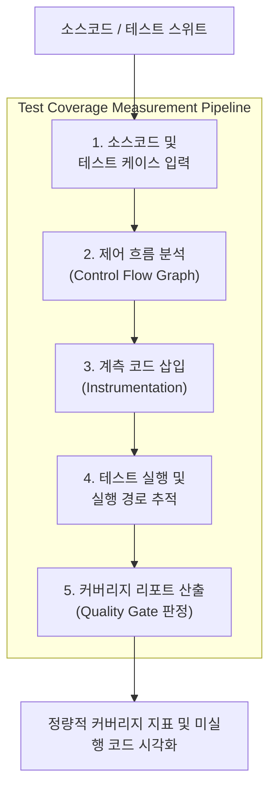

# 테스트 커버리지 (Test Coverage)

---

## I. 소프트웨어 테스트의 정량적 검증과 품질 보증을 위한 핵심 지표, 테스트 커버리지의 개요

* **정의**: 작성된 테스트 케이스가 소프트웨어의 소스코드를 얼마나 철저히 실행했는지를 백분율(%)로 측정하여, 테스트의 충분성과 누락된 영역을 파악하는 구조적 품질 검증 지표
* 잠재적 결함 영역 조기 식별, 코드 [[신뢰성]] 객관적 평가 및 CI/CD 품질 게이트(Quality Gate) 기준 정립 목적
* 특징: 구문·분기·조건 등 다차원적 기준 적용, 정량적 품질 제어, 자동화 도구(SonarQube 등) 연계 필수

---

## II. 테스트 커버리지의 아키텍처 및 핵심 기술 요소

### 가. 테스트 커버리지 측정 프로세스 및 동작 원리

* 소스코드를 분석하여 제어 흐름을 파악하고 계측(Instrumentation) 코드를 삽입한 뒤, 테스트 실행 시 통과된 구문과 분기를 실시간 추적하여 정량적 커버리지 비율을 산출하는 구조

### 나. 테스트 커버리지의 핵심 기술 및 구성 요소

| 분류 | 핵심 기술(키워드) | 세부 설명 |
| --- | --- | --- |
| 기본 측정 | 구문 커버리지 (Statement) | 프로그램 내 모든 실행 가능한 구문이 최소 1회 이상 실행되었는지 측정 |
| 흐름 제어 | 분기 커버리지 (Branch) | 결정(Decision) 포인트의 참(True) / 거짓(False) 결과가 모두 실행되었는지 측정 |
| 논리 연산 | 조건 커버리지 (Condition) | 개별 불리언 조건식이 각각 참과 거짓 결과가 되도록 테스트 수행 |
| 최고 등급 | MC/DC (Modified Condition/Decision) | 개별 조건이 전체 결정에 독립적 영향을 미치는지를 검증 ([[ISO 26262]] 필수) |
| 전체 경로 | 경로 커버리지 (Path) | 프로그램 내 가능한 모든 제어 흐름 경로의 실행 여부 검증 (복잡도 높음) |
| 품질 검증 | 돌연변이 테스트 (Mutation) | 코드에 의도적 결함을 주입하여 테스트 케이스가 이를 탐지하는지 검증 |
| 자동화 확장 | AI 기반 커버리지 최적화 | [[초거대 언어 모델|LLM]]을 활용하여 미실행 브랜치(Uncovered Branch)를 분석하고 테스트 자동 생성 |
| 파이프라인 | 품질 게이트 (Quality Gate) | SonarQube 등과 연계하여 기준치 미달 시 빌드 및 배포 자동 차단 |

---

## III. 전통적 구조적 커버리지 vs 최신 지능형 커버리지 비교 및 동향

| 비교 항목 | 전통적 구조적 커버리지 (Line/Branch) | 최신 지능형 커버리지 (AI & Mutation 기반) |
| --- | --- | --- |
| **측정 방식** | 구문 및 분기 실행 여부 중심의 단순 정량 수치 측정 | 코드의 의미적 완전성 및 돌연변이 생존 여부 기반 심층 검증 |
| **한계점** | 커버리지 수치 100% 달성이 실질적 결함 제로를 보장하지 않음 | 높은 연산 비용 및 복잡한 테스트 스크립트 작성 부담 |
| **최신 트렌드** | 수동적 수치 채우기 방식에서 탈피 | 생성형 AI 기반 미실행 엣지 케이스 자동 탐지 및 커버리지 극대화 |

* 최근 [[클라우드 네이티브]] 및 고도화된 [[DevOps]] 환경에서는 단순 코드 줄 수 채우기식 구조적 커버리지를 넘어, AI 에이전트 기반의 자동 테스트 생성과 뮤테이션 테스트를 결합한 실효성 중심의 고도화된 커버리지 관리 체계가 표준으로 자리 잡고 있음

---

### 🔗 연관 토픽

- **소속 도메인**: [[00_소프트웨어공학_MOC|🏗️ 소프트웨어공학]]
- **세부 분류**: `2. 애자일(Agile) & 지속적 통합/배포(CI/CD)`
- **핵심 연관 토픽**:
  - [[DevOps|데브옵스 (DevOps)]]
  - [[신뢰성]]
  - [[테스트 커버리지|테스트 커버리지 (Test Coverage)]]
  - [[Test Exit Criteria]]
  - [[클라우드 네이티브]]
