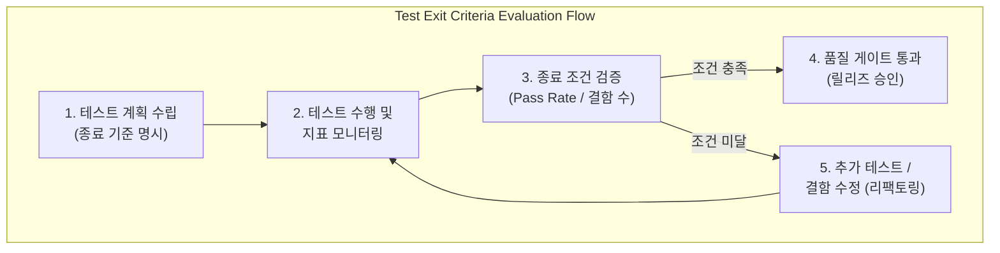

# 테스트 종료 조건 (Test Exit Criteria)

---

## I. 객관적 품질 보증과 릴리즈 의사결정을 위한 완료 기준, 테스트 종료 조건의 개요

* **정의**: [[소프트웨어 테스트]] 단계나 프로젝트 전체에서 테스팅 활동을 성공적으로 완수하고 종료하기 위해 사전에 정의된 정량적·정성적 충족 기준
* 무분별한 테스트 장기화 방지, 객관적 품질 보증 기준 확보 및 프로덕션 배포 리스크 최소화 목적
* 특징: ISTQB 표준 기반 정의, 정량적 메트릭(수행률, 결함 밀도 등) 활용, CI/CD 품질 게이트(Quality Gate) 연계

---

## II. 테스트 종료 조건의 아키텍처 및 핵심 기술 요소

### 가. 테스트 종료 조건 판정 프로세스 및 동작 원리

* 테스트 계획 단계에서 종료 기준을 정의하고, 수행 과정에서 수집된 지표를 바탕으로 종료 조건을 검증하여 품질 게이트 통과 여부를 판정하는 구조

### 나. 테스트 종료 조건의 핵심 구성 요소 및 지표

| 분류 | 요소기술(키워드) | 세부 설명 |
| --- | --- | --- |
| 수행 지표 | 테스트 케이스 수행률 (Execution Rate) | 계획된 전체 테스트 케이스 중 실제로 실행된 케이스의 비율 (목표 100%) |
| 성공 지표 | 테스트 통과율 (Pass Rate) | 실행된 테스트 케이스 중 정상 통과(Pass)한 비율 (핵심 기능 100% 필수) |
| 결함 지표 | 잔존 결함 심각도 (Defect Severity) | Critical, Major 등 치명적 등급의 결함이 모두 해결(Closed)되었는지 여부 |
| 품질 지표 | [[코드 커버리지]] (Code Coverage) | 테스트가 소스코드를 실행한 비율(구문/분기 기준 정해진 기준치 충족) |
| 자동화 검증 | 품질 게이트 (Quality Gate) | SonarQube 등과 연계하여 빌드 및 배포 전 자동 차단 조건 충족 여부 |
| 리스크 평가 | 잔존 리스크 분석 (Residual Risk) | 미해결 마이너 결함이 시스템 운영에 미치는 영향도 평가 |
| 표준 기준 | ISTQB 테스트 완료 기준 | 테스팅 활동이 목표를 달성했음을 증명하기 위해 규정된 국제 표준 가이드 |
| 최신 트렌드 | AI 기반 동적 품질 게이트 | [[초거대 언어 모델|LLM]] 및 실시간 운영 메트릭을 결합한 지능형 종료 조건 판정 |

---

## III. 전통적 수동 종료 기준 vs 최신 지능형(CI/CD) 품질 게이트 비교 및 동향

| 비교 항목 | 전통적 정적 종료 기준 (Static Exit Criteria) | 최신 지능형 품질 게이트 (AI & CI/CD Gate) |
| --- | --- | --- |
| **판정 기준** | 수동으로 집계된 테스트 통과율 및 결함 수 고정 적용 | 파이프라인 실시간 메트릭 및 자동화 테스트 결과 동적 반영 |
| **적용 시점** | 마일스톤 완료 시점 등 비정기적 수동 승인 | 코드 푸시 및 빌드 단계마다 상시 자동 평가 |
| **한계점** | 급변하는 개발 주기에 맞추기 어렵고 주관적 판단 개입 가능 | 높은 자동화 성숙도와 정교한 파이프라인 세팅 필요 |

* 최근 [[클라우드 네이티브]] 및 데브옵스([[DevOps]]) 환경의 확장에 따라, 고정된 문서 기반의 수동 종료 기준에서 벗어나 CI/CD 파이프라인 상에서 실시간 지표와 AI 기반 리스크 분석을 연계한 **지능형 품질 게이트** 체계가 표준으로 자리 잡고 있음

---

### 🔗 연관 토픽

- **소속 도메인**: [[00_소프트웨어공학_MOC|🏗️ 소프트웨어공학]]
- **세부 분류**: `2. 애자일(Agile) & 지속적 통합/배포(CI/CD)`
- **핵심 연관 토픽**:
  - [[소프트웨어 테스트|소프트웨어 테스트 (Software Test)]]
  - [[DevOps|데브옵스 (DevOps)]]
  - [[코드 커버리지|코드 커버리지(Code Coverage)]]
  - [[Test Coverage]]
  - [[클라우드 네이티브]]
