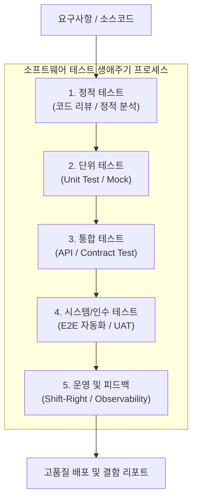

# 소프트웨어 테스트 (Software Testing) 일반

---

## I. 품질 보증 및 결함 조기 예방을 위한 체계적 검증 프로세스, 소프트웨어 테스트의 개요

* **정의**: 소프트웨어가 명시된 요구사항을 만족하는지 확인하고, 잠재된 결함을 체계적으로 발견하기 위해 실행(Dynamic) 및 비실행(Static) 방식을 통해 시스템을 평가하는 공학적 품질 보증 활동
* 요구사항 불일치 및 결함으로 인한 비용 증가 방지, 시스템 [[신뢰성]] 확보 및 운영 안정성 보장 목적
* 특징: 검증(Verification)과 확인(Validation)의 이중 구조, 개발 전 생애주기 연계(Shift-Left / Shift-Right), 자동화 기반 지속적 테스트(Continuous Testing) 체계

---

## II. 소프트웨어 테스트의 아키텍처 및 핵심 기술 요소

### 가. 소프트웨어 테스트의 통합 프로세스 및 동작 원리

* 요구사항 및 소스코드 단계의 정적 분석을 거쳐, 단위·통합·시스템 테스트를 거시적·미시적으로 수행하고, 프로덕션 단계의 모니터링까지 연결하는 구조

### 나. 소프트웨어 테스트의 핵심 기술 및 구성 요소

| 분류 | 요소기술(키워드) | 세부 설명 |
| --- | --- | --- |
| 정적 테스트 | 정적 코드 분석 (Static Analysis) | 코드 실행 없이 문법, 코딩 표준 위반 및 보안 취약점 사전 검증 |
| 동적 테스트 | 단위 및 [[통합 테스트]] (JUnit / PyTest) | 개별 함수 및 모듈 간 상호작용의 정상 동작 여부 검증 |
| 자동화 테스트 | E2E 테스트 자동화 (Playwright) | 사용자 관점의 브라우저 및 UI 상호작용 시나리오 자동 검증 |
| 격리 기법 | 모의 객체 (Mock / Stub) | 외부 의존성(DB, 외부 API 등)을 분리하여 독립적 테스트 환경 구성 |
| 품질 지표 | [[코드 커버리지]] (Code Coverage) | 테스트 코드가 실제 소스코드를 실행하는 비율(Line, Branch) 측정 |
| 검증 패러다임 | Shift-Left 테스팅 | 요구사항 및 설계 단계부터 테스트를 앞당겨 수행하여 비용 절감 |
| 운영 검증 | Shift-Right / 카나리 배포 | 프로덕션 환경에서의 실시간 모니터링 및 트래픽 분산 검증 |
| 최신 트렌드 | AI 기반 테스트 에이전트 | [[초거대 언어 모델|LLM]]을 활용한 테스트 케이스 자동 생성 및 자가 치유(Self-Healing) |

---

## III. 전통적 수동 테스팅 vs AI 기반 지능형 테스팅 비교 및 동향

| 비교 항목 | 전통적 수동 테스팅 (Manual Testing) | AI 기반 지능형 테스팅 (AI-Driven Testing) |
| --- | --- | --- |
| **수행 주체** | QA 엔지니어 및 개발자 중심의 수동 입력·검증 | LLM 및 자율형 AI 에이전트 기반 자동 생성·실행 |
| **실행 주기** | 마일스톤 완료 시점 등 비정기적 일회성 수행 | CI/CD 파이프라인 연계를 통한 상시 지속적 검증 |
| **유지보수성** | UI 변경 시 테스트 스크립트 수정 비용 과다 | UI 변경에 자동 적응하는 자가 치유(Self-Healing) 기능 적용 |

* 최근 [[클라우드 네이티브]] 및 애자일 환경의 확산에 따라, 수동 중심의 사후 테스트에서 벗어나 CI/CD 파이프라인 상의 지속적 테스팅(Continuous Testing)과 생성형 AI 기반의 테스트 케이스 자동 생성 및 [[유지보수]] 자동화 체계가 표준으로 자리 잡고 있음

---

### 🔗 연관 토픽

- **소속 도메인**: [[00_소프트웨어공학_MOC|🏗️ 소프트웨어공학]]
- **세부 분류**: `3. 요구사항 공학 & UML 객체지향 분석/설계`
- **핵심 연관 토픽**:
  - [[신뢰성]]
  - [[유지보수]]
  - [[코드 커버리지|코드 커버리지(Code Coverage)]]
  - [[추상화|추상화 (Abstraction)]]
  - [[시스템 테스트]]
