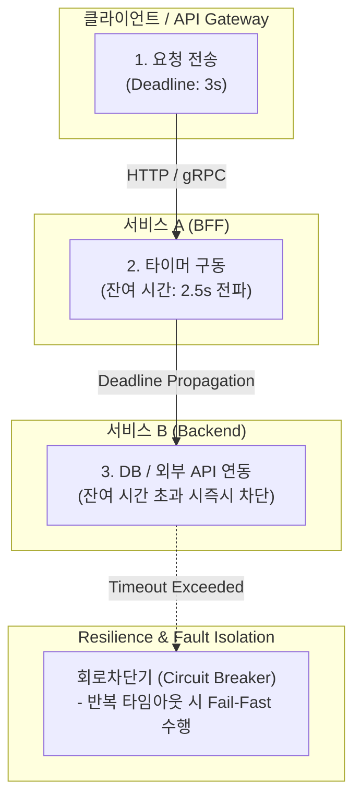

# 타임아웃 (Timeout)

---

## I. 분산 시스템 자원 보호 및 연쇄 장애 방지를 위한 제어 메커니즘, 타임아웃의 개요

* **정의**: 네트워크 통신이나 [[프로세스]] 수행 시 정해진 시간 내에 응답이 오지 않을 경우, 작업을 강제로 중단하고 예외 처리를 수행하여 시스템 자원의 무한 대기를 방지하는 공학적 제어 기법
* 마이크로서비스([[MSA (Micro Service Architecture)|MSA]]) 환경에서 특정 서비스 지연이 전체 시스템의 장애로 전파되는 연쇄 장애(Cascading Failure) 차단 및 스레드 풀 고갈(Thread Pool Exhaustion) 방지 목적
* 특징: Fail-Fast 원칙 기반, 클라이언트/서버 단방향 또는 양방향 적용, 동적 적응형 타임아웃으로 진화

---

## II. 타임아웃의 아키텍처 및 핵심 기술 요소

### 가. 분산 환경에서의 타임아웃 및 데드라인 전파 프로세스

* 클라이언트가 요청 시 설정한 데드라인(Deadline)을 마이크로서비스 간 전파하고, 잔여 시간이 소진되거나 응답 지연 발생 시 즉시 작업을 중단하여 리소스 낭비를 방지하는 구조

### 나. 타임아웃의 핵심 기술 및 구성 요소

| 분류 | 요소기술(키워드) | 세부 설명 |
| --- | --- | --- |
| 연결 설정 | Connection Timeout | 서버와 네트워크 세션을 맺기 위해 대기하는 최대 시간 |
| 데이터 전송 | Read / Write Timeout | [[TCP]] 스트림을 통해 실제 데이터 읽기/쓰기를 대기하는 최대 시간 |
| 분산 전파 | Deadline Propagation | gRPC 등에서 분산 [[트랜잭션]] 전파 시 전체 남은 유효 시간을 하위 서비스로 전달 |
| 장애 격리 | 회로 차단기 (Circuit Breaker) | 타임아웃 반복 발생 시 해당 서비스 호출을 즉시 차단하고 Fallback 수행 |
| 동적 제어 | Adaptive Timeout | 네트워크 RTT 및 부하 상태를 실시간 측정하여 타임아웃 임계값 자동 조절 |
| 아키텍처 | Fail-Fast | 지연 발생 시 자원을 오래 붙잡지 않고 즉시 실패 처리하여 시스템 보호 |
| 관측 가능성 | Distributed Tracing | OpenTelemetry 기반으로 타임아웃 발생 구간 및 병목 지점 추적 |
| 최신 검증 | Chaos Engineering | 의도적인 지연(Latency) 주입을 통해 타임아웃 및 복원력 정책 검증 |

---

## III. 전통적 고정 타임아웃 vs 최신 동적/적응형 타임아웃 비교 및 동향

| 비교 항목 | 전통적 고정 타임아웃 (Static Timeout) | 최신 동적/적응형 타임아웃 (Adaptive Timeout) |
| --- | --- | --- |
| **설정 방식** | 모든 서비스와 구간에 일괄적인 고정 시간(예: 3초) 적용 | 실시간 네트워크 RTT, 시스템 부하 및 p99 지연 기반 동적 산정 |
| **네트워크 [[변동성]]** | 네트워크 지연 변동 시 불필요한 타임아웃 또는 장애 확산 발생 | 환경 변화에 유연하게 대응하여 오탐지 및 장애 전파 최소화 |
| **리소스 효율성** | 획일적 대기로 인해 순간적 부하 분산 처리 능력 저하 | 빠른 Fail-Fast 및 적응형 조절로 시스템 [[처리량]](Throughput) 극대화 |

* 최근 대규모 [[클라우드 네이티브]] 및 MSA 환경의 확장에 따라, 고정된 설정값에 의존하는 방식에서 벗어나 gRPC 기반의 **Deadline Propagation**과 실시간 망 상태를 반영하는 **Adaptive Timeout**, 그리고 **Chaos Engineering**을 결합한 지능형 회복력(Resilience) 설계 체계가 표준으로 자리 잡고 있음

---

### 🔗 연관 토픽

- **소속 도메인**: [[00_소프트웨어공학_MOC|🏗️ 소프트웨어공학]]
- **세부 분류**: `4. 아키텍처 스타일 & 객체지향 설계 원리`
- **핵심 연관 토픽**:
  - [[MSA (Micro Service Architecture)]]
  - [[클라우드 네이티브]]
  - [[신뢰성]]
  - [[처리량]]
  - [[EDA|EDA (Event-Driven Architecture)]]
