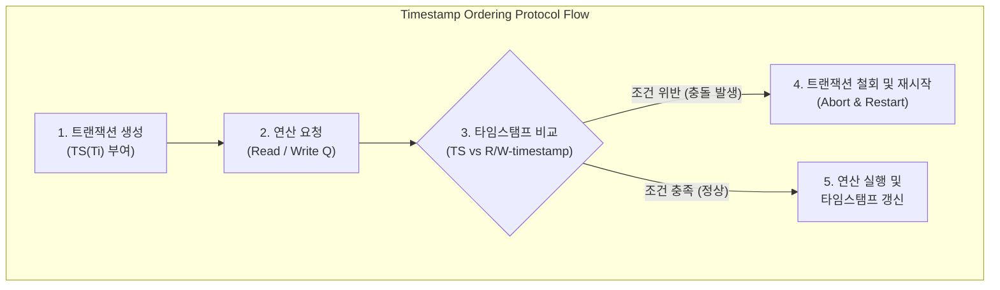

# 타임스탬프 순서 제어 (Timestamp Ordering Protocol)

---

## I. 트랜잭션 고유 시간 기반 충돌 제어 및 직렬가능성 보장 메커니즘, 타임스탬프 순서 제어의 개요

* **정의**: [[DBMS]]에서 트랜잭션별로 고유한 타임스탬프(Timestamp)를 부여하고, 시간 순서에 따라 데이터의 읽기·쓰기 연산을 제어하여 락(Lock) 없이 직렬가능성(Serializability)을 보장하는 동시성 제어 기법
* 락(Lock)으로 인한 교착상태(Deadlock)를 원천 차단하고, 분산 환경에서 [[트랜잭션]] 처리 순서를 명확히 정렬하기 위한 목적
* 특징: 락-프리(Lock-free) 구조, 타임스탬프 대소 비교 기반 검증, 충돌 시 철회(Abort) 및 재시작(Restart) 수행

---

## II. 타임스탬프 순서 제어의 개념도 및 핵심 기술 요소

### 가. 타임스탬프 순서 제어의 동작 프로세스

* 트랜잭션 진입 시 부여된 타임스탬프와 데이터 항목의 읽기/쓰기 타임스탬프를 비교하여, 시간 순서 위반 시 즉시 Abort 처리하고 정상 시 연산 실행 후 타임스탬프를 갱신하는 구조

### 나. 타임스탬프 순서 제어의 핵심 구성 요소

| 분류 | 요소기술(키워드) | 세부 설명 |
| --- | --- | --- |
| 트랜잭션 식별 | 트랜잭션 타임스탬프 ($TS(T_i)$) | 트랜잭션이 시스템에 들어올 때 부여되는 고유의 논리적/물리적 시간 값 |
| 데이터 관리 | 읽기 타임스탬프 ($R-timestamp(Q)$) | 데이터 항목 $Q$를 성공적으로 읽은 트랜잭션들 중 가장 큰 타임스탬프 |
| 데이터 관리 | 쓰기 타임스탬프 ($W-timestamp(Q)$) | 데이터 항목 $Q$를 성공적으로 갱신한 트랜잭션들 중 가장 큰 타임스탬프 |
| 읽기 규칙 | Read Operation 검증 | $TS(T_i) < W-timestamp(Q)$인 경우, 낡은 데이터를 읽으려 하므로 $T_i$ 철회(Abort) |
| 쓰기 규칙 | Write Operation 검증 | $TS(T_i) < R-timestamp(Q)$ 또는 $W-timestamp(Q)$인 경우, 시간 순서 위반으로 철회 |
| 최적화 기법 | 토마스 쓰기 규칙 (Thomas Write Rule) | $TS(T_i) < W-timestamp(Q)$일 때 이미 덮어씌워진 구형 쓰기 연산을 무시하고 생략 허용 |
| 시스템 특성 | 무교착 상태 (Deadlock-Free) | 공유 락이나 배타 락을 사용하지 않으므로 교착상태가 원천적으로 발생하지 않음 |
| 분산 확장 | TrueTime / 분산 타임스탬프 | Google Spanner 등에서 전역 물리 시계 동기화를 통해 분산 환경 트랜잭션 정렬 |

---

## III. 락 기반(2PL) vs 타임스탬프 순서 제어 비교 및 최신 동향

| 비교 항목 | 2단계 락킹 ([[2PL]], Two-Phase [[Locking]]) | 타임스탬프 순서 제어 (Timestamp Ordering) |
| --- | --- | --- |
| **제어 철학** | 락(Lock)을 선점하여 충돌을 사전에 방지하는 비관적 제어 | 타임스탬프 순서 비교를 통해 충돌 발생 시 사후 처리하는 방식 |
| **[[교착상태|교착상태 (Deadlock)]]** | 락 대기 과정에서 교착상태 발생 가능 (타임아웃 또는 탐지 필요) | 락을 사용하지 않으므로 교착상태가 발생하지 않음 (Deadlock-Free) |
| **오버헤드 발생원인** | 락 획득, 해제 및 대기 시간에 따른 지연 발생 | 빈번한 충돌 시 트랜잭션 철회(Abort) 및 재시작(Restart) 비용 발생 |
| **주요 활용 영역** | 전통적인 단일 노드 RDBMS의 표준 동시성 제어 기법 | [[분산 데이터베이스]], 고성능 인메모리 및 낙관적 동시성 제어(OCC) 영역 |

* 최근 [[클라우드 네이티브]] 및 분산 [[데이터베이스]] 환경에서는 단일 노드 락킹의 한계를 극복하기 위해, 물리 시계 동기화(Google Spanner의 TrueTime API)와 타임스탬프 순서 제어를 결합한 **글로벌 전역 동시성 제어(Global Concurrency Control)** 아키텍처로 진화 중

---

### 🔗 연관 토픽

- **소속 도메인**: [[00_데이터베이스_MOC|🗄️ 데이터베이스]]
- **세부 분류**: `2. 트랜잭션 & 동시성 제어 (Concurrency)`
- **핵심 연관 토픽**:
  - [[트랜잭션]]
  - [[Locking]]
  - [[2PL|2PL (Two-Phase Locking Protocol)]]
  - [[타임스탬프 순서 기법|타임스탬프 순서 기법 (Timestamp Ordering)]]
  - [[DB 동시성제어]]
