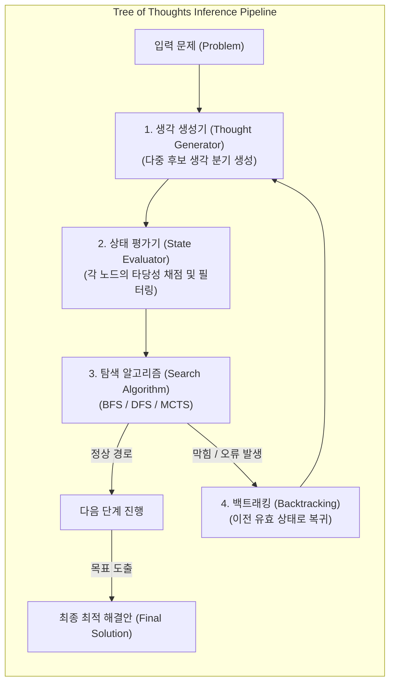

# ToT (Tree of Thoughts)

---

## I. 다단계 추론 확장 및 탐색 기반 LLM 문제 해결 프레임워크, ToT의 개요

* **정의**: 대규모 언어 모델([[초거대 언어 모델|LLM]])이 단일 선형 추론 경로의 한계를 극복하고, 여러 생각(Thought)의 분기(Branching)를 생성한 뒤 평가·탐색(BFS/DFS)과 백트래킹을 거쳐 최적의 문제 해결 경로를 도출하는 고급 프롬프트 및 추론 제어 기법
* 기존 Chain of Thought([[COT|CoT]]) 방식의 초기 오류 누적 및 장기 계획(Planning) 능력 부족 문제를 해결하고 복잡한 탐색·의사결정 문제 해결 목적
* 특징: 생각의 분할 생성, 상태 평가(State Evaluation) 기반 채점, 백트래킹(Backtracking)을 통한 동적 경로 수정

---

## II. ToT의 아키텍처 및 핵심 기술 요소

### 가. ToT의 동작 프로세스 및 아키텍처

* 문제를 여러 생각의 조각으로 분해하여 후보군을 생성하고, 각 상태를 평가하여 유망한 경로를 BFS/DFS로 탐색하되, 실패 시 백트래킹으로 최적의 답을 찾아가는 구조

### 나. ToT의 핵심 기술 및 구성 요소

| 분류 | 요소기술(키워드) | 세부 설명 |
| --- | --- | --- |
| 분해 단계 | 생각 분해 (Thought Decomposition) | 복잡한 문제를 중간 단계의 작은 생각(Thought) 단위로 세분화 |
| 생성 단계 | 생각 생성기 (Thought Generator) | LLM을 활용하여 현재 상태에서 가능한 다음 단계의 후보 생각들을 다중 생성 |
| 평가 단계 | 상태 평가기 (State Evaluator) | 생성된 생각들의 타당성을 채점(Scoring)하거나 분류하여 유망한 경로 선택 |
| 탐색 [[알고리즘]] | 너비/깊이 우선 탐색 (BFS / DFS) | 트리의 노드를 체계적으로 순회하며 해결 가능성을 검증하는 탐색 제어 |
| 제어 기법 | 백트래킹 (Backtracking) | 잘못된 추론이나 막힌 경로 발견 시 이전 상태로 돌아가 다른 경로를 탐색 |
| 확장 기법 | 몬테카를로 트리 탐색 (MCTS) | 시뮬레이션 기반 확률적 트리 탐색을 결합하여 추론 성능 극대화 |
| 진화 모델 | Graph of Thoughts ([[Graph of Thought (GoT)|GoT]]) | 트리를 넘어 생각 간의 순환, 병합 및 분할이 가능한 그래프 구조로 확장 |
| 최신 적용 | 추론 시간 연산 (Inference-time Compute) | 최신 추론 모델(OpenAI o1/o3 등)의 내부 탐색 및 검증 메커니즘으로 활용 |

---

## III. CoT vs ToT 비교 및 최신 동향

| 비교 항목 | Chain of Thought (CoT) | Tree of Thoughts (ToT) |
| --- | --- | --- |
| **추론 구조** | 단일 선형 시퀀스 (Linear Sequence) | 다중 분기 트리 구조 (Tree Structure) |
| **오류 대응** | 중간 단계 오류 발생 시 전체 결과 왜곡 (오류 누적) | 백트래킹 및 상태 평가를 통한 오류 교정 가능 |
| **적용 영역** | 단순 산술, 직관적 질의응답 및 단기 추론 | 복잡한 퍼즐, 장기 계획, 수학적 증명 및 전략 게임 |

* 최근 생성형 AI 패러다임은 단순 프롬프팅을 넘어 대규모 추론 시간 연산(Inference-time Compute)과 MCTS 기반의 **탐색(Search) 중심 자율 에이전트 아키텍처**로 진화 중임

---

### 🔗 연관 토픽

- **소속 도메인**: [[00_인공지능_MOC|🤖 인공지능]]
- **세부 분류**: `4. 거대언어모델 (LLM) & 생성형 AI`
- **핵심 연관 토픽**:
  - [[COT|COT(Chain of Thought)]]
  - [[Graph of Thought (GoT)|got Graph of thought]]
  - [[대규모 언어 모델 성능 향상 기술|대규모 언어 모델(LLM) 성능 향상 기술]]
  - [[프롬프트 엔지니어링|프롬프트 엔지니어링(Prompt Engineering)]]
  - [[테스트 타임 스케일링|테스트 타임 스케일링(Test-Time Scaling, TTS)]]
