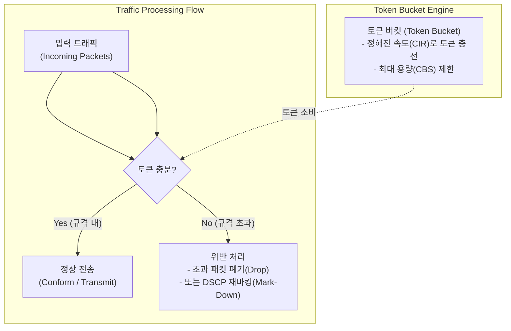

# 트래픽 폴리싱 (Traffic Policing)

---

## I. 네트워크 대역폭 제어 및 규격 준수를 위한 트래픽 관리 기법, 트래픽 폴리싱의 개요

* **정의**: 트래픽이 사전에 정의된 대역폭(CIR, Committed Information Rate)을 초과하는지 모니터링하고, 규격을 위반한 패킷을 즉시 폐기(Drop)하거나 마킹(Marking)하여 네트워크 과부하를 방지하는 실시간 제어 메커니즘
* [[SLA]](Service Level Agreement) 준수, 네트워크 [[백본망]] 보호 및 비정상적 버스트 트래픽 제어 목적
* 특징: 토큰 버킷(Token Bucket) [[알고리즘]] 기반, 초과 패킷 즉시 폐기(Drop) 또는 DSCP 재마킹, 지연(Delay) 발생 없이 즉각 처리

---

## II. 트래픽 폴리싱의 아키텍처 및 핵심 기술 요소

### 가. 트래픽 폴리싱(Token Bucket 기반)의 동작 원리

* 일정 비율로 충전되는 토큰 버킷을 활용하여, 입력되는 패킷의 크기만큼 토큰을 소모하며, 토큰이 부족할 경우 규격 위반(Exceed)으로 간주하여 즉시 폐기하거나 마킹 처리하는 구조

### 나. 트래픽 폴리싱의 핵심 기술 및 구성 요소

| 분류 | 요소기술(키워드) | 세부 설명 |
| --- | --- | --- |
| 제어 알고리즘 | 토큰 버킷 (Token Bucket) | 정해진 대역폭에 따라 토큰을 누적하고 패킷 크기만큼 차감하여 제어 |
| 기본 대역폭 | CIR (Committed Information Rate) | 보장되는 약정 전송 속도로, 토큰이 충전되는 기준 속도 |
| 버스트 허용 | CBS (Committed Burst Size) | 토큰 버킷의 최대 용량으로, 단기적인 대용량 버스트 트래픽 수용 크기 |
| 위반 처리 | 드롭 (Drop) / 마킹 (Mark-Down) | 규격을 초과한 패킷을 즉시 버리거나 우선순위(DSCP)를 낮춰 처리 |
| 2/3색 마커 | srTCM / trTCM | 단일/이중 래트 토큰 버킷을 이용한 Green/Yellow/Red 다단계 트래픽 분류 |
| 비교 대상 | 트래픽 셰이핑 ([[Traffic Shaping (트래픽 쉐이핑)|Traffic Shaping]]) | 트래픽을 버퍼에 대기(Queueing)시켰다가 일정하게 내보내는 지연 제어 방식 |
| 표준 기술 | [[DiffServ (Differentiated Services)|DiffServ]] / [[QoS]] | 서비스 품질(QoS) 아키텍처 내에서 패킷 분류 및 대역폭 제어의 핵심 요소 |
| 최신 트렌드 | AI 기반 지능형 대역폭 제어 | 실시간 트래픽 패턴 변화에 맞춰 폴리싱 파라미터(CIR/CBS)를 동적 최적화 |

---

## III. 트래픽 폴리싱 vs 트래픽 셰이핑 비교 및 최신 동향

| 비교 항목 | 트래픽 폴리싱 (Traffic Policing) | 트래픽 셰이핑 (Traffic Shaping) |
| --- | --- | --- |
| **초과 처리 방식** | 규격 초과 패킷을 **즉시 폐기(Drop)** 또는 마킹 | 초과 패킷을 **버퍼([[Queue]])에 대기**시켰다가 순차 전송 |
| **지연 (Latency)** | 지연 시간이 발생하지 않음 (Low Latency) | 버퍼링으로 인해 지연 시간(Delay)이 발생할 수 있음 |
| **주요 활용 위치** | [[ISP (Information Strategy Plan)|ISP]] 경계 [[라우터]] 및 수신 측(Ingress) 대역폭 통제 | 송신 측(Egress) 인터페이스 및 부드러운 전송률 유지 |
| **패킷 손실률** | 대역폭 초과 시 패킷 손실률이 상대적으로 높음 | 버퍼 크기 내에서 패킷 손실을 최소화하고 평탄화 |

* 최근 5G, [[Wi-Fi 7]] 및 [[클라우드 네이티브]] 네트워크 환경의 고도화에 따라, 단순 정적 폴리싱을 넘어 애플리케이션의 실시간 특성에 맞춰 동적으로 정책을 변경하는 지능형 QoS 관리 체계로 진화 중

---

### 🔗 연관 토픽

- **소속 도메인**: [[00_네트워크_MOC|🌐 네트워크]]
- **세부 분류**: `3. 전송 계층 & 트래픽 / 혼잡 제어 (L4)`
- **핵심 연관 토픽**:
  - [[Traffic Shaping (트래픽 쉐이핑)]]
  - [[QoS|QoS (Quality of Service)]]
  - [[DiffServ (Differentiated Services)]]
  - [[Wi-Fi 7|WI-FI 7 (IEEE 802.11be)]]
  - [[라우터]]
