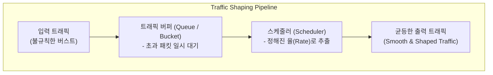

# 트래픽 쉐이핑 (Traffic Shaping)

---

## I. 트래픽 흐름 평탄화 및 패킷 손실 최소화를 위한 대역폭 제어 기술, 트래픽 쉐이핑의 개요

* **정의**: 네트워크 대역폭 한계를 초과하는 트래픽을 버퍼([[Queue]])에 임시 보관(Buffering)한 후, 일정한 속도나 규격화된 패턴으로 지연시켜 전송함으로써 네트워크 폭주를 방지하는 제어 메커니즘
* 급격한 버스트(Burst) 트래픽으로 인한 패킷 손실(Drop)을 방지하고, 네트워크 자원의 안정적 분배 및 서비스 품질([[QoS]]) 보장 목적
* 특징: 리키 버킷/토큰 버킷 [[알고리즘]] 기반, 패킷 지연(Delay)을 통한 평탄화(Smoothing), 송신 측(Egress) 중심 적용

---

## II. 트래픽 쉐이핑의 아키텍처 및 핵심 기술 요소

### 가. 트래픽 쉐이핑(Leaky/Token Bucket 기반)의 동작 원리

* 불규칙하게 유입되는 트래픽을 버퍼에 임시 저장하고, 스케줄러가 일정한 속도(Rate)로 패킷을 꺼내어 전송함으로써 출력 트래픽의 파형을 평탄하게 만드는 구조

### 나. 트래픽 쉐이핑의 핵심 기술 및 구성 요소

| 분류 | 요소기술(키워드) | 세부 설명 |
| --- | --- | --- |
| 제어 알고리즘 | 리키 버킷 (Leaky Bucket) | 물이 일정한 속도로 떨어지듯 트래픽을 일정한 속도로 균등하게 출력 |
| 제어 알고리즘 | 토큰 버킷 (Token Bucket) | 일정 수준의 버스트 트래픽을 허용하면서 평균 전송률을 규제 |
| 큐잉 방식 | CBQ (Class-Based Queuing) | 트래픽을 클래스별로 분류하고 등급에 따라 대역폭 차등 할당 |
| 큐잉 방식 | [[WFQ|WFQ (Weighted Fair Queuing)]] | 세션별 가중치를 부여하여 공정하게 대역폭을 분배하고 지연 제어 |
| 제어 특성 | 버퍼링 및 지연 (Delay) | 초과 패킷을 버리지 않고 대기시키므로 지연 시간은 증가하나 손실 방지 |
| 적용 위치 | 송신 측 (Egress Interface) | 외부 네트워크로 트래픽을 내보내기 전 송신율을 제어하는 위치 |
| 표준 기술 | QoS / [[DiffServ (Differentiated Services)|DiffServ]] | 서비스 품질 아키텍처 내에서 트래픽 성형 및 우선순위 제어 연계 |
| 최신 트렌드 | AI 기반 동적 쉐이핑 | 실시간 네트워크 대역폭(RTT) 변동에 맞춰 쉐이핑 파라미터 자동 조절 |

---

## III. 트래픽 쉐이핑 vs 트래픽 폴리싱 비교 및 최신 동향

| 비교 항목 | 트래픽 쉐이핑 (Traffic Shaping) | 트래픽 폴리싱 ([[Traffic Policing (트래픽 정책처리)|Traffic Policing]]) |
| --- | --- | --- |
| **초과 패킷 처리** | 버퍼에 **대기(Buffering)** 시켰다가 순차 전송 | 규격 초과 패킷을 **즉시 폐기(Drop)** 또는 마킹 |
| **패킷 손실률** | 버퍼 크기 내에서 패킷 손실 최소화 (Low Loss) | 대역폭 초과 시 패킷 손실 발생 가능성 높음 |
| **지연 시간 (Latency)** | 버퍼링으로 인한 전송 지연 발생 | 지연 시간 발생 없음 (즉각 처리) |
| **주요 적용 위치** | 송신 측 (Egress) 인터페이스 | 수신 측 및 [[ISP (Information Strategy Plan)|ISP]] 경계 [[라우터]] (Ingress) |

* 최근 5G, [[Wi-Fi 7]] 및 [[클라우드 네이티브]] 분산 환경의 고도화에 따라, 단순 정적 버퍼 기반 쉐이핑을 넘어 실시간 애플리케이션의 트래픽 특성(지연 민감도 등)을 반영하는 **AI 기반 적응형 쉐이핑(Adaptive Shaping)** 체계로 고도화되는 중

---

### 🔗 연관 토픽

- **소속 도메인**: [[00_네트워크_MOC|🌐 네트워크]]
- **세부 분류**: `3. 전송 계층 & 트래픽 / 혼잡 제어 (L4)`
- **핵심 연관 토픽**:
  - [[QoS|QoS (Quality of Service)]]
  - [[Traffic Policing (트래픽 정책처리)]]
  - [[Network Neutrality]]
  - [[Wi-Fi 7|WI-FI 7 (IEEE 802.11be)]]
  - [[WFQ|WFQ (Weighted Fair Queuing)]]
