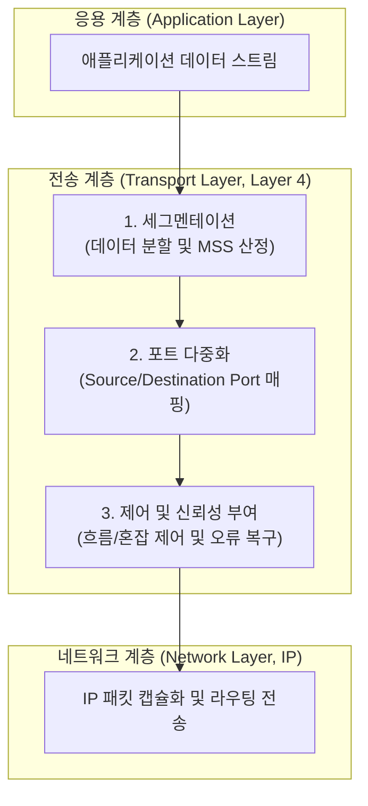

# 전송 계층 (Transport Layer, Layer 4)

---

## I. 양 끝단 간 신뢰성 있는 데이터 전송을 보장하는 L4 네트워크 핵심, 전송 계층의 개요

* **정의**: OSI 7계층 중 제4계층에 위치하며, 송신 측과 수신 측([[End-to-End]]) 간에 투명하고 [[신뢰성]] 있는(또는 고속의) 데이터 전송을 보장하고 흐름·혼잡 제어를 담당하는 핵심 계층
* 상위 응용 계층과 하위 [[네트워크 계층]] 간의 가교 역할, 데이터 분할 및 재조립(Segmentation), 종단 간 서비스 품질([[QoS]]) 보장 목적
* 특징: 포트 번호(Port Number) 기반 [[다중화|다중화(Multiplexing)]], 연결 지향([[TCP]]) 및 비연결 지향(UDP) [[프로토콜]] 지원, 차세대 QUIC 통합 전송 체계로 진화

---

## II. 전송 계층의 아키텍처 및 핵심 기술 요소

### 가. 전송 계층의 데이터 처리 프로세스 및 동작 원리

* 응용 계층의 데이터를 적절한 크기로 분할(Segmentation)하고 포트 번호를 부여하여 다중화한 뒤, 흐름 및 혼잡 제어를 거쳐 하위 네트워크 계층으로 전달하는 구조

### 나. 전송 계층의 핵심 기술 및 구성 요소

| 분류 | 요소기술(키워드) | 세부 설명 |
| --- | --- | --- |
| 식별 제어 | 포트 번호 (Port Number) | 16비트 주소 체계를 활용하여 동일 장내 다수 프로세스를 식별 (Well-known 등) |
| 데이터 단위 | 세그먼트 / 데이타그램 | TCP의 세그먼트(Segment)와 UDP의 데이타그램(Datagram) 단위 데이터 처리 |
| 신뢰성 보장 | 오류 제어 (ARQ / Checksum) | 패킷 손실 시 재전송(Retransmission) 및 데이터 [[무결성]] 검증 수행 |
| 흐름 제어 | 슬라이딩 윈도우 (Sliding Window) | 수신측 버퍼 오버플로우 방지를 위한 동적 송신량 조절 메커니즘 |
| [[혼잡 제어]] | 느린 시작 / BBRv3 | 네트워크 대역폭 포화 방지를 위한 윈도우 크기(CWND) 조절 제어 |
| 표준 프로토콜 | TCP / UDP | 신뢰성 중심의 연결형 프로토콜(TCP)과 실시간 속도 중심 비연결형(UDP) |
| 차세대 표준 | QUIC (RFC 9000) | UDP 기반 위에서 전송 신뢰성, TLS [[암호화]] 및 0-RTT 핸드셰이크 통합 규격 |
| 최신 트렌드 | MPTCP (Multipath TCP) | 다중 네트워크 경로를 동시에 활용하여 대역폭 확장 및 무중단 핸드오버 지원 |

---

## III. 전통적 전송 계층(TCP/UDP) vs 차세대 전송 계층(QUIC/MPTCP) 비교 및 동향

| 비교 항목 | 전통적 [[전송 계층]] (TCP / UDP) | 차세대 전송 계층 (QUIC / MPTCP) |
| --- | --- | --- |
| **연결 설정** | TCP 3-Way Handshake + 별도 TLS 설정 (다중 왕복 지연) | 전송 계층과 보안을 통합하여 0-RTT 또는 1-RTT 연결 설정 |
| **네트워크 이동성** | IP/포트 변경 시 [[세션]] 단절 (재연결 필요) | 커넥션 ID 및 멀티패스 기반으로 네트워크 변경 시 무중단 유지 |
| **헤드 오브 라인** | TCP 패킷 유실 시 후속 스트림 전체 대기 (HOL Blocking) | 독립적 스트림 처리로 단일 유실의 영향 최소화 |

* 최근 고성능 클라우드 및 5G/6G 환경의 확장에 따라, 전통적인 TCP/UDP 이분법에서 벗어나 UDP 기반 위에서 신뢰성과 보안을 내재화한 **QUIC** 프로토콜과 다중 경로 전송을 지원하는 **MPTCP** 중심의 지능형 전송 계층 아키텍처로 빠르게 전환되는 중

---

### 🔗 연관 토픽

- **소속 도메인**: [[00_네트워크_MOC|🌐 네트워크]]
- **세부 분류**: `1. OSI 7계층 & 데이터링크 계층 (L1/L2)`
- **핵심 연관 토픽**:
  - [[프로토콜]]
  - [[TCP]]
  - [[네트워크 계층|네트워크 계층 (Network Layer)]]
  - [[전송 계층|전송 계층 (Transport Layer)]]
  - [[세션]]
