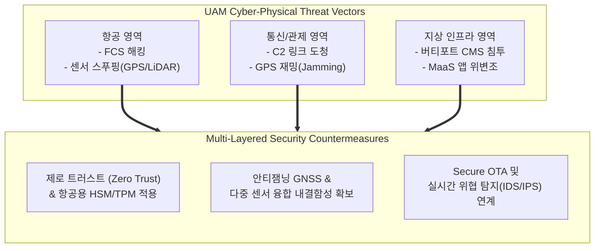

# UAM 취약점 및 대응방안 (Vulnerabilities and Countermeasures of Urban Air Mobility)

---

## I. 도심항공교통 안전 확보를 위한 사이버-물리 보안 체계, UAM 취약점 및 대응방안의 개요

* **정의**: [[UAM|UAM(Urban Air Mobility)]] 시스템을 구성하는 eVTOL(전동 수직이착륙기), 저고도 교통관리체계(UTM), 지상 버티포트(Vertiport) 및 통신망 전반에 내재된 사이버-물리적 보안 취약점과 이에 대응하기 위한 종합적 보호 기술 및 관리 체계
* 도심 저고도 자율비행 환경에서 발생할 수 있는 해킹, 통신 교란 및 물리적 테러 위협을 차단하고 인명 안전(Safety)과 보안(Security)을 동시에 보장하기 위한 목적
* 특징: 사이버-물리 시스템([[CPS]]) 특성 반영, 실시간 무선 통신(C2 링크) 보호 필수, 국제 항공 감항 당국(FAA, EASA 등)의 엄격한 보안 규격 준수

---

## II. UAM 취약점 아키텍처 및 핵심 대응 요소

### 가. UAM 영역별 위협 벡터 및 보안 아키텍처

* UAM의 항공, 통신, 지상 영역에서 발생하는 GPS 스푸핑, C2 링크 탈취, 인프라 침투 등의 위협에 대해 제로 트러스트 아키텍처와 하드웨어 보안모듈을 결합하여 다중 방어하는 구조

### 나. UAM 영역별 주요 취약점 및 대응 방안 (핵심 기술 요소)

| 분류 | 취약점 유형 (위협 벡터) | 대응 방안 (보안 기술 및 키워드) |
| --- | --- | --- |
| **항공기(eVTOL) 영역** | 비행제어컴퓨터(FCS) 펌웨어 취약점 및 악성코드 주입 | 하드웨어 보안 모듈(HSM) 탑재 및 Secure Boot 적용 |
| **센서 영역** | GPS 스푸핑 및 LiDAR/IMU 센서 위·변조 공격 | 항법 센서 [[다중화]](Sensor Fusion) 및 안티스푸핑 GNSS |
| **통신/관제 영역** | 제어(C2) 링크 도청, 스니핑 및 메시지 위변조 | 대칭/비대칭 [[암호화]] 기반 양방향 인증 및 [[무결성]] 검증 |
| **교통관리(UTM) 영역** | 저고도 비행계획 데이터 유출 및 서비스 거부([[DoS (Denial of Service)|DoS]]) 공격 | 클라우드 인프라 [[방화벽]], API [[게이트웨이]] 보안 및 [[DDOS|DDoS]] 대응 |
| **지상 인프라 영역** | 버티포트 충전관리시스템(CMS) 및 관제 서버 해킹 | 제로 트러스트([[제로 트러스트 보안모델|Zero Trust]]) 기반 내부망 마이크로 [[세그멘테이션]] |
| **사용자 영역** | 통합 MaaS 예약 플랫폼 탈취 및 계정 도용 | 다중 인증(MFA) 및 단말 무결성 검증 솔루션 연동 |
| **공급망(Supply Chain)** | 서드파티 항공 부품 및 오픈소스 라이브러리 취약점 | 소프트웨어 자재 명세서([[SBOM]]) 도입 및 Secure OTA 검증 |
| **국제 표준 규격** | EASA SC-EASA / FAA 감항 인증 기준 미달 | 항공용 사이버보안 인증 가이드라인 및 모의 해킹(Pentest) 검증 |

---

## III. 전통적 항공 보안 vs 최신 UAM 사이버-물리 보안 비교 및 동향

| 비교 항목 | 전통적 항공 보안 (Traditional Aviation) | 최신 UAM 사이버-물리 보안 (UAM Security) |
| --- | --- | --- |
| **보안 초점** | 물리적 출입 통제 및 폐쇄형 항법 시스템 보호 | 개방형 5G/6G 통신망 연계 및 자율비행 CPS 보호 |
| **위협 대상** | 물리적 테러, 내부자 위협 및 수동 조작 방해 | 원격 사이버 공격, GPS 재밍·스푸핑, AI 모델 오염 |
| **대응 체계** | 사후 규제 중심의 폐쇄적 점검 체계 | 실시간 위협 탐지(IDS), 제어권 이중화 및 Secure OTA |

* 최근 UAM 상용화가 가속화됨에 따라 단순 물리적 안전(Safety)을 넘어 무선 통신과 자율비행 제어 시스템을 겨냥한 사이버 위협이 급증하고 있으며, 이에 대응하기 위해 **EASA/FAA 기반의 항공용 제로 트러스트 보안 아키텍처**와 **AI 기반 실시간 이상 탐지 시스템(IDS)** 도입이 필수적인 표준으로 자리 잡고 있음

---

### 🔗 연관 토픽

- **소속 도메인**: [[00_보안_MOC|🛡️ 보안]]
- **세부 분류**: `1. 정보보안 원칙 & 거버넌스 · 인증`
- **핵심 연관 토픽**:
  - [[제로 트러스트 보안모델|제로 트러스트 (Zero Trust) 보안모델]]
  - [[DoS (Denial of Service)]]
  - [[DDOS]]
  - [[암호화|암호화 (Encryption)]]
  - [[방화벽]]
