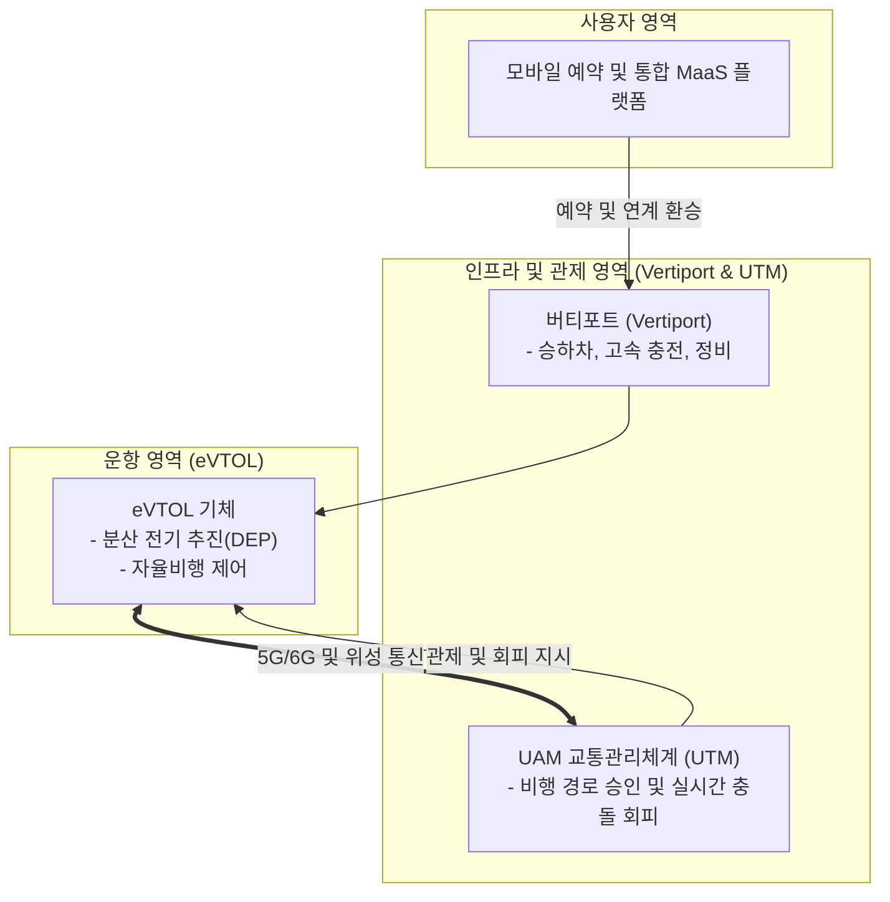

# UAM (Urban Air Mobility, 도심항공교통)

---

## I. 도심 교통 혼잡 해소를 위한 3차원 차세대 항공 교통 체계, UAM의 개요

* **정의**: 전동 수직이착륙기(eVTOL)를 활용하여 대도시권 내에서 승객과 화물을 안전하고 신속하게 수송하는 지능형 차세대 입체 교통 서비스 및 인프라 시스템
* 도로 교통 혼잡 한계 극복, 탄소중립형 친환경 이동 수단 확보 및 미래 모빌리티 생태계 선점 목적
* 특징: 전기 분산 추진(DEP) 기반 저소음·친환경 비행, 버티포트(Vertiport) 중심 인프라 연계, AI 기반 무인 교통관리체계(UTM) 적용

---

## II. UAM의 아키텍처 및 핵심 기술 요소

### 가. UAM의 서비스 아키텍처 및 동작 원리

* 사용자가 MaaS 플랫폼을 통해 UAM을 예약하고 버티포트에 탑승하면, eVTOL 기체가 전동 수직이착륙 후 5G/6G 및 UTM(교통관제) 연계를 통해 안전한 저고도 항로로 목적지까지 이동하는 구조

### 나. UAM의 핵심 기술 및 구성 요소

| 분류 | 요소기술(키워드) | 세부 설명 |
| --- | --- | --- |
| 기체 기술 | eVTOL (전동 수직이착륙기) | 수직 이착륙과 고효율 수평 비행이 가능한 다중 로터 항공기 시스템 |
| 동력 제어 | 분산 전기 추진 (DEP) | 다수의 소형 전기 모터를 분산 배치하여 안전성 확보 및 소음 최소화 |
| 에너지원 | 고출력 리튬메탈 / 전고체 배터리 | 높은 에너지 밀도와 고속 충전을 지원하는 친환경 항공용 배터리 |
| 교통 관리 | UAM 교통관리체계 (UTM) | 저고도 무인 항공기 전용 항로 설정, 비행 계획 승인 및 실시간 충돌 회피 |
| 지상 인프라 | 버티포트 (Vertiport) | 도심 내 옥상 등에 구축되는 UAM 전용 이착륙, 충전, 정비 통합 터미널 |
| 자율 비행 | 충돌 방지 (DAA, Detect and Avoid) | 센서와 AI 알고리즘을 통한 주변 장애물 및 타 항공기 실시간 회피 기술 |
| 안전 인증 | 형식증명 (Type Certification) | 감항 당국(FAA, EASA, 국토부 등)의 상용화 전 엄격한 안전성 검증 규격 |
| 최신 트렌드 | AI 기반 버티포트 운영 최적화 | 실시간 기상 및 승객 흐름을 반영한 자율 운항 [[스케줄링]] 및 지능형 관제 |

---

## III. 전통적 헬리콥터 vs 차세대 UAM(eVTOL) 비교 및 동향

| 비교 항목 | 전통적 헬리콥터 (Helicopter) | 차세대 UAM (eVTOL) |
| --- | --- | --- |
| **추진 방식** | 가소성 엔진 및 단일 메인 로터 (내연기관) | 전기 분산 추진 (DEP, 다중 전동 모터) |
| **소음 및 환경** | 고소음 및 대량의 탄소 배출 (도심 운행 제한) | 저소음(도심 수용 가능) 및 100% 전기 친환경 추진 |
| **안전성 및 구조** | 단일 회전익 고장 시 치명적 위험 (단일 장애점) | 다중 로터 분산 구조로 비상 착륙 안정성 확보 |
| **운영 경제성** | 높은 연료비 및 [[유지보수]] 비용 소요 | 자율비행 및 전력 기반으로 대중화 가능한 경제성 확보 |

* 최근 전 세계적으로 감항 당국의 형식증명(TC) 검증이 가속화되고 있으며, 도심 교통 혼잡 해결과 모빌리티 혁신을 위해 AI 기반 자율비행 및 버티포트 인프라가 통합된 실증 사업(K-UAM 등) 중심의 상용화 단계로 진화 중임

---

### 🔗 연관 토픽

- **소속 도메인**: [[00_디지털서비스_MOC|🚀 디지털서비스]]
- **세부 분류**: `3. 사물인터넷 (IoT) & 스마트 플랫폼 · 메타버스`
- **핵심 연관 토픽**:
  - [[드론|드론 (Drone; 무인기)]]
  - [[C-ITS|C-ITS (Cooperative-Intelligent Transport Systems)]]
  - [[유지보수]]
  - [[스케줄링]]
  - [[디지털 트윈|디지털 트윈 (Digital Twin)]]
