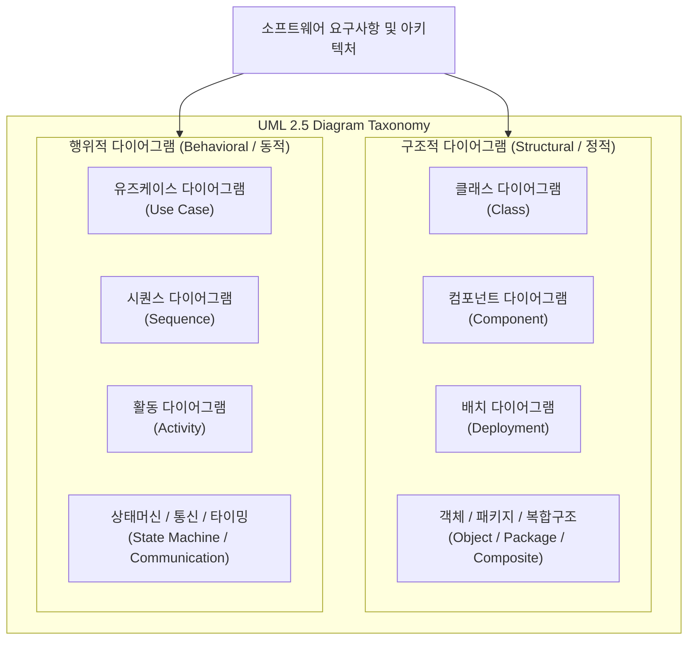

# UML 다이어그램 전체 (Comprehensive UML Diagrams)

---

## I. 객체지향 시스템의 구조와 행위 표준화를 위한 통합 모델링 체계, UML 다이어그램 전체의 개요

* **정의**: [[객체지향]] 소프트웨어 시스템의 분석·설계 단계에서 시스템의 아키텍처와 기능을 시각화, 명세화, 문서화하기 위해 OMG에서 제정한 표준 통합 모델링 언어([[UML]] 2.5)의 전체 다이어그램 분류 체계
* 시스템의 복잡성 제어, 이해관계자 간의 원활한 의사소통 및 객체지향 설계의 재사용성 확보 목적
* 특징: 시스템의 불변적 구조를 다루는 **구조적(정적) 다이어그램**과 시간 흐름 및 변화를 다루는 **행위적(동적) 다이어그램**의 이중 분류 체계

---

## II. UML 다이어그램의 아키텍처 및 핵심 구성 요소

### 가. UML 2.5 다이어그램 분류 아키텍처

* 시스템의 물리적·논리적 정적 요소를 정의하는 구조적 다이어그램과, 이벤트와 시간에 따른 객체 간 상호작용 및 상태 변화를 추적하는 행위적 다이어그램이 상호 보완적으로 유기적 모델링을 수행하는 구조

### 나. UML 핵심 다이어그램 및 구성 요소

| 분류 | 요소기술(키워드) | 세부 설명 |
| --- | --- | --- |
| 구조적 (정적) | [[클래스 다이어그램]] (Class) | 시스템 내 [[클래스]], 속성, 메서드 및 객체 간 관계(연관, 상속 등)를 정의하는 핵심 구조도 |
| 구조적 (정적) | 컴포넌트 다이어그램 (Component) | 소프트웨어 모듈, 컴포넌트 간의 물리적 의존성과 인터페이스 연결 관계 표현 |
| 구조적 (정적) | 배치 다이어그램 (Deployment) | 물리적 하드웨어 노드와 소프트웨어 컴포넌트 간의 네트워크 토폴로지 매핑 |
| 행위적 (동적) | [[유즈케이스 다이어그램]] (Use Case) | 사용자(Actor) 관점에서 시스템의 기능 요구사항 및 외부 상호작용 범위 정의 |
| 행위적 (동적) | 시퀀스 다이어그램 (Sequence) | 객체 간 메시지 교환 및 시간 순서에 따른 상호작용의 동적 흐름을 시각화 |
| 행위적 (동적) | 활동 다이어그램 (Activity) | 비즈니스 프로세스나 제어 흐름의 분기, 병렬 처리 및 작업 단계를 절차적으로 표현 |
| 행위적 (동적) | 상태머신 다이어그램 (State) | 이벤트 발생에 따른 단일 객체의 생명주기 및 상태 전이 과정을 모델링 |
| 최신 트렌드 | 코드-퍼스트 모델링 (Mermaid) | 마크다운 코드로 다이어그램을 실시간 렌더링하고 형상 관리와 직접 연계 |

---

## III. 전통적 그래픽 UML 도구 vs 최신 코드-퍼스트 및 AI 기반 UML 비교 및 동향

| 비교 항목 | 전통적 그래픽 UML 도구 (Manual Draw) | 최신 코드-퍼스트 및 AI 기반 UML |
| --- | --- | --- |
| **작성 방식** | 드래그 앤 드롭 형태의 수동 GUI 드로잉 도구 | 텍스트 코드 기반 작성 (Mermaid, PlantUML) |
| **[[형상 관리]]** | 바이너리 파일 관리로 Git 충돌 및 이력 추적 곤란 | 텍스트 기반으로 Git을 통한 완벽한 버전 관리 및 Diff 지원 |
| **최신 트렌드** | 문서화 부서 중심의 사후 정적 작성 방식 | CI/CD 파이프라인 연계 및 생성형 AI 기반 자동 생성 |

* 최근 애자일 개발 환경과 챗GPT/[[초거대 언어 모델|LLM]] 등 생성형 AI의 확산에 따라, 수동 드로잉 중심의 사후 문서화에서 벗어나 코드로 작성하고 AI로 즉시 시각화하는 **Text-to-Diagram 및 Code-First 모델링 체계**로 패러다임이 빠르게 전환됨

---

### 🔗 연관 토픽

- **소속 도메인**: [[00_소프트웨어공학_MOC|🏗️ 소프트웨어공학]]
- **세부 분류**: `3. 요구사항 공학 & UML 객체지향 분석/설계`
- **핵심 연관 토픽**:
  - [[UML|UML (정적, 동적 다이어그램)]]
  - [[유즈케이스 다이어그램]]
  - [[클래스 다이어그램|클래스 다이어그램 (Class Diagram)]]
  - [[클래스]]
  - [[객체지향]]
