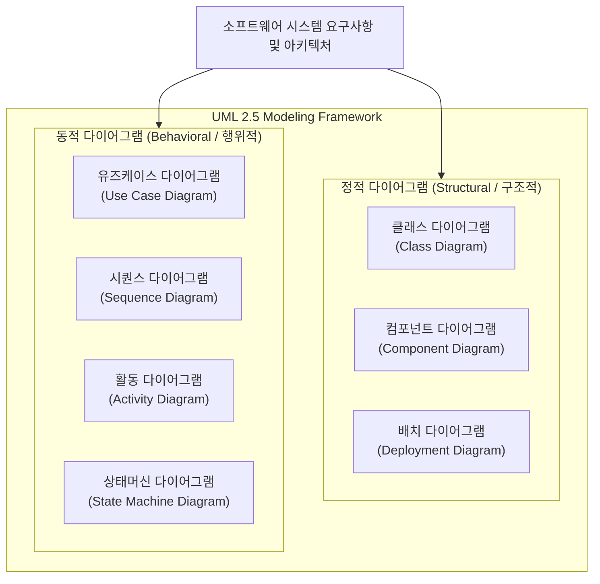

# UML (정적, 동적 다이어그램)

---

## I. 객관적 시스템 설계와 가시화를 위한 객체지향 표준 모델링 언어, UML의 개요

* **정의**: [[객체지향]] 소프트웨어 시스템의 분석·설계 단계에서 시스템의 구조와 행위를 표준화된 그래픽 표기법을 통해 시각화, 명세화, 문서화하는 통합 모델링 언어(Unified Modeling Language, OMG 표준)
* 소프트웨어 복잡성 제어, 이해관계자 간의 원활한 의사소통 및 객체지향 설계의 재사용성 확보 목적
* 특징: 정적(구조적) 다이어그램과 동적(행위적) 다이어그램의 이중 분류 체계, 최근 AI 기반 텍스트-투-다이어그램 및 코드-퍼스트(Mermaid/PlantUML) 환경으로 진화

---

## II. UML의 구조(정적/동적 다이어그램) 및 핵심 기술 요소

### 가. UML의 정적 및 동적 다이어그램 분류 아키텍처

* 시스템의 불변하는 물리적·논리적 구조를 표현하는 **정적 다이어그램**과 시간 흐름에 따른 객체 간 상호작용 및 상태 변화를 표현하는 **동적 다이어그램**으로 이원화되어 시스템을 다차원적으로 모델링하는 구조

### 나. UML 핵심 다이어그램 및 구성 요소

| 분류 | 요소기술(키워드) | 세부 설명 |
| --- | --- | --- |
| 정적(구조) | [[클래스 다이어그램|클래스 다이어그램 (Class Diagram)]] | 시스템 내 [[클래스]], 속성, 메서드 및 객체 간 관계(연관, 상속 등)를 표현하는 핵심 구조도 |
| 정적(구조) | 컴포넌트 다이어그램 (Component Diagram) | 소프트웨어 모듈, 인터페이스 간의 물리적 의존성과 컴포넌트 조립 관계 정의 |
| 정적(구조) | 배치 다이어그램 (Deployment Diagram) | 물리적 하드웨어 노드와 소프트웨어 컴포넌트의 배치 및 네트워크 토폴로지 매핑 |
| 동적(행위) | [[유즈케이스 다이어그램]] (Use Case) | 사용자(Actor) 관점에서 시스템의 기능 요구사항과 외부 상호작용 범위 정의 |
| 동적(행위) | 시퀀스 다이어그램 (Sequence) | 객체 간 메시지 교환 및 시간 순서에 따른 상호작용 흐름을 시각화 |
| 동적(행위) | 활동 다이어그램 (Activity Diagram) | 비즈니스 프로세스나 제어 흐름의 분기, 병렬 처리 및 작업 단계를 절차적으로 표현 |
| 동적(행위) | 상태머신 다이어그램 (State Machine) | 이벤트 발생에 따른 단일 객체의 생명주기 및 상태 전이 과정을 모델링 |
| 최신 트렌드 | 코드-퍼스트 모델링 (Mermaid) | 마크다운 및 코드 기반으로 정적·동적 다이어그램을 실시간 자동 렌더링 및 [[형상 관리]] |

---

## III. UML 정적 다이어그램 vs 동적 다이어그램 비교 및 최신 동향

| 비교 항목 | 정적 다이어그램 (Structural Diagrams) | 동적 다이어그램 (Behavioral Diagrams) |
| --- | --- | --- |
| **초점 및 관점** | 시스템의 **구조(Structure)** 및 컴포넌트 간 관계 | 시스템의 **행위(Behavior)** 및 시간 흐름에 따른 변화 |
| **시간 개념** | 시간의 경과에 따른 변화를 명시적으로 다루지 않음 | 시간 축(Timeline)과 이벤트 발생 순서가 핵심 |
| **주요 활용 단계** | 시스템 아키텍처 설계, 클래스 모델링 및 물리 배포 | 요구사항 분석, 비즈니스 로직 검증 및 시나리오 테스트 |

* 최근 소프트웨어 엔지니어링 환경은 수동 드로잉 도구 중심에서 벗어나, 텍스트 코드로 관리하는 **Mermaid/PlantUML** 기반의 코드-퍼스트 방식과 생성형 AI를 활용한 **텍스트-투-다이어그램(Text-to-Diagram) 자동 생성** 체계로 빠르게 전환되고 있음

---

### 🔗 연관 토픽

- **소속 도메인**: [[00_소프트웨어공학_MOC|🏗️ 소프트웨어공학]]
- **세부 분류**: `3. 요구사항 공학 & UML 객체지향 분석/설계`
- **핵심 연관 토픽**:
  - [[클래스 다이어그램|클래스 다이어그램 (Class Diagram)]]
  - [[유즈케이스 다이어그램]]
  - [[UML Diagram 전체|UML / Diagram 전체]]
  - [[클래스]]
  - [[객체지향]]
