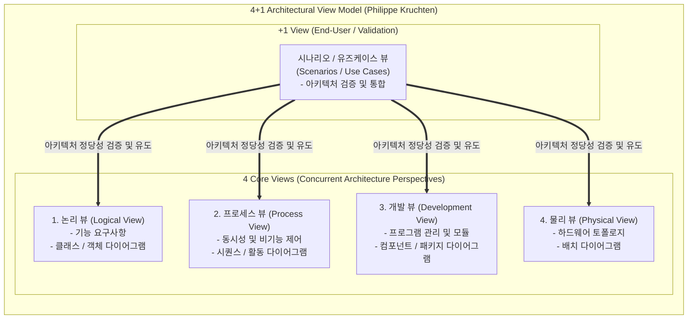

# UML의 4+1 View Model

---

## I. 소프트웨어 아키텍처 다차원 기술 및 이해관계자 관점 통합 프레임워크, 4+1 뷰 모델의 개요

* **정의**: 필립 크루텐(Philippe Kruchten)이 제안한 [[소프트웨어 아키텍처]] 설계 프레임워크로, 시스템을 바라보는 서로 다른 관점(Logical, Process, Development, Physical)의 4가지 주요 뷰와 이를 검증·연계하는 유즈케이스(Scenario) 뷰를 합친 복합 모델
* 복잡한 소프트웨어 시스템의 요구사항을 분할 정복하고, 다양한 이해관계자(개발자, 아키텍트, 시스템 엔지니어, 최종 사용자)의 관심사를 체계적으로 분리·수용하기 위한 목적
* 특징: 동시 다발적 뷰(Concurrent Views) 구조, 유즈케이스를 통한 아키텍처 검증(+1), [[UML]] 표준 표기법 적극 활용

---

## II. 4+1 View Model의 아키텍처 및 핵심 구성요소

### 가. 4+1 View Model의 구조 및 다이어그램 매핑

* 시스템의 핵심 구조를 논리, [[프로세스]], 개발, 물리 영역의 4가지 관점으로 분리 기술하고, 사용자 시나리오(유즈케이스)를 통해 이들을 통합·검증하는 구조

### 나. 4+1 View Model의 5가지 핵심 뷰 및 구성 요소

| 뷰 구분 | 주요 이해관계자 | 핵심 관심사 및 설명 | 연계 UML 다이어그램 |
| --- | --- | --- | --- |
| **시나리오 뷰 (+1)** | 최종 사용자, 테스터, 아키텍트 | 다른 4개 뷰를 도출하고 검증하는 기준이 되는 핵심 유즈케이스 및 작업 흐름 | [[유즈케이스 다이어그램]] |
| **논리 뷰 (Logical)** | 최종 사용자, 설계자 | 시스템이 제공하는 기능적 요구사항 및 객체 지향적 구조 분석 | [[클래스]], 객체 다이어그램 |
| **프로세스 뷰 (Process)** | 시스템 엔지니어, 통합자 | 런타임 시 동시성(Concurrency), 성능, [[HA(High Availability)|가용성]], 스레드 동기화 및 통신 제어 | 시퀀스, 활동, 상태 다이어그램 |
| **개발 뷰 (Development)** | 개발자, 형상 관리자 | 소스코드 구조, 패키지 분할, 컴포넌트 의존성 및 서브시스템 관리 | 컴포넌트, 패키지 다이어그램 |
| **물리 뷰 (Physical)** | 시스템 엔지니어, [[DevOps]] | 하드웨어 노드 배치, 네트워크 토폴로지 및 물리적 컴포넌트 매핑 | 배치(Deployment) 다이어그램 |

---

## III. 전통적 아키텍처 문서화 vs 최신 클라우드 네이티브 4+1 모델 비교 및 동향

| 비교 항목 | 전통적 모놀리식 4+1 모델 | 최신 [[클라우드 네이티브]] / [[MSA (Micro Service Architecture)|MSA]] 4+1 모델 |
| --- | --- | --- |
| **물리 뷰(Physical)** | 고정된 물리 서버 및 온프레미스 네트워크 토폴로지 중심 | [[쿠버네티스]](K8s) 클러스터, 멀티 클라우드 및 IaC 인프라 구성 반영 |
| **프로세스 뷰(Process)** | 단일 노드 내 스레드 및 프로세스 간 IPC 중심 | 마이크로서비스 간 비동기 메시징, 이벤트 드리븐 및 서비스 머시(Mesh) 구조 |
| **적용 방식** | 문서 중심의 사후 정적 아키텍처 블루프린트 작성 | C4 모델 등과 결합하여 코드와 동기화되는 실시간 아키텍처 가시화 |

* 최근 클라우드 네이티브 및 마이크로서비스(MSA) 환경의 고도화에 따라, 전통적인 4+1 뷰 모델은 **C4 모델(Context, Container, Component, Code)** 및 IaC(Infrastructure as Code) 형상 관리와 유기적으로 결합되어 분산 시스템의 아키텍처 명세 표준으로 진화하고 있음

---

### 🔗 연관 토픽

- **소속 도메인**: [[00_소프트웨어공학_MOC|🏗️ 소프트웨어공학]]
- **세부 분류**: `3. 요구사항 공학 & UML 객체지향 분석/설계`
- **핵심 연관 토픽**:
  - [[유즈케이스 다이어그램]]
  - [[UML|UML (정적, 동적 다이어그램)]]
  - [[클래스]]
  - [[소프트웨어 아키텍처|소프트웨어 아키텍쳐]]
  - [[클라우드 네이티브]]
