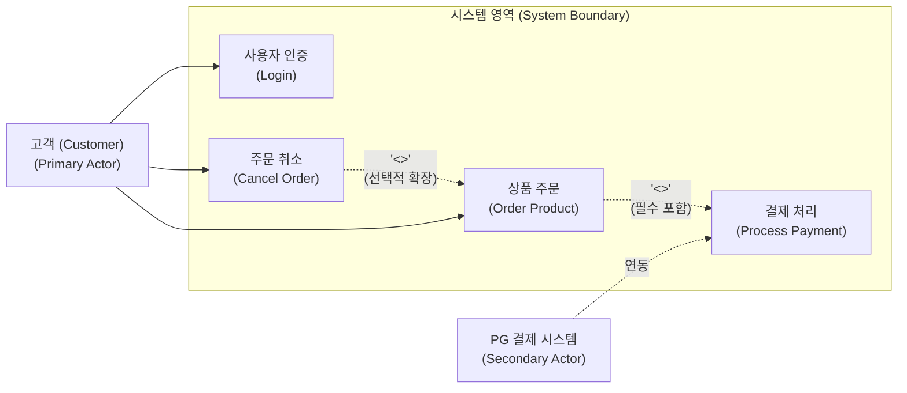

# 유즈케이스 다이어그램 (Use Case Diagram)

---

## I. 사용자 관점의 시스템 기능 요구사항 시각화 모델, 유즈케이스 다이어그램의 개요

* **정의**: 시스템과 외부 사용자(액터) 간의 상호작용을 통해 소프트웨어가 제공해야 하는 기능적 요구사항을 시각적으로 정의하는 [[UML]] 행위적(동적) 다이어그램
* 시스템의 범위(System Boundary) 확정, 이해관계자 간의 원활한 의사소통 및 요구사항 분석 명세화 목적
* 특징: 사용자 중심의 기능 정의, 액터와 유즈케이스 간의 관계(Include/Extend) 표현, 최근 AI 기반 Text-to-Diagram 자동 생성 체계로 진화

---

## II. 유즈케이스 다이어그램의 개념도 및 핵심 기술 요소

### 가. 유즈케이스 다이어그램의 아키텍처 및 동작 원리

* 고객(Primary Actor)이 시스템에 접속하여 인증 및 주문을 수행할 때, 주문 과정에서 결제 처리 기능이 필수 포함(Include)되고 조건에 따라 취소가 확장(Extend)되는 상호작용 구조

### 나. 유즈케이스 다이어그램의 핵심 기술 요소

| 분류 | 요소기술(키워드) | 세부 설명 |
| --- | --- | --- |
| 주체 정의 | 액터 (Actor) | 시스템 외부에서 상호작용하는 사용자, 하드웨어 또는 외부 시스템 |
| 기능 정의 | 유즈케이스 (Use Case) | 시스템이 액터에게 제공하는 가치 있는 서비스 및 기능 단위 |
| 범위 설정 | 시스템 경계 (System Boundary) | 시스템 내부 기능과 외부 환경(액터)을 명확히 구분하는 외곽선 |
| 필수 관계 | 포함 관계 (<>) | 다른 유즈케이스 실행 시 반드시 거쳐야 하는 필수 서브 기능 연결 |
| 선택 관계 | 확장 관계 (<>) | 특정 조건(Condition) 만족 시 선택적으로 부가 기능이 수행되는 관계 |
| 구조화 | [[일반화]] (Generalization) | 액터나 유즈케이스 간의 상속(is-a) 및 공통 특성 [[재사용]] 구조 |
| 표기 방식 | 코드-퍼스트 (Mermaid) | 마크다운 및 텍스트 코드로 유즈케이스 다이어그램을 실시간 렌더링 |
| 최신 트렌드 | AI Text-to-Diagram | [[초거대 언어 모델|LLM]]을 활용하여 [[요구사항 명세서]](SRS)를 유즈케이스 코드로 자동 변환 |

---

## III. 유즈케이스 다이어그램의 최신 동향 및 적용 방향

* 전통적 소프트웨어 공학에서는 수동 드로잉 툴을 이용해 요구사항 분석 단계에서 정적 산출물로 작성하였으나, 최근 애자일 개발 환경과 생성형 AI의 확산에 따라 **사용자 스토리(User Story) 기반 자동 매핑** 및 LLM을 활용한 **Text-to-Diagram(Mermaid/PlantUML) 자동 생성 체계**로 빠르게 진화 중임

---

### 🔗 연관 토픽

- **소속 도메인**: [[00_소프트웨어공학_MOC|🏗️ 소프트웨어공학]]
- **세부 분류**: `3. 요구사항 공학 & UML 객체지향 분석/설계`
- **핵심 연관 토픽**:
  - [[UML|UML (정적, 동적 다이어그램)]]
  - [[재사용]]
  - [[유즈케이스 다이어그램]]
  - [[요구 공학|요구 공학 (Requirements Engineering)]]
  - [[클래스]]
