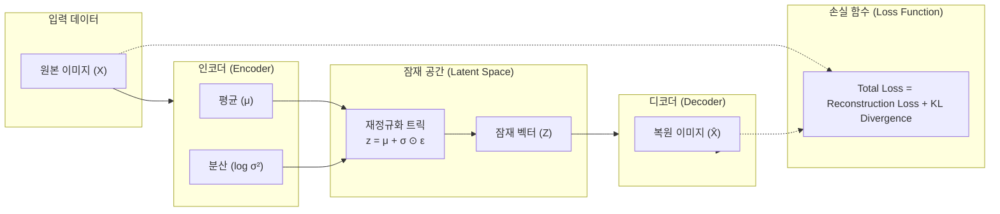

# VAE (Variational Autoencoder, 변이형 오토인코더)

---

## I. 확률적 잠재 공간 학습 기반의 심층 생성 모델, VAE의 개요

* **정의**: 입력 데이터를 압축하는 오토인코더에 확률적 잠재 공간(Latent Space) 개념을 결합하여, 인코더가 출력하는 확률 분포(평균, 분산)로부터 새로운 데이터를 샘플링하여 생성할 수 있는 심층 생성 모델
* 단순 데이터 압축을 넘어 연속적이고 부드러운 잠재 공간을 확보하고, 새로운 데이터를 창출하기 위한 생성적(Generative) 능력 확보 목적
* 특징: 인코더-디코더 구조, 재정규화 트릭(Reparameterization Trick) 적용, 재구성 손실(Reconstruction Loss)과 KL 발산(KL Divergence)의 결합 손실 함수 사용

---

## II. VAE의 아키텍처 및 핵심 기술 요소

### 가. VAE의 아키텍처 및 동작 원리

* 원본 데이터($X$)를 인코더가 확률 분포($\mu, \sigma^2$)로 매핑하고, 재정규화 트릭을 통해 미분 가능한 잠재 벡터($Z$)를 샘플링한 뒤, 디코더가 이를 복원하여 재구성 오차와 정규화 오차를 동시 최적화하는 구조

### 나. VAE의 핵심 기술 요소

| 분류 | 요소기술(키워드) | 세부 설명 |
| --- | --- | --- |
| 인코딩 | 인코더 네트워크 (Encoder) | 입력 데이터를 잠재 공간의 확률 분포 파라미터($\mu, \log\sigma^2$)로 변환 |
| 샘플링 | 재정규화 트릭 (Reparameterization) | 확률적 노드를 거치면서도 [[역전파]](Backpropagation)가 가능하도록 변환 |
| 잠재 공간 | 잠재 벡터 (Latent Space, $Z$) | 데이터의 압축된 확률적 특징을 담는 연속적이고 밀집된 벡터 공간 |
| 디코딩 | 디코더 네트워크 (Decoder) | 잠재 벡터로부터 원본과 유사한 새로운 데이터를 복원 및 생성 |
| [[손실함수]] | 재구성 손실 (Reconstruction Loss) | 원본 데이터와 복원 데이터 간의 차이 측정 (MSE 또는 BCE) |
| 정규화 | KL 발산 (KL Divergence) | 잠재 공간의 분포가 표준 정규 분포($N(0, I)$)에 가깝도록 규제 |
| 확장 모델 | VQ-VAE (Vector Quantized VAE) | 이산적 잠재 코드를 사용하여 코드북 기반 고해상도 생성 지원 |
| 최신 응용 | 잠재 확산 모델 (LDM, Stable Diffusion) | 픽셀 공간 대신 VAE 잠재 공간에서 확산 연산을 수행하여 연산 효율 극대화 |

---

## III. 전통적 오토인코더 vs VAE vs GAN 비교 및 최신 동향

| 비교 항목 | 전통적 오토인코더 (Autoencoder) | VAE (Variational Autoencoder) | [[GAN (Generative Adversarial Network)]] |
| --- | --- | --- | --- |
| **학습 방식** | 결정론적(Deterministic) 압축 및 복원 | 확률적(Probabilistic) 잠재 공간 분포 학습 | 생성자와 판별자의 경쟁적(Adversarial) 학습 |
| **잠재 공간** | 불연속적이며 빈 공간(Hole) 존재 가능 | 연속적이고 정규화된 분포로 보간(Interpolation) 용이 | 비정형 잠재 공간으로 직접 제어가 상대적으로 까다로움 |
| **생성 능력** | 새로운 데이터 생성(Generation) 기능 취약 | 안정적인 확률적 데이터 생성 가능하나 이미지가 다소 흐림 | 고해상도의 매우 사실적인 이미지 생성 우수 |

* 초기 VAE는 생성된 이미지가 다소 흐리다는(Blurry) 한계가 있었으나, 최근에는 고해상도 표현력을 지닌 **VQ-VAE** 및 스테이블 디퓨전(Stable Diffusion)의 기반이 되는 잠재 확산 모델(LDM)의 핵심 압축 인코더로 발전하여 차세대 생성형 AI 인프라의 근간 기술로 활용 중임

---

### 🔗 연관 토픽

- **소속 도메인**: [[00_인공지능_MOC|🤖 인공지능]]
- **세부 분류**: `1. 수학 · 통계학 & 데이터 전처리`
- **핵심 연관 토픽**:
  - [[GAN (Generative Adversarial Network)]]
  - [[손실함수]]
  - [[비지도 학습]]
  - [[합성 데이터|합성 데이터(Synthetic Data)]]
  - [[클래스 불균형|클래스 불균형(Class Imbalance)]]
