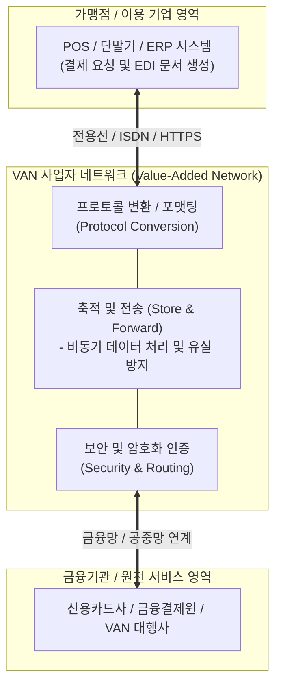

# VAN (Value-Added Network, 부가가치통신망)

---

## I. 고속·안전한 데이터 유통과 전용 부가서비스를 제공하는 공중전기통신망 기반 인프라, VAN의 개요

* **정의**: 공중전기통신사업자(KT 등)로부터 통신 회선을 임차하거나 교환기를 설치하여, 단순한 회선 임대 이상의 데이터 가공, 축적, 변환, 교환 등 부가적 가치 서비스를 제공하는 정보통신 네트워크
* 기업 간 전자문서교환([[EDI]]), 신용카드 조회 및 결제 승인 중계, 대규모 데이터 유통의 [[신뢰성]] 및 보안성 확보 목적
* 특징: 이기종 시스템 간 [[프로토콜]] 변환, 데이터 축적 및 전송(Store and Forward), VAN 사업자를 통한 거래 투명성 및 안정성 보장

---

## II. VAN의 아키텍처 및 핵심 기술 요소

### 가. VAN 서비스 처리 프로세스 및 아키텍처

* 가맹점이나 기업 시스템이 POS 및 EDI를 통해 데이터를 전송하면, VAN 사업자 네트워크 내부에서 프로토콜 변환 및 축적·전송(Store & Forward) 처리를 거쳐 금융사 및 관련 기관으로 안전하게 중계하는 구조

### 나. VAN의 핵심 구성 요소 및 기술 요소

| 분류 | 요소기술(키워드) | 세부 설명 |
| --- | --- | --- |
| 통신 제어 | 프로토콜 변환 (Protocol Conversion) | 이기종 단말과 시스템 간 상이한 통신 규격을 상호 호환되도록 변환 |
| 데이터 처리 | 축적 및 전송 (Store & Forward) | 수신된 데이터를 일시 저장한 후, 수신측 상태에 맞춰 순차적 전송 |
| 결제 중계 | 신용카드 조회 승인 | 가맹점과 카드사 간의 결제 승인 요청 및 결과를 실시간 중계 |
| 기업 연동 | EDI (Electronic Data Interchange) | 기업 간 상거래 문서(주문, 송장 등)를 표준 규격으로 전자 교환 |
| 보안 통신 | 전용선 및 [[VPN]] [[암호화]] | 금융 및 상거래 데이터 유출 방지를 위한 암호화된 전용 통신망 구축 |
| 정산 관리 | 거래 대행 및 정산 시스템 | 일일 거래 내역 집계, 가맹점 수수료 정산 및 데이터 [[무결성]] 보장 |
| 차세대 기술 | 오픈 API 및 가상 VAN | 물리적 단말 중심에서 클라우드 및 모바일 기반 디지털 페이먼트 연계 |
| 최신 트렌드 | PG·VAN 복합화 및 [[01_IT Tech/핀테크]] 융합 | 단순 중계를 넘어 핀테크 플랫폼 및 간편결제(Simple Pay) 인프라로 진화 |

---

## III. 전통적 VAN vs 최신 PG·핀테크 기반 디지털 결제 체계 비교 및 동향

| 비교 항목 | 전통적 VAN (Value-Added Network) | 최신 PG 및 핀테크 디지털 결제 인프라 |
| --- | --- | --- |
| **핵심 인프라** | 물리적 전용선, POS 단말기 및 전용 네트워크 중계 | 클라우드 기반 API, 모바일 앱 및 오픈 커머스 [[게이트웨이]] |
| **서비스 범위** | 오프라인 가맹점 중심의 신용카드 승인 및 EDI 문서 유통 | 온·오프라인 통합 결제, 간편결제(Simple Pay) 및 부가 정산 |
| **수익 구조** | 승인 건당 정액 중계 수수료 및 회선 임대 수수료 중심 | 결제 금액 비례 수수료, 데이터 분석 및 부가 가치 서비스 |

* 최근 [[클라우드 네이티브]] 환경과 모바일 중심의 간편결제 확산으로 인해, 전통적인 물리적 VAN 사업 영역은 PG(Payment Gateway) 및 핀테크 플랫폼과의 융합을 통한 **디지털 페이먼트 허브** 형태로 빠르게 진화하고 있음

---

### 🔗 연관 토픽

- **소속 도메인**: [[00_네트워크_MOC|🌐 네트워크]]
- **세부 분류**: `5. 통신 인프라 & 차세대 네트워크 기술`
- **핵심 연관 토픽**:
  - [[EDI]]
  - [[게이트웨이]]
  - [[VPN|VPN(Virtual Private Network)]]
  - [[무결성]]
  - [[프로토콜]]
