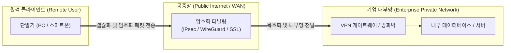

# VPN (Virtual Private Network, 가상 사설망)

---

## I. 공중망을 통한 안전한 사설 통신망 구축 기술, VPN의 개요

* **정의**: 물리적인 전용선이 아닌 공중망(인터넷)을 활용하여, 터널링(Tunneling)과 [[암호화]] 기술을 적용함으로써 마치 전용선을 쓰는 것과 같이 안전하게 통신할 수 있는 가상의 사설 네트워크 기술
* 원격 근무 환경에서의 기업 내부망 안전 접속, 데이터 유출 및 도청 방지, 비용 절감 목적
* 특징: 강력한 암호화 및 [[무결성]] 보장, 터널링 [[프로토콜]] 기반 [[캡슐화]], 최근 제로 트러스트(ZTNA) 아키텍처와의 융합으로 진화

---

## II. VPN의 아키텍처 및 핵심 기술 요소

### 가. VPN의 터널링 및 데이터 전송 프로세스

* 원격 사용자의 단말기가 암호화 터널링을 통해 공중망을 거쳐 기업 VPN 게이트웨이에 도달한 뒤, 복호화를 거쳐 안전하게 내부 자원에 접근하는 구조

### 나. VPN의 핵심 기술 및 구성 요소

| 분류 | 요소기술(키워드) | 세부 설명 |
| --- | --- | --- |
| 터널링 프로토콜 | [[IP Sec|IPsec]] (Internet Protocol Security) | [[네트워크 계층]](L3)에서 패킷 단위 암호화 및 인증을 수행하는 표준 보안 프로토콜 |
| 터널링 프로토콜 | WireGuard | 최신 고성능 경량 VPN 프로토콜로, 빠르고 간결한 코드베이스와 고속 암호화 제공 |
| [[세션]] 보안 | SSL / TLS VPN | [[전송 계층]](L4~L7) 기반으로 별도의 클라이언트 설치 없이 웹 브라우저로 접속 지원 |
| 암호화 [[알고리즘]] | [[AES]]-256 / ChaCha20 | 데이터 기밀성을 보장하기 위한 고성능 [[대칭키 암호화]] 알고리즘 |
| 키 교환 | IKEv2 / Diffie-Hellman | 안전한 세션 키 교환 및 상호 인증을 수행하는 프로토콜 |
| 트래픽 제어 | 스플릿 터널링 (Split Tunneling) | 업무용 트래픽만 VPN으로 우회하고 일반 인터넷 트래픽은 로컬망으로 직접 처리 |
| 네트워크 제어 | NAT Traversal (NAT-T) | 사설 IP 환경(NAT)에서도 VPN 터널이 정상적으로 유지되도록 지원하는 기술 |
| 최신 아키텍처 | ZTNA 연계 | 네트워크 접근 허용 후 전체를 신뢰하던 방식에서 세션별 최소 권한 검증으로 진화 |

---

## III. 전통적 VPN vs 최신 제로 트러스트(ZTNA) 비교 및 동향

| 비교 항목 | 전통적 VPN (Traditional VPN) | 최신 제로 트러스트 네트워크 접근 (ZTNA) |
| --- | --- | --- |
| **접속 및 신뢰 모델** | 네트워크 경계(Perimeter) 기반 신뢰 (일회성 인증 시 내부망 전체 허용) | "절대 믿지 말고 항상 검증" (Never Trust, Always Verify) |
| **접근 단위** | 네트워크(IP/Subnet) 단위 전체 접근 권한 부여 | 특정 애플리케이션 및 서비스 단위 최소 권한 접근 |
| **보안 취약성** | 침해 사고 발생 시 내부망 전체로 측면 이동(Lateral Movement) 확산 위험 | 세션별 실시간 상태 검증으로 공격 확산 원천 차단 |

* 최근 원격·하이브리드 근무의 보편화와 고도화된 사이버 위협으로 인해, 전통적인 네트워크 기반 VPN은 애플리케이션 중심의 **ZTNA([[제로 트러스트 보안모델|Zero Trust]] Network Access)** 및 **[[SASE(Secure Access Service Edge)]]** 아키텍처로 빠르게 대체되는 추세임

---

### 🔗 연관 토픽

- **소속 도메인**: [[00_보안_MOC|🛡️ 보안]]
- **세부 분류**: `1. 정보보안 원칙 & 거버넌스 · 인증`
- **핵심 연관 토픽**:
  - [[암호화|암호화 (Encryption)]]
  - [[제로 트러스트 보안모델|제로 트러스트 (Zero Trust) 보안모델]]
  - [[IP Sec]]
  - [[SASE(Secure Access Service Edge)]]
  - [[대칭키 암호화]]
