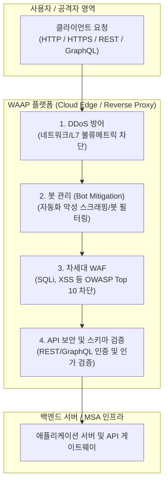

# WAAP (Web Application and API Protection)

---

## I. 웹 애플리케이션 및 API 보안 통합 보호 솔루션, WAAP의 개요

* **정의**: 전통적인 웹 [[방화벽]](WAF) 기능에 API 보안, 봇 관리(Bot Management), 계층 7 [[DDOS|DDoS]] 방어 기능을 통합하여 웹 애플리케이션과 API를 포괄적으로 보호하는 차세대 보안 솔루션
* 마이크로서비스([[MSA (Micro Service Architecture)|MSA]]), 모바일 앱 및 오픈 API 확산에 따른 공격 표면(Attack Surface) 확대 대응 목적
* 특징: 4대 핵심 기능 통합(WAF, API Security, Bot, DDoS), [[클라우드 네이티브]] 아키텍처 지원, 머신러닝 기반 지능형 위협 탐지

---

## II. WAAP의 아키텍처 및 핵심 기술 요소

### 가. WAAP의 트래픽 검사 및 보호 아키텍처

* 외부에서 유입되는 모든 HTTP/HTTPS 트래픽이 클라우드 엣지의 WAAP 플랫폼을 거치며, DDoS, 봇, 웹 취약점(WAF), API 악용 순으로 다중 필터링되어 안전한 백엔드로 전달되는 구조

### 나. WAAP의 핵심 구성 요소 및 기술 요소

| 분류 | 요소기술(키워드) | 세부 설명 |
| --- | --- | --- |
| 웹 방호 | 차세대 WAF (NG-WAF) | [[SQL(Structured Query Language)|SQL]] 인젝션, [[XSS]] 등 OWASP Top 10 및 시그니처/행위 기반 웹 공격 차단 |
| API 보안 | API 디스커버리 및 [[스키마]] 검증 | REST/GraphQL 등 API 엔드포인트 자동 식별 및 [[JSON]]/[[XML]] 스키마 위반 탐지 |
| 봇 통제 | 봇 관리 (Bot Mitigation) | [[인공지능]]/머신러닝 기반으로 정상 사용자, 자동화 스크립트 및 악성 봇 구별 |
| [[HA(High Availability)|가용성]] 보장 | L7 DDoS 방어 | 애플리케이션 계층의 자원 고갈형 대규모 분산 서비스 거부 공격 실시간 방어 |
| 탐지 기술 | 머신러닝 기반 행위 분석 | 정적 시그니처의 한계를 극복하고 이상 트래픽 및 제로데이(0-day) 공격 탐지 |
| 배포 모델 | 클라우드 엣지 / SaaS 기반 | [[CDN]] 및 클라우드 인프라와 결합하여 전 세계 엣지에서 지연 없이 트래픽 검사 |
| 운영 통합 | 통합 대시보드 및 가시성 | 웹과 API 전반의 보안 이벤트를 단일 창(Single Pane of Glass)으로 모니터링 |
| 최신 트렌드 | AI 기반 자동 정책 튜닝 | 오탐(False Positive)을 줄이고 API 변경 사항을 자동 학습하여 보안 정책 동적 갱신 |

---

## III. 전통적 WAF vs 차세대 WAAP 비교 및 동향

| 비교 항목 | 전통적 웹 방화벽 (Traditional WAF) | 차세대 WAAP (Web App & API Protection) |
| --- | --- | --- |
| **보호 범위** | 전통적인 웹 페이지(HTML 기반 HTTP/HTTPS 트래픽) 중심 | 웹 애플리케이션 + 모바일/IoT용 API(REST, GraphQL 등) 포괄 |
| **탐지 기법** | 주로 정적 시그니처(Signature) 매칭 기반 | 시그니처 + 머신러닝 기반 행위 분석 + 봇/DDoS 통합 방어 |
| **아키텍처** | 온프레미스 하드웨어 장비 또는 가상 어플라이언스 중심 | 클라우드 엣지(Cloud [[EDGE|Edge]]) 기반 분산 아키텍처 및 SaaS 형태 |

* 최근 API 기반 비즈니스 급증과 AI 자동화 공격(악성 봇)의 고도화에 따라, 단순 웹 방화벽(WAF) 단계를 넘어 **API 보안과 봇 관리가 결합된 통합 WAAP 아키텍처**가 엔터프라이즈 표준 보안 체계로 자리 잡고 있음

---

### 🔗 연관 토픽

- **소속 도메인**: [[00_보안_MOC|🛡️ 보안]]
- **세부 분류**: `3. 네트워크 & 엔드포인트 · 인프라 보안`
- **핵심 연관 토픽**:
  - [[클라우드 컴퓨팅 취약점 및 대응기술]]
  - [[방화벽]]
  - [[JSON]]
  - [[DDOS]]
  - [[DoS (Denial of Service)]]
