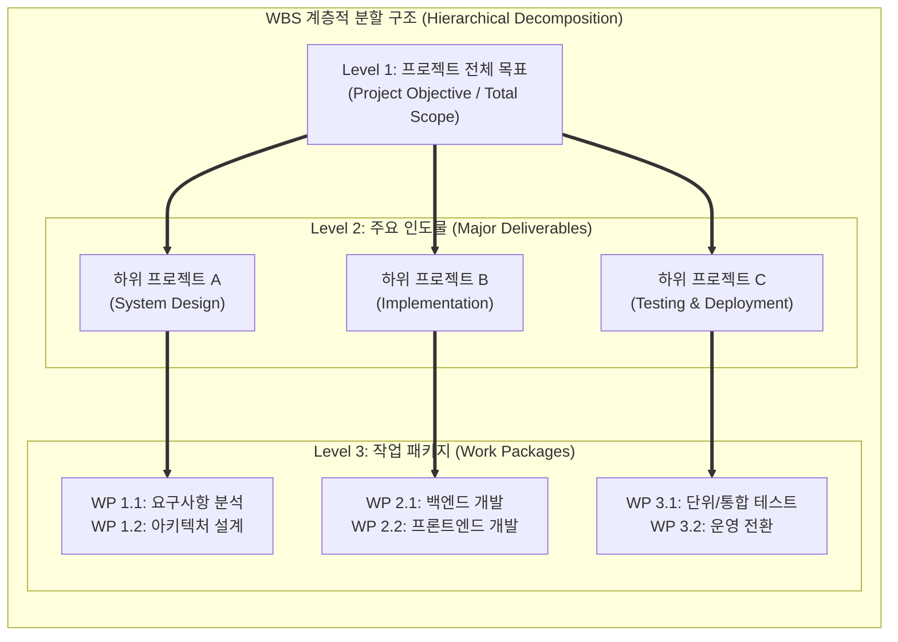

# WBS (Work Breakdown Structure, 작업분할구조도)

---

## I. 프로젝트 범위 관리 및 성공적 인도물 달성을 위한 계층적 작업 분할 도구, WBS의 개요

* **정의**: 프로젝트의 최종 목표를 달성하기 위해 수행해야 할 전체 범위를 관리 가능한 크기의 하위 작업 패키지(Work Package)로 계층적으로 분할·정의하는 프로젝트 관리(PM)의 핵심 도구
* 프로젝트 범위(Scope) 명확화, 일정 및 원가 산정의 기초 제공, 팀원 간 역할 분담 및 책임 명확화 목적
* 특징: 100% 규칙(100% Rule) 적용, 인도물(Deliverable) 중심 계층 구조, PMBOK 기반 표준화

---

## II. WBS의 계층 구조 및 핵심 기술 요소

### 가. WBS의 계층적 분할 아키텍처 및 동작 원리

* 프로젝트 전체 범위를 Level 1(목표)에서 출발하여 Level 2(주요 인도물)를 거쳐 Level 3(실행 가능한 작업 패키지)까지 하향식(Top-Down)으로 세분화하는 구조

### 나. WBS의 핵심 구성 요소 및 기술 요소

| 분류 | 요소기술(키워드) | 세부 설명 |
| --- | --- | --- |
| 분할 원칙 | 100% 규칙 (100% Rule) | 상위 수준의 작업은 하위 수준 작업들의 합과 100% 일치해야 하며 누락 방지 |
| 최소 단위 | 작업 패키지 (Work Package) | 일정과 원가를 산정하고 책임을 할당할 수 있는 WBS의 최하단 관리 단위 |
| 명세 정의 | WBS 딕셔너리 (WBS Dictionary) | 작업 패키지에 대한 상세 설명, 담당자, 일정, 산출물 등을 기술한 문서 |
| 통제 기준 | 통제점 (Control Point) | 진척도 측정과 비용 통제를 위해 WBS 특정 노드에 설정하는 관리 기준점 |
| 접근 방법 | 하향식 분할 (Top-Down) | 전체 프로젝트 목표를 점진적으로 세분화하여 세부 작업으로 쪼개는 방식 |
| 책임 할당 | OBS 연계 (RAM / RACI) | WBS와 조직구조도(OBS)를 결합하여 책임과 권한을 명확히 매핑 |
| 애자일 연계 | 백로그 분할 (Epic / Story) | [[워터폴|폭포수]] 모델의 WBS를 애자일 환경의 에픽(Epic) 및 사용자 스토리로 전환 |
| 최신 트렌드 | AI 기반 WBS 자동 생성 | 과거 프로젝트 데이터를 학습한 [[초거대 언어 모델|LLM]] 기반의 WBS 및 일정 초안 자동 생성 |

---

## III. 전통적 WBS vs 최신 애자일·AI 기반 WBS 비교 및 동향

| 비교 항목 | 전통적 WBS (Waterfall WBS) | 최신 애자일 및 AI 기반 WBS |
| --- | --- | --- |
| **분할 방식** | 인도물 중심의 고정된 계층적 트리 구조 (Top-Down) | 기능 및 사용자 가치 중심의 백로그 및 스프린트 단위 분할 |
| **유연성** | 요구사항 변경 시 WBS 전체 구조 수정 비용이 큼 | 반복적 주기에 따라 동적으로 작업 항목 추가 및 수정 용이 |
| **최신 트렌드** | PMBOK 표준 문서 중심의 정적 관리 방식 | 생성형 AI 및 지라(Jira) 등 PM 도구를 연동한 자동화 관리 |

* 최근 소프트웨어 개발 환경이 폭포수에서 애자일 및 하이브리드 체계로 전환됨에 따라, 전통적인 정적 WBS는 **애자일 백로그(Product Backlog) 및 에픽(Epic)** 구조와 유기적으로 결합되며, 생성형 AI를 활용한 **자동 작업 분할 및 일정 예측** 형태로 진화 중임

---

### 🔗 연관 토픽

- **소속 도메인**: [[00_프로젝트관리_MOC|📋 프로젝트관리]]
- **세부 분류**: `2. 프로젝트 범위 & 일정 관리 (Scope & Schedule)`
- **핵심 연관 토픽**:
  - [[워터폴]]
  - [[3점 산정]]
  - [[범위관리]]
  - [[비용산정 일정관리 모델]]
  - [[프로젝트 일정관리|프로젝트 일정관리(Project Schedule Management)에 대하여 설명하시오]]
