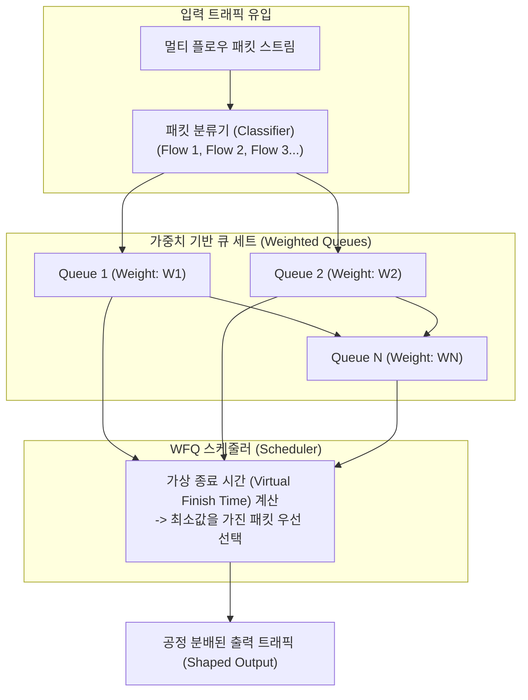

# WFQ (Weighted Fair Queuing, 가중 공정 큐잉)

---

## I. 패킷 트래픽의 공정성 제고와 대역폭 차등 할당을 위한 핵심 스케줄링 기법, WFQ의 개요

* **정의**: 라우터나 스위치에서 여러 플로우(Flow)의 패킷을 처리할 때, 단순 선입선출([[FIFO]])의 불공정성을 극복하고 각 플로우에 부여된 가중치(Weight)에 비례하여 대역폭을 공정하게 분배하는 패킷 [[스케줄링]] [[알고리즘]]
* FQ(Fair Queuing)의 공정성 보장 모델에 서비스 수준([[SLA]])에 따른 차등 대역폭 할당 기능을 결합하고, 기아 상태(Starvation)를 방지하기 위한 목적
* 특징: 플로우별 독립 큐 분리, 가상 종료 시간(Virtual Finish Time) 기반 스케줄링, 트래픽 특성에 따른 동적 자원 분배

---

## II. WFQ의 아키텍처 및 핵심 기술 요소

### 가. WFQ의 스케줄링 프로세스 및 동작 원리

* 입력된 패킷이 분류기를 거쳐 플로우별 큐에 적재되고, 스케줄러가 패킷 크기와 가중치를 반영한 가상 종료 시간을 계산하여 가장 값이 작은 패킷을 우선적으로 내보내는 구조

### 나. WFQ의 핵심 기술 및 구성 요소

| 분류 | 요소기술(키워드) | 세부 설명 |
| --- | --- | --- |
| 분류 단계 | 플로우 분류 (Flow Classification) | 5-Tuple(IP, Port 등) 또는 DSCP 값을 기반으로 패킷을 개별 세션별로 식별 |
| 자원 할당 | 가중치 할당 (Weight Assignment) | 트래픽 중요도 및 SLA 계약에 따라 큐별 전송 대역폭 비율을 차등 부여 |
| 연산 모델 | 유체 공정 모형 (Fluid Fair Queuing) | 이상적인 비트 단위 라운드로빈(Bit-by-bit RR) 방식을 패킷 단위로 근사화 |
| 스케줄링 | 가상 종료 시간 (Virtual Finish) | 패킷의 도착 시각, 크기 및 가중치를 연산하여 전송 순서를 결정하는 핵심 지표 |
| 공정성 보장 | 기아 상태 방지 (Starvation Free) | 대용량 트래픽 속에서도 소규모 트래픽이 최소한의 전송 기회를 보장받도록 제어 |
| 표준 연계 | [[QoS]] 및 [[DiffServ (Differentiated Services)|DiffServ]] 통합 | 차별화된 서비스(DiffServ) 아키텍처 내에서 대역폭 보장 및 지연 제어 연계 |
| 성능 특성 | 예측 가능한 지연 (Delay Bound) | 버스트 트래픽 환경에서도 각 플로우별 최대 지연 시간을 수학적으로 보장 |
| 최신 트렌드 | 스마트닉 및 P4 하드웨어 가속 | 고속 [[백본망]] 환경에서 복잡한 WFQ 연산을 하드웨어(SmartNIC) 레벨에서 고속 처리 |

---

## III. WFQ vs WRR 비교 및 최신 동향

| 비교 항목 | WFQ (Weighted Fair Queuing) | WRR (Weighted Round Robin) |
| --- | --- | --- |
| **처리 방식** | 패킷 크기와 가중치를 모두 고려한 **가상 시간 기반** 스케줄링 | 큐를 순환하며 고정된 개수(Weight)의 패킷을 차례로 전송 |
| **공정성 수준** | 패킷 크기가 달라도 정확한 대역폭 비례 **공정성 보장** | 패킷 크기 편차가 클 경우 대역폭 분배의 불공정성 발생 가능 |
| **구현 복잡도** | 가상 종료 시간 계산 등 연산 복잡도가 상대적으로 높음 | 단순한 라운드 로빈 구조로 구현이 직관적이고 가벼움 |

* 최근 고속 데이터 센터 및 5·6G 네트워크 환경의 고도화에 따라, 전통적인 소프트웨어 기반 WFQ의 연산 부하를 극복하기 위해 **P4 프로그래머블 [[스위치 (Layer 3 Switch)|스위치]] 및 스마트닉(SmartNIC)** 기반의 하드웨어 가속형 지능형 스케줄링 기술로 진화 중임

---

### 🔗 연관 토픽

- **소속 도메인**: [[00_네트워크_MOC|🌐 네트워크]]
- **세부 분류**: `2. 네트워크 계층 & 라우팅 프로토콜 (L3)`
- **핵심 연관 토픽**:
  - [[QoS|QoS (Quality of Service)]]
  - [[백본망]]
  - [[DiffServ (Differentiated Services)]]
  - [[스케줄링]]
  - [[FIFO]]
