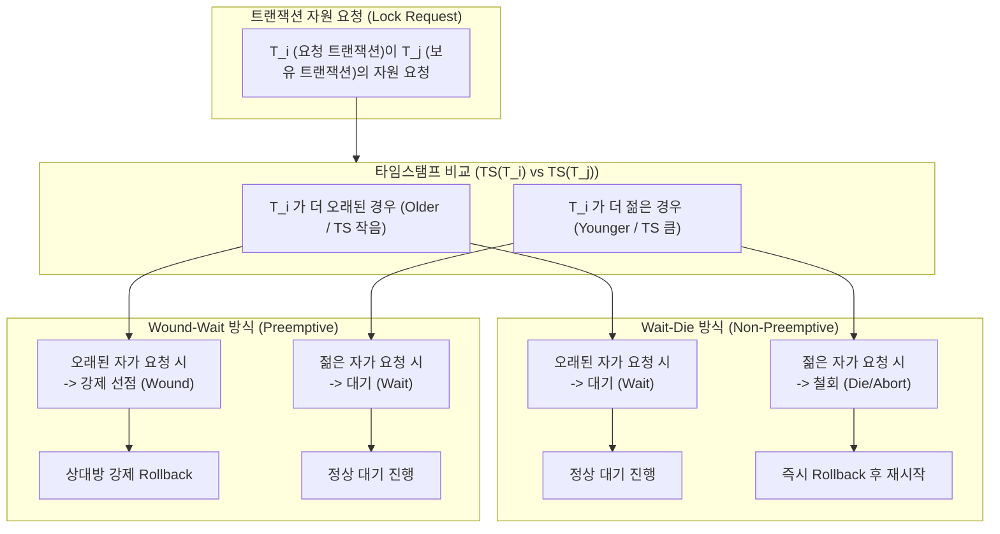

# Wait-Die와 Wound-Wait (타임스탬프 기반 교착상태 예방 기법)

---

## I. 타임스탬프 기반 교착상태 사전 예방을 위한 동시성 제어 기법, Wait-Die와 Wound-Wait의 개요

* **정의**: [[데이터베이스]] 관리 시스템([[DBMS]])에서 [[트랜잭션]] 간 [[교착상태]](Deadlock)를 사전에 방지하기 위해, 트랜잭션의 생성 시각(Timestamp)을 기준으로 자원 요청 시 대기(Wait) 또는 철회(Abort/Die/Wound) 여부를 결정하는 비관적 교착상태 예방 [[프로토콜]]
* 락(Lock) 획득 대기 중 발생하는 순환 대기(Circular Wait) 조건 원천 차단 및 타임스탬프 순서에 따른 공정성 확보 목적
* 특징: 타임스탬프 우선순위 기반, Wait-Die(비선점형), Wound-Wait(선점형) 이원화 구조

---

## II. Wait-Die와 Wound-Wait의 동작 원리 및 핵심 기술 요소

### 가. Wait-Die 및 Wound-Wait의 동작 프로세스 아키텍처

* 요청한 트랜잭션($T_i$)과 자원을 보유한 트랜잭션($T_j$) 간의 타임스탬프를 비교하여, Wait-Die는 오래된 트랜잭션에게 대기 권한을 부여하고, Wound-Wait은 오래된 트랜잭션이 젊은 트랜잭션을 선점(Wound)하는 구조

### 나. Wait-Die와 Wound-Wait의 핵심 구성 요소 및 기술 요소

| 분류 | 요소기술(키워드) | 세부 설명 |
| --- | --- | --- |
| 식별 기준 | 타임스탬프 (Timestamp, TS) | 트랜잭션 시작 시 부여되는 고유한 시간 값으로, 선후 순서 및 우선순위 결정 |
| Wait-Die 정책 | 비선점형 (Non-Preemptive) | 오래된 트랜잭션은 대기(Wait)하고, 젊은 트랜잭션은 철회(Die)되는 방식 |
| Wound-Wait 정책 | 선점형 (Preemptive) | 오래된 트랜잭션이 젊은 트랜잭션을 강제 철회(Wound)하고 자원 획득 |
| 예방 메커니즘 | 교착상태 사전 차단 (Prevention) | 락 대기 그래프(Wait-for Graph) 생성 전 정책적으로 순환 대기 원천 차단 |
| 예외 처리 | 롤백 및 재시작 (Rollback & Restart) | 충돌 시 철회된 트랜잭션에 원래의 타임스탬프를 유지한 채 재시작 수행 |
| 기아 상태 | 무한 대기 방지 (Starvation Free) | 타임스탬프 순서가 보장되므로 특정 트랜잭션이 무한히 대기하는 현상 방지 |
| 적용 환경 | 분산 DB 및 [[2PL]] 연계 | 전통적인 2단계 락(2PL) 프로토콜 환경 및 분산 트랜잭션 관리 호환 |
| 최신 트렌드 | 낙관적 제어(OCC) 및 MVCC | 락 기반 예방에서 벗어나 비관적 대기 비용을 줄이는 다중버전 동시성 제어로 진화 |

---

### III. Wait-Die vs Wound-Wait 비교 및 최신 동향

| 비교 항목 | Wait-Die 방식 | Wound-Wait 방식 |
| --- | --- | --- |
| **선점 여부** | 비선점형 (Non-Preemptive) | 선점형 (Preemptive) |
| **오래된 자가 요청 시** | 대기 (Wait) 수행 | 자원 보유자를 강제 철회 (Wound) |
| **젊은 자가 요청 시** | 즉시 철회 (Die / Abort) | 대기 (Wait) 수행 |
| **롤백(Rollback) 빈도** | 젊은 트랜잭션이 많을 경우 롤백 빈도가 높음 | 상대적으로 불필요한 롤백이 적어 효율적임 |

* 최근 고성능 대규모 [[분산 데이터베이스]] 환경에서는 락(Lock) 경합으로 인한 성능 저하를 방지하기 위해 엄격한 타임스탬프 기반 예방 기법보다는 **MVCC(Multi-Version Concurrency Control)** 및 낙관적 동시성 제어(OCC)를 결합한 분산 트랜잭션 아키텍처가 주류로 활용됨

---

### 🔗 연관 토픽

- **소속 도메인**: [[00_운영체제_MOC|⚙️ 운영체제]]
- **세부 분류**: `4. 교착상태 (Deadlock) 방지 및 해결`
- **핵심 연관 토픽**:
  - [[트랜잭션]]
  - [[교착상태|교착상태 (Deadlock)]]
  - [[2PL|2PL (Two-Phase Locking Protocol)]]
  - [[데이터베이스]]
  - [[DBMS]]
