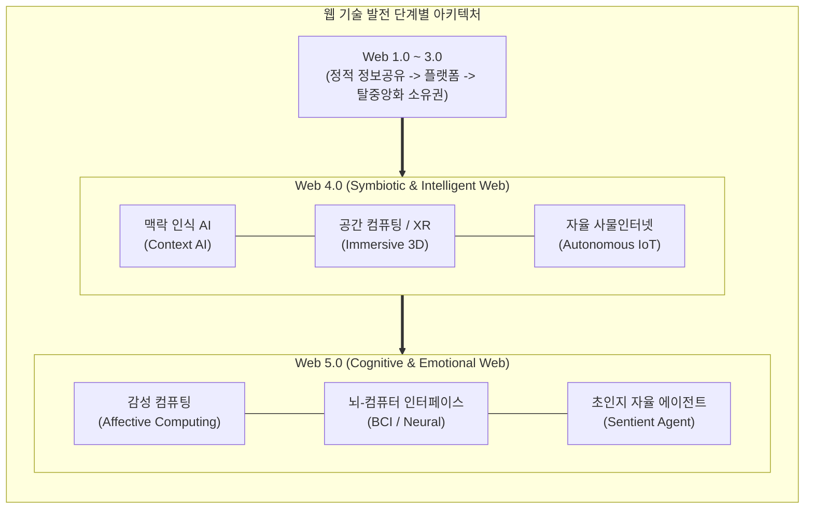

# Web 4.0 및 Web 5.0 (차세대 지능형·감성형 웹 패러다임)

---

## I. 지능형 공생 및 감성·인지 기반의 차세대 웹 진화 단계, Web 4.0 및 Web 5.0의 개요

* **정의**: Web 4.0은 [[인공지능]](AI), 사물인터넷(IoT), 공간 컴퓨팅이 융합되어 인간과 기기가 완벽하게 상호작용하는 공생웹(Symbiotic Web)이며, Web 5.0은 감성 컴퓨팅과 뇌-컴퓨터 인터페이스(BCI)를 결합하여 인간의 감정과 인지를 실시간으로 교류하는 **감성·인지웹(Emotional/Cognitive Web)**
* 플랫폼 중심(Web 2.0)과 소유권 중심([[Web 3.0]])을 넘어, 초지능·초실감·초감성 중심의 인간-기기 융합 에코시스템 구축 목적
* 특징: 맥락 인식형 자율 AI 에이전트 활성화, 가상·현실의 실시간 동기화, 인간 중심의 감정 및 인지 인터페이스 진화

---

## II. Web 4.0 및 Web 5.0의 아키텍처 및 핵심 기술 요소

### 가. 웹 기술 진화 및 Web 4.0·5.0 통합 아키텍처

* Web 3.0의 탈중앙화 기반 위에 AI와 공간 컴퓨팅이 결합된 Web 4.0을 거쳐, 인간의 감정과 신경계가 직접 연결되는 Web 5.0의 인지·감성 컴퓨팅 환경으로 확장되는 구조

### 나. Web 4.0 및 Web 5.0의 핵심 기술 요소

| 분류 | 요소기술(키워드) | 세부 설명 |
| --- | --- | --- |
| **Web 4.0 지능화** | 맥락 인식 AI (Context-Aware AI) | 단순 키워드 검색을 넘어 사용자의 의도와 상황 맥락을 실시간 파악·예측 |
| **Web 4.0 공간성** | 확장 현실 (XR) 및 공간 컴퓨팅 | 물리 공간과 디지털 가상 공간이 3D로 실시간 동기화되는 몰입형 환경 |
| **Web 4.0 초연결** | 자율 사물인터넷 (Autonomous IoT) | 기기 간 자율 통신을 통해 인간 개입 없이 실시간 최적화 서비스 제공 |
| **Web 4.0 인프라** | 엣지-클라우드 통합 인프라 | 초저지연 데이터 처리를 위한 분산 클라우드 및 엣지 컴퓨팅 아키텍처 |
| **Web 5.0 감성** | 감성 컴퓨팅 (Affective Computing) | 사용자의 생체 신호 및 표정을 분석하여 디지털 콘텐츠가 감정에 반응 |
| **Web 5.0 인터페이스** | 뇌-컴퓨터 인터페이스 (BCI) | 뉴럴 링크 등 신경계 신호를 활용한 생각 중심의 기기 제어 및 정보 교류 |
| **Web 5.0 지능** | 센티언트 에이전트 (Sentient Agent) | 인간의 인지적 한계를 보완하고 자율 의사결정을 수행하는 초고도화 AI |
| **통합 보안** | 프라이버시 보장형 탈중앙 보안 | 초연결 환경에서 제로 트러스트와 분산 신원(DID)을 결합한 데이터 보호 |

---

## III. Web 4.0 vs Web 5.0 비교 및 발전 전망

| 비교 항목 | Web 4.0 (공생 및 지능형 웹) | Web 5.0 (감성 및 인지 웹) |
| --- | --- | --- |
| **핵심 초점** | AI와 공간 컴퓨팅을 통한 실시간 지능형 연결 및 자동화 | 인간의 감정, 인지 및 신경계 신호의 직접 교류 및 융합 |
| **주요 기술** | 맥락 인식 AI, 확장현실(XR), 자율 IoT, 엣지 컴퓨팅 | 감성 컴퓨팅, 뇌-컴퓨터 인터페이스(BCI), 초인지 AI |
| **상호작용 방식** | 음성, 제스처, 3D 몰입형 인터페이스 및 자율 에이전트 | 생각(Neural), 생체 감정 인식 및 실시간 인지 동기화 |

* 웹 기술은 데이터 소유권 확보(Web 3.0)를 넘어 자율 지능과 공간 몰입의 **Web 4.0**으로 진입 중이며, 장기적으로는 인간의 감정 및 신경 신호와 결합하는 **Web 5.0** 기반의 초융합 인지 에코시스템으로 진화할 전망임

---

### 🔗 연관 토픽

- **소속 도메인**: [[00_디지털서비스_MOC|🚀 디지털서비스]]
- **세부 분류**: `2. 블록체인 & 분산원장 · Web3`
- **핵심 연관 토픽**:
  - [[Web 3.0]]
  - [[인공지능]]
  - [[NFT (Non Fungible Token)]]
  - [[01_IT Tech/블록체인|블록체인 (Block Chain)]]
  - [[합의 알고리즘|합의 알고리즘 (Consensus Algorithm)]]
