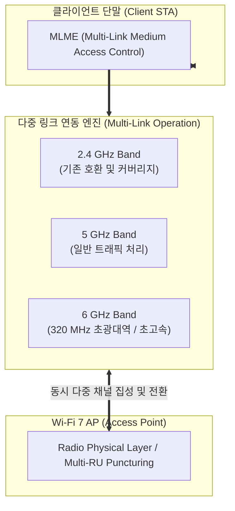

# Wi-Fi 7 (IEEE 802.11be)

---

## I. 초고속·저지연 무선 통신을 위한 차세대 무선랜 표준, Wi-Fi 7의 개요

* **정의**: IEEE 802.11be EHT(Extremely High Throughput) 표준을 기반으로 하며, 최대 30 Gbps 이상의 전송 속도와 초저지연, 고신뢰성을 제공하는 차세대 무선랜(Wi-Fi) 기술
* 고해상도 AR/VR/XR, 실시간 클라우드 게이밍, 대규모 기업형 스마트 오피스의 무선 트래픽 폭증 해소 목적
* 특징: 320 MHz 초광대역폭 지원, 4K-QAM(4096-QAM) 고밀도 변조, MLO(Multi-Link Operation) 기반 다중 대역 동시 전송

---

## II. Wi-Fi 7의 아키텍처 및 핵심 구성요소

### 가. Wi-Fi 7의 MLO 및 채널 다중화 아키텍처

* 단말이 2.4GHz, 5GHz, 6GHz 대역의 여러 링크를 동시에(MLO) 활용하여 트래픽을 분산 전송하거나 지연이 적은 채널을 동적으로 선택해 처리하는 구조

### 나. Wi-Fi 7의 핵심 기술 요소

| 분류 | 요소기술(키워드) | 세부 설명 |
| --- | --- | --- |
| 대역폭 확장 | 320 MHz 채널 (Channel) | 6 GHz 대역에서 기존 Wi-Fi 6 대비 2배 넓은 대역폭 제공으로 초고속 전송 실현 |
| 변조 기법 | 4096-QAM (4K-QAM) | 심볼당 12비트를 전송하여 Wi-Fi 6(1024-QAM) 대비 데이터 밀도 약 20% 향상 |
| 다중 연결 | MLO (Multi-Link Operation) | 여러 무선 주파수 대역과 채널을 동시에 묶거나 전환하여 지연 시간 최소화 |
| 자원 활용 | Multi-RU Puncturing | 간섭이 발생한 서브채널을 특정하여 회피하고, 남은 자원을 효율적으로 결합 활용 |
| 공간 스트림 | 16 Spatial Streams | 안테나 공간 스트림을 최대 16개까지 확장하여 물리적 전송 용량 극대화 |
| 간섭 제어 | Coordinated AP (협력 통신) | 인접 AP 간 조율을 통해 다중 셀 환경에서의 전파 간섭을 능동적으로 억제 |
| 보안 [[프로토콜]] | WPA3 Enterprise | 고도화된 [[암호화]] 알고리즘을 적용하여 엔터프라이즈 환경의 보안 [[무결성]] 보장 |
| 최신 응용 | XR 및 무선 백홀 | [[메타버스]], 8K 스트리밍 및 공장 자동화(AGV) 무선 통신망에 핵심 적용 |

---

## III. Wi-Fi 6(802.11ax) vs Wi-Fi 7(802.11be) 비교 및 최신 동향

| 비교 항목 | Wi-Fi 6 (IEEE 802.11ax) | Wi-Fi 7 (IEEE 802.11be) |
| --- | --- | --- |
| **최대 전송 속도** | 약 9.6 Gbps | 약 30 ~ 46 Gbps (이론상 최대 4배 향상) |
| **최대 채널 대역폭** | 160 MHz | **320 MHz** (6 GHz 대역 전용) |
| **변조 방식 (Modulation)** | 1024-QAM (10K) | **4096-QAM (4K-QAM)** |
| **다중 링크 지원** | 단일 링크 연결 중심 (Single-link) | **MLO (Multi-Link Operation)** 전면 도입 |

* 현재 Wi-Fi 7은 스마트폰, 노트북 및 엔터프라이즈 공유기 시장을 중심으로 상용화가 가속화되고 있으며, 향후 유선 네트워크를 대체하는 **초고속 무선 백홀** 및 **실시간 AI·XR 서비스 인프라**의 핵심 표준으로 자리 잡고 있음

---

### 🔗 연관 토픽

- **소속 도메인**: [[00_네트워크_MOC|🌐 네트워크]]
- **세부 분류**: `3. 전송 계층 & 트래픽 / 혼잡 제어 (L4)`
- **핵심 연관 토픽**:
  - [[Traffic Shaping (트래픽 쉐이핑)]]
  - [[Traffic Policing (트래픽 정책처리)]]
  - [[Wi-Fi 8|Wi-Fi 8(IEEE 802.11bn)]]
  - [[QAM(Quadrature Amplitude Modulation)--|QAM(Quadrature Amplitude Modulation)]]
  - [[무결성]]
