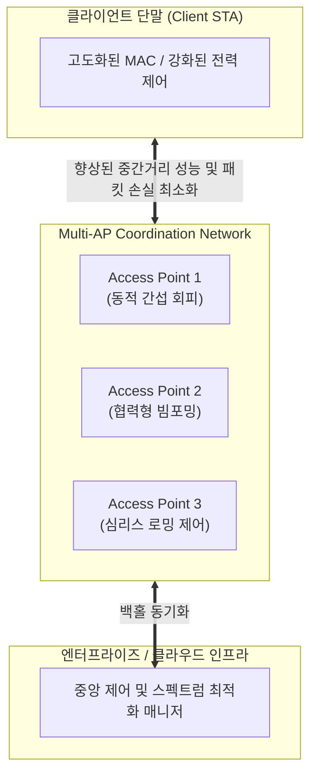

# Wi-Fi 8 (IEEE 802.11bn UHR)

---

## I. 초고신뢰성 및 유선급 연결성 보장을 위한 차세대 무선랜 표준, Wi-Fi 8의 개요

* **정의**: [[IEEE 802.11bn (Wi-Fi 8 표준)|IEEE 802.11bn]] UHR(Ultra High Reliability) 표준을 기반으로 하며, 무선 전송 속도의 무분별한 최대치 경신에서 벗어나 실제 사용 환경에서의 **[[신뢰성]](Reliability), 지연 시간 안정화 및 끊김 없는 연결**을 극대화하는 차세대 무선랜(Wi-Fi) 기술
* 고밀도 공공장소, 스마트 홈/공장 내 다중 기기 접속 시 발생하는 전파 간섭 및 지연 지터(Jitter) 해결, 무선 백홀의 안정성 확보 목적
* 특징: 최고 속도 유지보다는 **실효 [[처리량]](Median Throughput) 및 로밍 안정성 25% 향상**, 다중 AP 협력 통신(Multi-AP Coordination) 기반 전파 간섭 최소화

---

## II. Wi-Fi 8의 아키텍처 및 핵심 기술 요소

### 가. Wi-Fi 8의 다중 AP 협력 및 초고신뢰성 통신 아키텍처

* 단말과 주변 다수의 Access Point(AP)가 유기적으로 협력하여(Multi-AP Coordination), 음영 지역이나 셀 경계면에서도 전파 간섭을 억제하고 데이터 유실 없는 안정된 세션을 유지하는 구조

### 나. Wi-Fi 8의 핵심 구성 요소 및 기술 요소

| 분류 | 요소기술(키워드) | 세부 설명 |
| --- | --- | --- |
| 신뢰성 제어 | Multi-AP Coordination (다중 AP 협력) | 인접 AP 간 조율을 통해 전파 간섭을 줄이고 고밀도 환경에서 끊김 없는 통신 보장 |
| 성능 최적화 | Mid-to-Long Range Throughput | 원거리 및 장애물 환경에서의 신호 감쇠를 줄여 중간-장거리 실효 속도 개선 |
| 로밍 안정성 | Seamless Roaming (심리스 로밍) | AP 간 이동 시 핸드오버 과정에서 발생하는 패킷 드롭률을 대폭 저감 (목표 25%↓) |
| 지연 제어 | 95th Percentile Latency Reduction | 극단적인 지연(Tail Latency) 현상을 억제하여 XR 및 실시간 제어의 신뢰성 확보 |
| 자원 관리 | Enhanced EDCA (채널 액세스) | 트래픽 특성별 스마트한 채널 접근 제어를 통해 멀티미디어와 제어 신호 간 충돌 방지 |
| 양방향 균형 | Balanced Uplink Connectivity | 저전력 IoT 기기의 약한 송신 출력을 보완하여 라우터와의 양방향 링크 안정성 강화 |
| 물리계층 | [[Wi-Fi 7]] 기반 물리 계층 승계 | 최대 320 MHz 대역폭, 4096-QAM 및 최대 8개의 공간 스트림 구조 유지 계승 |
| 표준화 일정 | IEEE 802.11bn 표준화 | 2026년 드라이프 성숙화 단계를 거쳐 2028년 최종 표준 승인 및 인증 목표로 추진 중 |

---

## III. Wi-Fi 7 vs Wi-Fi 8 비교 및 전망

| 비교 항목 | Wi-Fi 7 (IEEE 802.11be) | Wi-Fi 8 (IEEE 802.11bn) |
| --- | --- | --- |
| **핵심 개발 목표** | **최대 전송 속도(Peak Throughput)** 극대화 | **초고신뢰성(Ultra-High Reliability)** 및 실효 안정성 |
| **주요 기술 초점** | 320MHz 채널, 4K-QAM, MLO 기반 대역폭 확장 | 다중 AP 협력(Multi-AP), 로밍 손실 저감, 원거리 성능 유지 |
| **적용 효과** | 압도적인 대역폭을 통한 고속 데이터 다운로드 | 대규모 기기 접속 환경 및 실시간 서비스의 **지연 지터(Jitter) 제거** |

* Wi-Fi 8은 단순한 속도 경쟁에서 탈피하여, 스마트 홈의 수많은 IoT 기기, 스마트 팩토리, 원격 의료 등 **단 1초의 끊김도 허용되지 않는 미션 크리티컬(Mission-Critical) 영역**에서 유선 네트워크 수준의 결정론적(Deterministic) 신뢰성을 제공하는 핵심 무선 인프라로 진화 중임

---

### 🔗 연관 토픽

- **소속 도메인**: [[00_네트워크_MOC|🌐 네트워크]]
- **세부 분류**: `3. 전송 계층 & 트래픽 / 혼잡 제어 (L4)`
- **핵심 연관 토픽**:
  - [[IEEE 802.11bn (Wi-Fi 8 표준)]]
  - [[Wi-Fi 7|WI-FI 7 (IEEE 802.11be)]]
  - [[신뢰성]]
  - [[처리량]]
  - [[Traffic Shaping (트래픽 쉐이핑)]]
