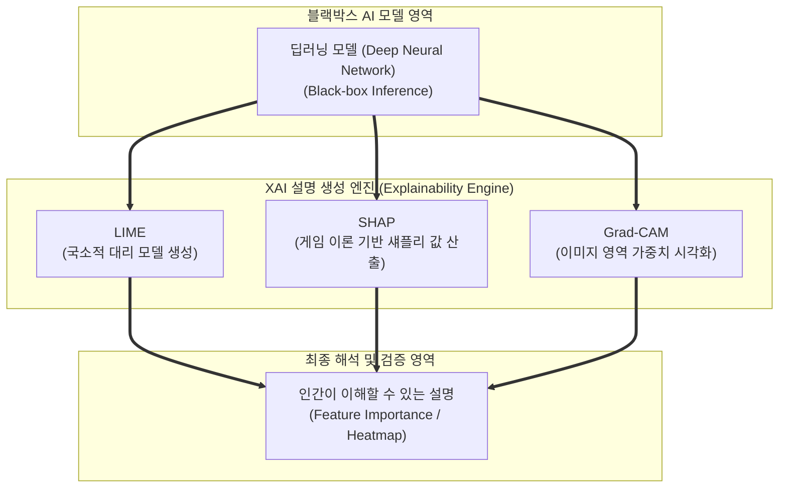

# XAI (Explainable Artificial Intelligence, 설명 가능한 인공지능)

---

## I. 블랙박스 AI의 한계 극복과 신뢰성 확보를 위한 투명한 인공지능 기술, XAI의 개요

* **정의**: 복잡한 [[딥러닝]] 모델(블랙박스)의 예측 및 의사결정 과정을 인간이 이해할 수 있는 형태의 근거, 시각화, 혹은 간소화된 설명으로 제공하여 신뢰성과 투명성을 보장하는 차세대 [[인공지능]] 기술
* AI 모델의 의사결정 과정에 대한 '블랙박스(Black-box)' 문제 해결, 금융·의료·[[Smart Car(자율주행)|자율주행]] 등 고위험(High-Risk) 영역에서의 책임성 및 규제 대응 목적
* 특징: 사후 설명력(Post-hoc Explainability) 제공, 모델 자체의 투명성(Inherently Interpretable) 확보, [[LIME]]·SHAP 등 다양한 해석 방법론 적용

---

## II. XAI의 아키텍처 및 핵심 기술 요소

### 가. XAI의 분석 프로세스 및 동작 아키텍처

* 블랙박스 딥러닝 모델의 추론 결과와 입력 데이터를 LIME, SHAP, Grad-CAM 등의 XAI 엔진이 분석하여, 특성 중요도(Feature Importance)나 히트맵 형태의 직관적인 설명 결과로 도출하는 구조

### 나. XAI의 핵심 구성 요소 및 기술 요소

| 분류 | 요소기술(키워드) | 세부 설명 |
| --- | --- | --- |
| 국소적 대리 모델 | LIME (Local Interpretable Model-agnostic Explanations) | 개별 예측 주변에 선형 등 단순한 대리 모델을 국소적으로 적용하여 설명 |
| 게임 이론 기반 | SHAP (SHapley Additive exPlanations) | 협조 게임 이론을 활용해 각 입력 변수가 최종 예측값에 기여한 기여도(값) 산출 |
| 이미지 시각화 | Grad-CAM (Gradient-weighted Class Activation Mapping) | 합성곱 신경망([[CNN]])의 그래디언트를 활용해 이미지 내 중요 영역을 히트맵으로 시각화 |
| 고유 투명성 모델 | 선형 모델 / 의사결정 나무 (White-box) | [[알고리즘]] 구조 자체가 수학적으로 투명하여 별도의 설명 기법이 불필요한 모델 |
| 글로벌 설명 | PDP (Partial Dependence Plot) / ICE | 특정 특성이 전체 모델 예측 결과에 미치는 평균적 비선형 관계를 그래프로 표현 |
| 규제 대응 | EU AI Act 고위험 AI 규정 준수 | 의료, 금융, 인사 등 규제 영역에서 AI 판정 사유 및 오류 검증 수단으로 의무화 |
| 최신 트렌드 | [[초거대 언어 모델|LLM]] 기반 자연어 설명 (Self-Explainable LLM) | 거대언어모델이 추론 과정과 근거를 체인오브소트([[COT|CoT]]) 형태로 스스로 서술 |
| 평가 방법 | Faithfulness / Human Evaluation | 생성된 설명이 실제 블랙박스 모델의 내부 작동을 충실히 반영하는지 검증 |

---

## III. 전통적 블랙박스 모델 vs XAI (설명 가능한 인공지능) 비교 및 동향

| 비교 항목 | 전통적 블랙박스 AI (Black-box AI) | 설명 가능한 인공지능 (XAI) |
| --- | --- | --- |
| **의사결정 투명성** | 내부 연산 과정이 복잡하여 결과의 도출 근거를 추적하기 어려움 | 예측 결과에 대한 기여도, 근거 및 시각화 설명 제공 |
| **[[신뢰성]] 및 책임성** | 오작동(Hallucination 등) 발생 시 원인 규명 및 책임 소재 불분명 | 오류 분석, [[편향]](Bias) 검출 및 디버깅 용이 |
| **주요 활용 분야** | 단순 추천 시스템, 패턴 인식, 범용 콘텐츠 생성 | 의료 진단, 금융 대출 심사, 자율주행, 법률 및 공공 서비스 |

* 최근 인공지능의 활용 범위가 전 산업의 고위험(High-Risk) 의사결정 영역으로 확대되고 유럽연합(EU)의 AI 법안 등 규제가 강화됨에 따라, XAI는 선택이 아닌 **AI 신뢰성(Trustworthiness) 확보를 위한 필수 아키텍처**로 자리 잡고 있음

---

### 🔗 연관 토픽

- **소속 도메인**: [[00_인공지능_MOC|🤖 인공지능]]
- **세부 분류**: `6. 설명가능한 AI (XAI) & AI 윤리 · 거버넌스`
- **핵심 연관 토픽**:
  - [[편향]]
  - [[LIME]]
  - [[딥러닝]]
  - [[인공지능]]
  - [[알고리즘]]
