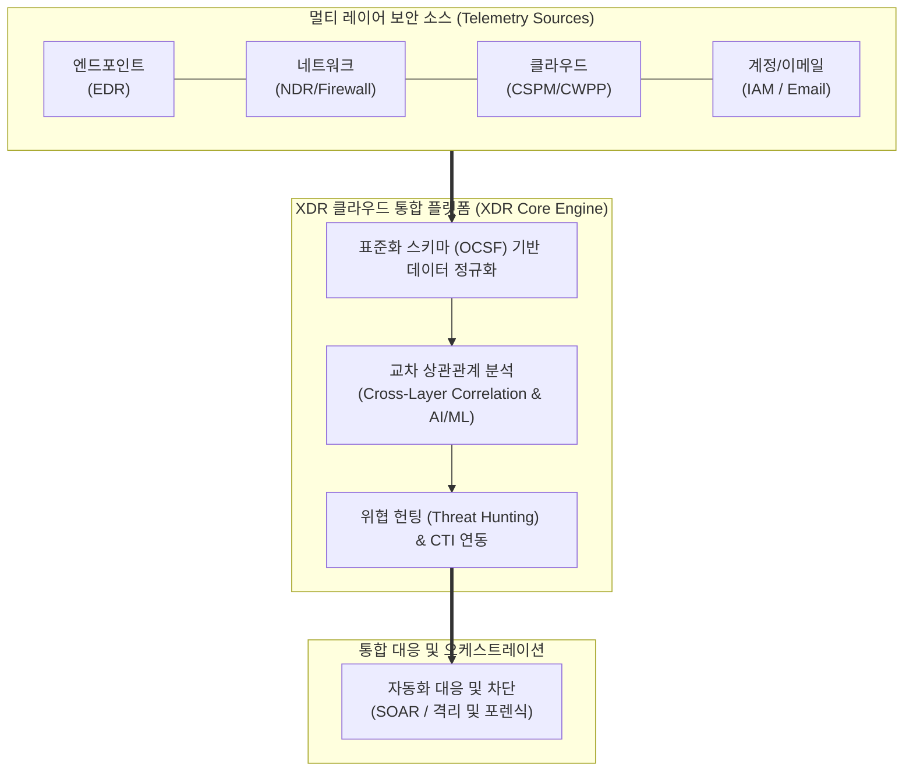

# XDR (eXtended Detection and Response, 확장형 탐지 및 대응)

---

## I. 멀티 레이어 위협의 통합 가시성 확보와 신속한 대응을 위한 차세대 보안 아키텍처, XDR의 개요

* **정의**: 엔드포인트([[EDR(Endpoint Detection and Response)|EDR]]), 네트워크, 클라우드, 이메일, 계정(Identity) 등 분산된 보안 영역의 텔레메트리(Telemetry)를 네이티브하게 수집·통합하여, 교차 상관관계 분석을 통해 지능형 위협을 탐지하고 자동 대응하는 클라우드 기반 통합 보안 솔루션
* 기존 단일 포인트 보안 솔루션(EDR, [[SIEM]] 등)의 사각지대 발생, 경보 피로도(Alert Fatigue) 및 분석 지연 극복 목적
* 특징: 크로스 레이어(Cross-Layer) 통합 가시성, AI/ML 기반 지능형 위협 상관분석, [[SOAR (Security Orchestration, Automation and Response)|SOAR]] 연계 자동화 대응

---

## II. XDR의 아키텍처 및 핵심 기술 요소

### 가. XDR의 다층 구조 텔레메트리 수집 및 상관분석 아키텍처

* 엔드포인트, 네트워크, 클라우드 등 다양한 소스에서 수집된 이질적 로그와 이벤트를 표준화(OCSF)하고, XDR 코어 엔진에서 교차 상관관계를 분석하여 지능형 위협을 식별한 뒤 자동 대응하는 구조

### 나. XDR의 핵심 기술 및 구성 요소

| 분류 | 요소기술(키워드) | 세부 설명 |
| --- | --- | --- |
| 수집 계층 | 크로스 레이어 텔레메트리 (Cross-Layer) | 엔드포인트, 네트워크, 클라우드 등 전방위적 보안 데이터를 단일 플랫폼으로 통합 수집 |
| [[데이터 표준화]] | OCSF (Open Cybersecurity Schema) | 이질적인 보안 로그와 이벤트를 상호 연동 가능한 단일 포맷으로 정규화 |
| 연관 분석 | 교차 상관관계 분석 (Cross-Correlation) | 단일 영역에서는 탐지하기 어려운 은밀한 지능형 지속 위협(APT)의 연계 흐름을 추적 |
| 지능형 탐지 | AI/ML 기반 행위 분석 (UEBA) | 사용자 및 개체의 비정상적인 행위 패턴을 학습하여 제로데이(0-day) 공격 탐지 |
| 위협 인텔리전스 | [[CTI]] 연동 및 [[위협 헌팅]] | 최신 글로벌 위협 정보(Indicators of Compromise)와 실시간 대조 및 능동적 추적 |
| 자동화 대응 | SOAR 연계 및 격리 조치 | 위협 탐지 시 [[프로세스]] 종료, 네트워크 차단, 계정 잠금 등 즉각적인 대응 자동화 |
| 아키텍처 | [[클라우드 네이티브]] SaaS | 확장성이 높고 분산 환경에서도 실시간 데이터 처리와 분석이 가능한 SaaS 기반 운영 |
| 개방형 생태계 | Open XDR 및 API 연동 | 타사(Third-party) 보안 솔루션과 유연하게 연동하여 종속성(Lock-in)을 탈피하는 구조 |

---

## III. EDR vs SIEM vs XDR 비교 및 최신 동향

| 비교 항목 | EDR (Endpoint Detection) | SIEM (Security Information...) | XDR (Extended Detection...) |
| --- | --- | --- | --- |
| **보호 범위** | 엔드포인트(PC, 서버) 단일 영역 중심 | 전사 인프라의 대규모 로그 수집 및 저장 | 엔드포인트 + 네트워크 + 클라우드 + 계정 통합 |
| **탐지 및 분석** | 엔드포인트 내부 행위 및 프로세스 추적 | 수동 작성된 룰(Rule) 기반 로그 검색 및 상관분석 | 멀티 레이어 교차 상관관계 분석 및 AI 기반 자동 탐지 |
| **대응 자동화** | 엔드포인트 단위 격리 및 복구 중심 | 알림(Alert) 발생 시 수동 조사 또는 타 시스템 연계 필요 | 다중 채널 동시 차단 및 SOAR 기반 완벽한 자동 대응 |

* 최근 단일 벤더의 폐쇄성을 극복하기 위한 **Open XDR** 표준화가 가속화되고 있으며, 생성형 AI를 활용한 자연어 기반 위협 헌팅 및 **제로 트러스트([[제로 트러스트 보안모델|Zero Trust]])** 아키텍처와 결합된 실시간 보안 운영(SecOps) 체계로 고도화되는 추세임

---

### 🔗 연관 토픽

- **소속 도메인**: [[00_보안_MOC|🛡️ 보안]]
- **세부 분류**: `2. 현대 암호학 & 키 관리 · 전자서명`
- **핵심 연관 토픽**:
  - [[제로 트러스트 보안모델|제로 트러스트 (Zero Trust) 보안모델]]
  - [[SIEM]]
  - [[위협 헌팅|위협 헌팅(Threat Hunting)]]
  - [[EDR(Endpoint Detection and Response)]]
  - [[RaaS(Ransomware as a Service)]]
