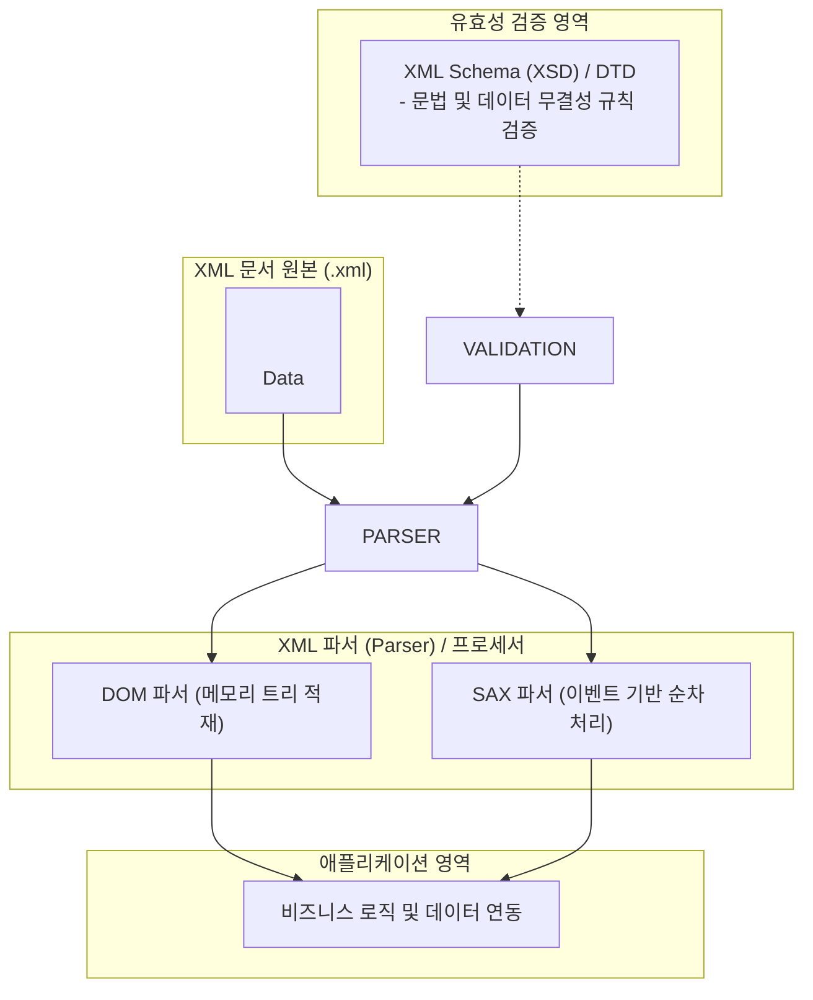

# XML (Extensible Markup Language)

---

## I. 웹 환경에서 구조화된 데이터 교환과 저장을 위한 메타 마크업 언어, XML의 개요

* **정의**: W3C에서 표준화한 텍스트 기반의 마크업 언어로, 사용자가 직접 태그를 정의하여 이기종 시스템 간에 구조화된 데이터를 교환하고 저장할 수 있도록 지원하는 범용 메타언어
* 웹 브라우저 간 표현 중심인 HTML의 한계를 극복하고, 데이터의 의미(Semantic)와 구조를 명확히 기술하여 상호운용성 확보 목적
* 특징: 확장 가능한 커스텀 태그 정의, 트리 구조의 계층적 데이터 표현, 플랫폼 및 하드웨어 독립성 보장

---

## II. XML의 아키텍처 및 핵심 기술 요소

### 가. XML의 문서 구조 및 파싱 처리 아키텍처

* XML 원본 문서가 [[스키마]](XSD/DTD) 검증을 거쳐 DOM 또는 SAX 파서로 유입된 뒤, 메모리 구조나 이벤트 스트림으로 변환되어 애플리케이션에 전달되는 구조

### 나. XML의 핵심 구성 요소 및 기술 요소

| 분류 | 요소기술(키워드) | 세부 설명 |
| --- | --- | --- |
| 문서 구조 | 루트 요소 (Root Element) | 모든 하위 요소를 포함하는 단 하나의 최상위 태그 |
| 데이터 표현 | 태그 및 속성 (Tag / Attribute) | 데이터의 의미와 구조를 정의하는 꺾쇠괄호(`< >`) 기반의 식별자 |
| [[무결성]] 검증 | XML Schema (XSD) / DTD | 문서의 구조, 데이터 타입, 제약 조건을 정의하여 유효성(Valid) 검증 |
| 문서 변환 | XSL / XSLT | XML 문서를 HTML이나 다른 포맷의 문서로 변환하는 스타일시트 언어 |
| 경로 탐색 | XPath / XPointer | XML 문서 내 특정 노드나 요소의 위치를 지정하고 탐색하기 위한 질의 언어 |
| 네임스페이스 | XML Namespace (xmlns) | 동일한 이름의 태그 충돌을 방지하기 위해 URI 기반의 고유 식별 접두사 부여 |
| 파싱 방식 | DOM vs SAX | 전체 문서를 트리로 적재(DOM)하거나 이벤트 단위로 순차 처리(SAX) |
| 최신 트렌드 | 문서 포맷 및 API 표준 (SOAP 등) | 오피스 문서(.docx 등)의 기반 포맷 및 레거시 웹 서비스(SOAP) 메시지 규격 활용 |

---

## III. XML vs JSON 비교 및 최신 동향

| 비교 항목 | XML (Extensible Markup Language) | [[JSON]] (JavaScript Object Notation) |
| --- | --- | --- |
| **데이터 표현** | 태그 기반의 트리 구조 (마크업 형태) | Key-Value 및 배열 기반의 경량 텍스트 구조 |
| **가독성 및 용량** | 태그 반복으로 인해 데이터 크기가 상대적으로 **무겁고 장황함** | 문법이 단순하여 데이터 용량이 **가볍고 가독성이 높음** |
| **스키마 및 검증** | XSD, DTD를 통한 강력한 정적 유효성 검증 지원 | 별도의 표준 스키마(JSON Schema)가 존재하나 상대적으로 단순함 |
| **주요 활용 영역** | 기업간 문서 교환, 문서 서식 규격(Office), 설정 파일 | 현대 웹/모바일 API, RESTful 서비스, 마이크로서비스 통신 |

* 현대의 대다수 웹/모바일 API 환경은 가볍고 빠른 JSON으로 전환되었으나, XML은 엄격한 스키마 검증과 복잡한 문서 구조 표현 능력을 바탕으로 기업 간 전자문서([[EDI]]), 공공 표준, 문서 파일 포맷(OOXML) 영역에서 핵심 표준으로 건재함

---

### 🔗 연관 토픽

- **소속 도메인**: [[00_소프트웨어공학_MOC|🏗️ 소프트웨어공학]]
- **세부 분류**: `6. 소프트웨어 테스팅 & 품질 보증 (QA/QC)`
- **핵심 연관 토픽**:
  - [[JSON]]
  - [[EDI]]
  - [[SBOM]]
  - [[AJAX]]
  - [[Annotation]]
