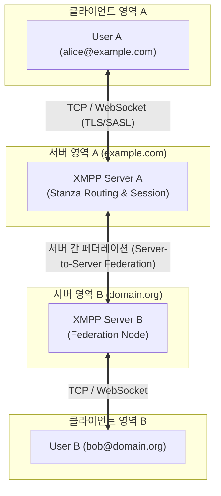

# XMPP (eXtensible Messaging and Presence Protocol)

---

## I. 개방형 XML 기반 실시간 메시징 및 상태 전송 표준 프로토콜, XMPP의 개요

* **정의**: [[XML]](Extensible Markup Language)을 기반으로 인스턴트 메신저(IM), 상태 정보(Presence), 연락처 관리 등을 실시간으로 처리하기 위해 IETF에서 표준화한 개방형 통신 [[프로토콜]]
* 중앙집중형 메신저의 폐쇄성 극복, 이기종 시스템 간 탈중앙화된 페더레이션(Federation) 및 확장 가능한 실시간 데이터 교환 목적
* 특징: 클라이언트-서버 아키텍처, XML 스트자(Stanza) 기반 메시징, XEP(XMPP Extension Protocols)를 통한 무한한 기능 확장성

---

## II. XMPP의 아키텍처 및 핵심 기술 요소

### 가. XMPP의 클라이언트-서버 및 페더레이션 아키텍처

* 사용자가 클라이언트와 XMPP 서버 간에 [[TCP]] 또는 WebSocket(TLS/SASL 보안 적용)을 통해 연결을 맺고, 서버 간 페더레이션(S2S)을 통해 서로 다른 도메인 간에도 XML 스트자를 실시간 라우팅하는 구조

### 나. XMPP의 핵심 구성 요소 및 기술 요소

| 구분 | 핵심 기술 | 설명 |
| --- | --- | --- |
| 기본 단위 | 메시지 스트자 (Message Stanza) | 채팅 메시지를 푸시 방식으로 상대방에게 전달하는 핵심 XML 데이터 단위 |
| 상태 관리 | 프레세스 스트자 (Presence Stanza) | 사용자의 접속 상태(Online, Away 등)를 네트워크와 상대방에게 브로드캐스팅 |
| 질의 응답 | IQ 스트자 (Info/Query Stanza) | 요청-응답(Request-Response) 구조로 정보 조회, 인증, 데이터 설정 수행 |
| 주소 체계 | JID (Jabber ID) | `user@domain/resource` 형태로 사용자 계정과 위치를 식별하는 고유 주소 체계 |
| 보안 인증 | SASL 및 TLS / OMEMO | 계정 인증(SASL), 전송 구간 [[암호화]](TLS) 및 종단간 암호화(OMEMO XEP) 지원 |
| 프로토콜 확장 | XEP (XMPP Extension Protocols) | 화상회의(Jingle), 그룹챗(MUC), IoT 등 수백 가지 확장 규격 정의 및 지원 |
| 전송 바인딩 | RFC 7395 (WebSocket Binding) | 브라우저 및 웹 환경에서 HTTP/WebSocket을 통해 XMPP 스트림을 원활히 지원 |
| 최신 트렌드 | IoT 및 푸시 알림 연계 | 가벼운 구조와 PubSub 확장을 활용하여 스마트홈 및 실시간 메신저 인프라로 고도화 |

---

## III. XMPP vs MQTT 비교 및 동향

| 비교 항목 | XMPP (Extensible Messaging...) | [[MQTT (Message Queuing Telemetry Transport)]] |
| --- | --- | --- |
| **기반 기술** | XML 기반 텍스트 스트림 프로토콜 | 바이너리 기반 경량 메시징 프로토콜 |
| **통신 모델** | 클라이언트-서버 및 도메인 간 페더레이션 | 발행-구독 (Pub-Sub) 및 브로커 중심 |
| **오버헤드** | XML 태그 구조로 인해 네트워크 대역폭 소비가 상대적으로 큼 | 최소 2바이트의 극단적으로 작은 헤더 크기로 저전력 최적화 |
| **주요 활용 분야** | 인스턴트 메신저, 협업툴, 실시간 채팅, 엔터프라이즈 통신 | 사물인터넷(IoT), 센서 데이터 수집, 저전력 임베디드 환경 |

* 초기 웹 메신저와 Jabber 기반에서 출발한 XMPP는 XML의 무거운 오버헤드와 모바일 환경에서의 전력 소모 한계로 인해 단순 IoT 영역에서는 MQTT 등에 자리를 양보했으나, **WebSocket 바인딩과 강력한 XEP 확장성**을 바탕으로 기업용 메신저 및 보안 중심의 실시간 커뮤니케이션 표준으로 견고한 입지를 유지하고 있음

---

### 🔗 연관 토픽

- **소속 도메인**: [[00_네트워크_MOC|🌐 네트워크]]
- **세부 분류**: `1. OSI 7계층 & 데이터링크 계층 (L1/L2)`
- **핵심 연관 토픽**:
  - [[MQTT (Message Queuing Telemetry Transport)]]
  - [[프로토콜]]
  - [[TCP]]
  - [[게이트웨이]]
  - [[DNS(Domain Name System)]]
