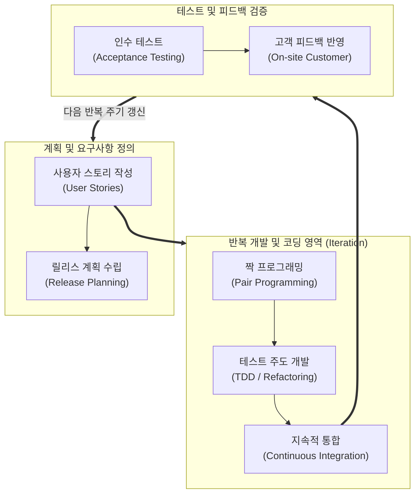

# XP (eXtreme Programming)

---

## I. 변화에 유연하고 고객 가치를 극대화하는 애자일 소프트웨어 개발 방법론, XP의 개요

* **정의**: 불확실하고 변경이 잦은 요구사항에 대응하기 위해 개발 주기를 짧게 가져가며, 피드백을 신속히 수용하고 소스코드의 품질을 극대화하는 경량형([[Agile]]) [[소프트웨어 개발 방법론]]
* 기존의 무겁고 문서 중심적인 [[워터폴|폭포수]] 모델의 한계를 극복하고, 개발 실천법(Practices)을 통해 소프트웨어 유지보수성과 품질을 높이기 위한 목적
* 특징: 4가지 핵심 가치(소통, 단순성, 피드백, 용기) 기반, 12가지 구체적인 실천 지침(Practices) 준수, 테스트 주도 개발([[TDD]]) 및 짝 프로그래밍 중심

---

## II. XP의 아키텍처 및 핵심 기술 요소

### 가. XP의 피드백 루프 및 개발 라이프사이클 아키텍처

* 고객이 작성한 사용자 스토리를 바탕으로 릴리스와 이터레이션을 계획하고, 짝 프로그래밍과 TDD를 통해 코드를 구현한 뒤 지속적 통합과 인수 테스트를 거쳐 신속하게 피드백을 반영하는 구조

### 나. XP의 핵심 구성 요소 및 기술 요소

| 분류 | 요소기술(키워드) | 세부 설명 |
| --- | --- | --- |
| 설계 원칙 | 단순한 설계 (Simple Design) | 현재 필요한 기능만 구현하고 불필요한 복잡성을 제거하여 코드 단순화 |
| 코딩 표준 | 코딩 표준 (Coding Standard) | 팀원 전체가 단일화된 스타일로 코드를 작성하여 가독성 및 협업 효율 제고 |
| 구현 기법 | 짝 프로그래밍 (Pair Programming) | 두 명의 개발자가 한 PC에서 코딩(Driver)과 검토(Navigator)를 동시에 수행 |
| 테스트 기법 | TDD (Test-Driven Development) | 실패하는 테스트를 먼저 작성한 후 코드를 구현하고 리팩토링하는 개발 방식 |
| 구조 개선 | 리팩토링 (Refactoring) | 외부 동작은 유지하면서 내부 코드를 깔끔하고 효율적으로 구조 개선 |
| 통합 자동화 | 지속적 통합 (Continuous Integration) | 개발된 코드를 수시로 빌드하고 자동화 테스트를 수행하여 통합 오류 예방 |
| 고객 참여 | 현장 고객 (On-site Customer) | 고객이 개발 팀에 상주하며 실시간으로 요구사항을 확인하고 우선순위 결정 |
| 소유권 공유 | 공동 코드 소유권 (Collective Ownership) | 팀의 모든 개발자가 전체 코드베이스를 수정하고 개선할 수 있는 권한 보유 |

---

## III. XP 실천법의 현대적 가치 및 애자일/DevOps 연계 동향

| 비교 항목 | 전통적 XP 실천법 (Classic XP) | 현대적 애자일 및 [[DevOps]] 연계 XP |
| --- | --- | --- |
| **자동화 환경** | 로컬 환경 중심의 [[단위 테스트]] 및 수동 빌드 | CI/CD Pipeline을 활용한 완전 자동화된 빌드, 테스트 및 배포 |
| **고객 협업** | 현장 고객 상주 중심의 대면 커뮤니케이션 | 디지털 백로그(Jira 등) 및 원격 실시간 협업 툴 기반 소통 |
| **적용 범위** | 소규모 팀 단위의 코딩 프랙티스 중심 | 대규모 엔터프라이즈 애자일(SAFe 등) 및 DevOps 문화의 기술적 근간 |

* 초기 XP의 핵심 프랙티스(TDD, CI, 짝 프로그래밍)는 오늘날 DevOps 파이프라인과 익스트림 리팩토링, AI [[페어 프로그래밍]](GitHub Copilot 등)의 기술적 근간으로 진화하여 고품질 소프트웨어 생산의 표준 실천법으로 자리 잡고 있음

---

### 🔗 연관 토픽

- **소속 도메인**: [[00_프로젝트관리_MOC|📋 프로젝트관리]]
- **세부 분류**: `4. 품질 보증 · 위험 관리 & 정보시스템 감리`
- **핵심 연관 토픽**:
  - [[소프트웨어 개발 방법론]]
  - [[Agile]]
  - [[TDD|TDD (Test Driven Development)]]
  - [[페어 프로그래밍|페어 프로그래밍 (Pair Programming)]]
  - [[워터폴]]
