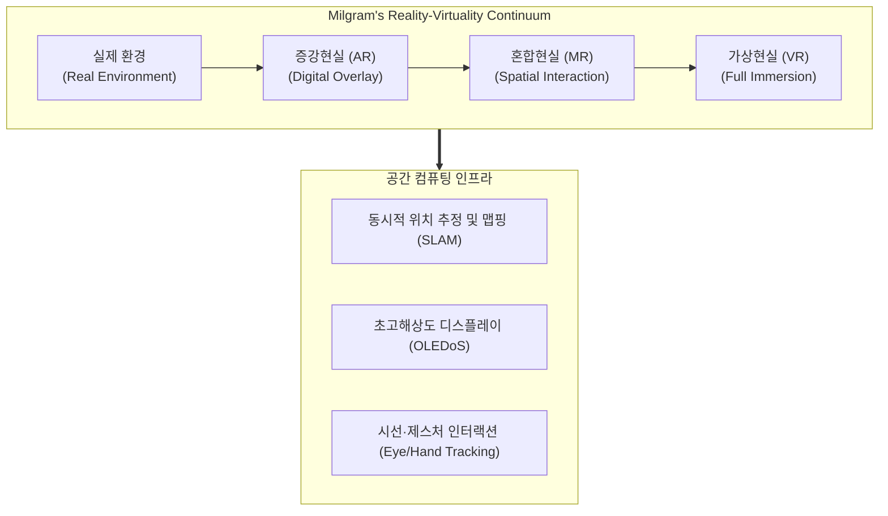

# XR (Extended Reality) 유형

---

## I. 현실과 가상의 연속성 기반 공간 컴퓨팅 융합 기술, XR 유형의 개요

* **정의**: 현실 세계와 가상 세계를 시공간적 제약 없이 연결하고 융합하는 포괄적 기술인 확장현실(XR)의 세부 유형으로, 몰입도와 상호작용성에 따라 VR, AR, MR 등으로 분류하는 기술 체계
* [[메타버스]], 공간 컴퓨팅(Spatial Computing) 및 초실감형 인터페이스 구현 목적
* 특징: 밀그램(Milgram)의 현실-가상 연속체(Reality-Virtuality Continuum) 기반 분류, 디지털 정보와 물리적 공간의 실시간 동기화

---

## II. XR의 분류 체계 및 핵심 기술 요소

### 가. XR 유형별 분류 아키텍처 및 동작 원리

* 실제 환경에서 출발하여 디지털 정보가 단순 중첩되는 AR, 물리 객체와 가상이 상호작용하는 MR을 거쳐 완전히 가상화된 VR에 이르는 연속선 상에서, SLAM과 OLEDoS 등의 공간 컴퓨팅 기술을 통해 구현되는 구조

### 나. XR 유형별 핵심 기술 및 구성 요소

| 분류 | 요소기술(키워드) | 세부 설명 |
| --- | --- | --- |
| **VR (가상현실)** | 완전 몰입형 환경 (Full Immersion) | 외부 현실을 완전히 차단하고 가상 공간 시뮬레이션을 제공하는 헤드셋 중심 기술 |
| **AR (증강현실)** | 정보 오버레이 (Digital Overlay) | 현실 세계의 시야 위에 실시간 디지털 정보, 텍스트, 그래픽을 중첩하여 제공 |
| **MR (혼합현실)** | 공간 상호작용 (Spatial Interaction) | 가상 객체가 물리적 사물(벽, 책상 등)과 가려짐(Occlusion) 처리 등 실시간 물리 반응 수행 |
| **공간 인식** | SLAM (동시적 위치 및 맵핑) | 카메라 및 센서를 통해 주변 공간을 3차원으로 실시간 인식하고 단말 위치 추적 |
| **디스플레이** | OLEDoS (Silicon OLED) | 마이크로 디스플레이 기반의 초고해상도(수천 ppi) 구현으로 픽셀 격자 현상 극복 |
| **광학계** | 팬케이크 렌즈 (Pancake Lens) | 여러 장의 반사 렌즈를 활용하여 광학 경로를 단축하고 기기를 소형·경량화 |
| **인터랙션** | 핸드/아이 트래킹 (Gesture/Eye) | 컨트롤러 없이 맨손 제스처와 시선 응시만으로 직관적인 UI 제어 지원 |
| **표준 플랫폼** | WebXR 및 공간 OS | 브라우저 기반 XR 표준 API 및 visionOS / Horizon OS 등 공간 컴퓨팅 [[OS(운영체제)|운영체제]] |

---

## III. XR 유형별 비교 및 최신 동향

| 비교 항목 | VR (가상현실) | AR (증강현실) | MR (혼합현실) |
| :--- | :--- | :--- |
| **시야 차단 여부** | 외부 현실 완전 차단 (O) | 투과형 광학계로 현실 시야 유지 (X) | 비디오 시스루(VST) 등으로 현실과 가상 결합 (Mixed) |
| **가상 객체 상호작용** | 가상 공간 내부에서만 제한적 상호작용 | 단순 시각적 중첩 중심 | 물리 공간 및 오브젝트와 실시간 동적 상호작용 |
| **주요 하드웨어** | VR 헤드셋 (Meta Quest 등) | 스마트 글래스 (Smart Glasses) | 스페이셜 헤드셋 (Apple Vision Pro 등) |

* 과거 하드웨어 중심의 대형 VR/AR 기기 경쟁에서 벗어나, 최근에는 **가벼운 AI 스마트 글래스**와 **공간 컴퓨팅(Spatial Computing)** 플랫폼이 융합되면서 일상 속 상시 착용이 가능한 실시간 AI 에이전트 연계형 XR 생태계로 빠르게 진화 중임

---

### 🔗 연관 토픽

- **소속 도메인**: [[00_디지털서비스_MOC|🚀 디지털서비스]]
- **세부 분류**: `3. 사물인터넷 (IoT) & 스마트 플랫폼 · 메타버스`
- **핵심 연관 토픽**:
  - [[메타버스|메타버스 (Metaverse)]]
  - [[OS(운영체제)]]
  - [[디지털 트윈|디지털 트윈 (Digital Twin)]]
  - [[Smart Car(자율주행)]]
  - [[ISO 26262]]
