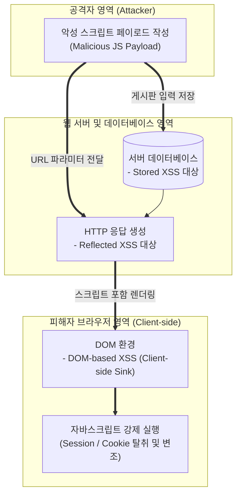

# XSS (Cross-Site Scripting, 크로스 사이트 스크립팅)

---

## I. 웹 애플리케이션 클라이언트 취약점인 악성 스크립트 삽입 공격, XSS의 개요

* **정의**: 공격자가 취약한 웹 페이지에 악성 자바스크립트(JavaScript) 코드를 삽입하여, 해당 페이지를 방문하는 사용자의 브라우저에서 코드가 실행되도록 함으로써 [[세션]] 탈취, [[쿠키]] 유출, 권한 도용 등을 유발하는 대표적인 웹 취약점 및 공격 기법
* 사용자 입력값에 대한 검증 및 출력 인코딩 부재를 악용하여 웹 애플리케이션의 신뢰성을 무력화하기 위한 목적
* 특징: 클라이언트 측 실행(Client-side Execution), 서버가 아닌 사용자 브라우저 탈취, 저장 여부 및 실행 경로에 따라 Stored, Reflected, DOM-based XSS로 분류

---

## II. XSS의 취약점 아키텍처 및 핵심 기술 요소

### 가. XSS의 유형별 공격 경로 및 동작 아키텍처

* 공격자가 전달한 악성 스크립트가 서버에 저장(Stored), 즉시 반영(Reflected), 또는 클라이언트 DOM 객체 조작(DOM-based)을 통해 피해자의 브라우저에 도달한 뒤 세션 권한으로 무단 실행되는 구조

### 나. XSS의 핵심 구성 요소 및 대응 기술 요소

| 분류 | 요소기술(키워드) | 세부 설명 |
| --- | --- | --- |
| 취약점 유형 | 저장형 XSS (Stored XSS) | 악성 스크립트가 DB에 영구 저장되어 해당 페이지를 열람하는 모든 사용자에게 실행 |
| 취약점 유형 | 반사형 XSS (Reflected XSS) | 악성 스크립트가 포함된 URL 요청이 즉시 서버 응답에 포함되어 피해자 브라우저에서 실행 |
| 취약점 유형 | DOM 기반 XSS (DOM XSS) | 서버를 거치지 않고 클라이언트 측 자바스크립트 취약점으로 인해 DOM 환경에서 직접 발현 |
| 방어 기법 | 출력 인코딩 (Output Encoding) | 사용자 입력 데이터가 HTML, JavaScript, URL 컨텍스트에 맞지 않게 해석되지 않도록 특수문자를 엔티티로 변환 |
| 방어 기법 | [[CSP]] (Content Security Policy) | 웹페이지에서 로드할 수 있는 스크립트의 출처를 화이트리스트 기반으로 제한하여 무단 실행 차단 |
| 쿠키 보호 | HttpOnly / Secure 속성 | 세션 쿠키에 `HttpOnly`를 설정하여 자바스크립트를 통한 쿠키 탈취(Document.cookie) 원천 차단 |
| 입력 검증 | 입력값 검증 및 필터링 | 허용된 문자열 및 형식(Allow-list)만을 입력받도록 유효성 검증 수행 |
| 최신 트렌드 | Trusted Types API | 브라우저 레벨에서 안전하지 않은 DOM Sink(`innerHTML` 등)로의 문자열 할당을 제어하고 실패 처리 |

---

### III. XSS의 유형별 비교 및 시큐어 코딩 대응 방안

| 비교 항목 | Stored XSS (저장형) | Reflected XSS (반사형) | DOM-based XSS (DOM 기반) |
| --- | --- | --- | --- |
| **스크립트 저장 위치** | 서버 [[데이터베이스]] 또는 파일 시스템 (영구) | 저장되지 않음 (URL 파라미터 등을 통해 일회성 반사) | 서버에 저장되지 않고 클라이언트 브라우저 DOM 내부에서 처리 |
| **파급 효과 및 범위** | 매우 높음 (페이지 방문자 전원에게 무차별 피해) | 중간 (피해자가 악성 링크를 클릭하도록 유도 필요) | 중간~높음 (클라이언트 취약한 스크립트 로직에 종속) |
| **근본적 대응 방안** | 입력 시 철저한 검증 및 출력 시 컨텍스트별 HTML [[엔티티]] 인코딩 적용 | URL 파라미터 및 에러 메시지 출력 부위의 엄격한 출력 인코딩 | 위험한 DOM Sink 사용 지양 (`innerHTML` 대신 `textContent` 사용 등) |

* XSS 취약점은 단순한 스크립트 실행을 넘어 사용자 세션 탈취 및 계정 탈당 등 치명적인 피해로 이어질 수 있으므로, 단일 방어선이 아닌 **입력값 필터링, 문맥별 출력 인코딩, HttpOnly 쿠키 설정 및 강력한 CSP 도입** 등 다중 보안 체계(Defense-in-Depth) 적용이 필수적임

---

### 🔗 연관 토픽

- **소속 도메인**: [[00_보안_MOC|🛡️ 보안]]
- **세부 분류**: `2. 현대 암호학 & 키 관리 · 전자서명`
- **핵심 연관 토픽**:
  - [[세션]]
  - [[쿠키]]
  - [[CSRF]]
  - [[크로스 사이트 스크립팅]]
  - [[사이트간 위조공격]]
