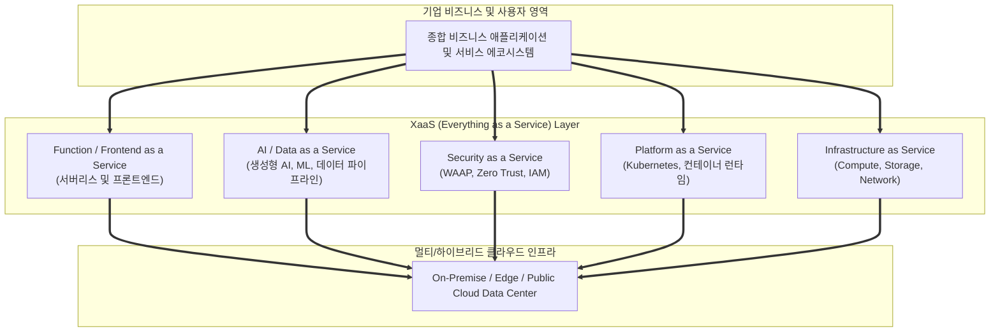

# XaaS (Everything as a Service, 사물/모든 서비스화)

---

## I. 클라우드 컴퓨팅 기반 IT 자원의 완전한 서비스형 패러다임, XaaS의 개요

* **정의**: 서버, 스토리지 등 전통적인 인프라(IaaS)를 넘어 소프트웨어(SaaS), 플랫폼(PaaS)뿐만 아니라 데이터(DaaS), [[인공지능]](AIaaS), 보안(SECaaS) 등 모든 비즈니스 기능과 IT 자원을 클라우드를 통해 서비스 형태로 제공하는 통합 패러다임
* IT 자원의 소유 중심에서 사용(Usage-based) 중심으로의 전환, 비즈니스 민첩성 극대화 및 초기 투자 비용 절감 목적
* 특징: [[클라우드 네이티브]] 아키텍처 기반, 온디맨드(On-Demand) 확장성, API 중심의 유연한 통합 결합

---

## II. XaaS의 아키텍처 및 핵심 구성요소

### 가. XaaS의 계층별 서비스 확장 아키텍처

* 인프라부터 플랫폼, 보안, AI, 데이터 및 서버리스 기능에 이르기까지 모든 IT 기능이 서비스 계층화되어 클라우드 인프라 위에서 유기적으로 제공되는 구조

### 나. XaaS의 핵심 구성 요소 및 기술 요소

| 분류 | 요소기술(키워드) | 세부 설명 |
| --- | --- | --- |
| 전통 인프라 | IaaS (Infrastructure as a Service) | 가상화된 컴퓨팅, 스토리지 및 네트워크 자원을 온디맨드 제공 |
| 개발 플랫폼 | [[PaaS|PaaS (Platform as a Service)]] | [[컨테이너]](K8s), 미들웨어 및 개발 환경을 추상화하여 제공 |
| 응용 소프트웨어 | SaaS (Software as a Service) | 웹 브라우저를 통해 완성된 비즈니스 애플리케이션 직접 활용 (ERP, [[CRM]] 등) |
| 지능형 서비스 | AIaaS (AI as a Service) | [[초거대 언어 모델|LLM]], 머신러닝 모델, 컴퓨터 비전 등을 API 형태로 호출하여 활용 |
| 보안 서비스 | [[SecaaS (Security as a Service)]] | [[WAAP]], 제로 트러스트(ZTNA), [[SIEM]] 등의 보안 솔루션을 클라우드로 구독 |
| 데이터 서비스 | DaaS (Data as a Service) | 데이터 레이크, 웨어하우스 및 실시간 스트리밍 분석을 서비스화 |
| 서버리스 | FaaS (Function as a Service) | 서버 관리 없이 코드를 이벤트 기반으로 즉시 실행하고 사용량만큼 과금 |
| 최신 트렌드 | FinOps 및 Multi-Cloud | XaaS 자원 파편화에 따른 비용 최적화(FinOps) 및 멀티 클라우드 오케스트레이션 |

---

## III. 전통적 IT 소유 모델 vs XaaS 구독 모델 비교 및 동향

| 비교 항목 | 전통적 IT 소유 모델 (On-Premise) | 차세대 XaaS 구독 모델 (Cloud-Native) |
| --- | --- | --- |
| **비용 구조** | 초기 대규모 자본적 지출(CAPEX, 하드웨어 구입) | 사용량 중심의 운영적 지출(OPEX, 구독형 과금) |
| **확장성 및 속도** | 하드웨어 발주 및 구축에 수주~수개월 소요 | 클릭 한 번으로 수분 내 자원 [[프로비저닝]] 및 즉시 확장 |
| **[[유지보수]] 책임** | 기업 내부 IT 조직이 직접 패치, 업그레이드, 장애 대응 | 클라우드 서비스 제공자([[CSP]])가 인프라 및 보안 관리 전담 |

* 최근 인공지능(AIaaS)과 보안(SecaaS)의 대중화에 힘입어, 기업들은 소프트웨어뿐만 아니라 물리적 하드웨어(HaaS)와 제조 공정(MaaS)까지 서비스로 소비하는 **전 산업의 XaaS(Everything as a Service) 가속화 추세**를 보임

---

### 🔗 연관 토픽

- **소속 도메인**: [[00_디지털서비스_MOC|🚀 디지털서비스]]
- **세부 분류**: `1. 클라우드 컴퓨팅 & 가상화 인프라`
- **핵심 연관 토픽**:
  - [[CSP|CSP (Cloud Service Provider)]]
  - [[Digital Transformation]]
  - [[클라우드 네이티브]]
  - [[컨테이너|컨테이너 (Container)]]
  - [[PaaS|PaaS (Platform as a Service)]]
