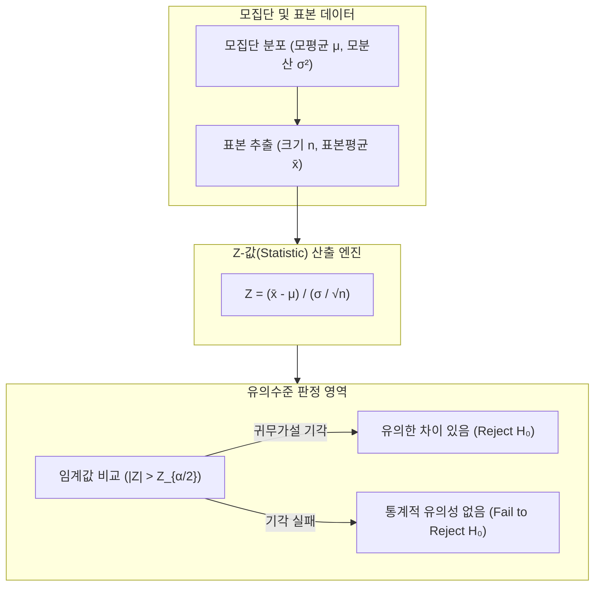

# Z-검정 (Z-test, Z-statistic Hypothesis Testing)

---

## I. 정규분포 가정을 바탕으로 모평균의 유의성을 검정하는 통계적 가설검정 기법, Z-검정의 개요

* **정의**: 모집단의 표준편차를 알고 있거나 표본 크기가 충분히 클 때(Typically $n \ge 30$), 중심극한정리에 근거하여 정규분포를 따르는 통계량(Z값)을 산출하고 귀무가설의 기각 여부를 판정하는 모수적 가설검정 방법
* 표본 집단을 통한 모집단 특성 추론, 두 집단 간 평균 차이 검증 및 통계적 의사결정 지원 목적
* 특징: 표준정규분포($N(0, 1)$) 활용, 모분산 기지(Known Variance) 조건 또는 대표본 조건 필수, t-검정 대비 분산 추정 오차 배제

---

## II. Z-검정의 검정 통계량 아키텍처 및 핵심 기술 요소

### 가. Z-검정의 가설 검증 및 통계량 산출 아키텍처

* 모집단에서 추출한 표본 평균($\bar{x}$)과 알려진 모표준편차($\sigma$)를 활용해 Z-통계량을 계산하고, 표준정규분포의 임계값과 비교하여 가설을 채택하거나 기각하는 구조

### 나. Z-검정의 핵심 구성 요소 및 기술 요소

| 분류 | 요소기술(키워드) | 세부 설명 |
| --- | --- | --- |
| 통계량 모델 | Z-통계량 (Z-Statistic) | 표본평균과 모평균의 차이를 표준오차로 나누어 표준화한 값 |
| 기본 가정 | 대표본 조건 (Large Sample) | 중심극한정리에 의해 표본 크기 $n \ge 30$ 이상일 때 정규성 근사 확보 |
| 분포 기준 | 표준정규분포 (Standard Normal) | 평균이 0이고 분산이 1인 [[정규분포]]($N(0, 1)$) 곡선 상의 확률 계산 |
| 가설 설정 | 양측 / 단측 검정 (Two/One-tailed) | 대립가설의 방향성(차이가 있다 vs 크다/작다)에 따른 임계 영역 설정 |
| 오류 제어 | 유의수준 ($\alpha$) 및 [[유의확률|p-value]] | 제1종 오류의 허용 한계(예: 0.05)를 설정하여 검정 결과의 [[신뢰성]] 확보 |
| 비교 대조 | Z-검정 vs t-검정 | 모분산의 기지 여부 및 표본 크기에 따라 Z-분포 또는 t-분포 선택 적용 |
| 확장 응용 | 비율 검정 (Two-proportion Z-test) | 두 독립된 집단의 성공 비율(p1, p2) 간의 차이를 검정하는 이항 비율 모델 |
| 최신 트렌드 | A/B 테스팅 및 대규모 분석 | 웹 서비스 및 마케팅 성과 측정을 위한 대규모 실시간 Z-통계 검증 자동화 |

---

## III. Z-검정 vs t-검정 비교 및 최신 동향

| 비교 항목 | Z-검정 (Z-test) | [[t-검정 (t-test)]] |
| --- | --- | --- |
| **모분산 ($\sigma$) 조건** | 모집단의 표준편차를 **알고 있는 경우** (Known) | 모집단의 표준편차를 **모르는 경우** (Unknown) |
| **표본 크기 ($n$)** | 주로 대표본 ($n \ge 30$) 환경에 적용 | 소표본 ($n < 30$) 환경에서도 널리 활용 |
| **사용하는 확률 분포** | 표준정규분포 ($Z \sim N(0, 1)$) | 자유도($n-1$)를 갖는 학생 t-분포 (t-distribution) |

* 실제 데이터 분석 환경에서는 모분산을 알 수 없는 경우가 대부분이므로 t-검정이 주로 활용되나, 최근 대규모 사용자 데이터(Big Data)를 다루는 **디지털 마케팅 A/B 테스팅 및 [[01_IT Tech/핀테크]] 가설 검증** 영역에서는 중심극한정리가 성립하는 대규모 표본 특성 덕분에 **Z-검정 기반 고속 자동 통계 분석 파이프라인**이 표준으로 널리 활용되고 있음

---

### 🔗 연관 토픽

- **소속 도메인**: [[00_인공지능_MOC|🤖 인공지능]]
- **세부 분류**: `1. 수학 · 통계학 & 데이터 전처리`
- **핵심 연관 토픽**:
  - [[t-검정 (t-test)]]
  - [[가설 검정]]
  - [[중심극한정리|중심극한정리 (Central Limit Theorem)]]
  - [[정규분포|정규분포(Normal Distribution)]]
  - [[유의확률|유의확률 (p-value)]]
