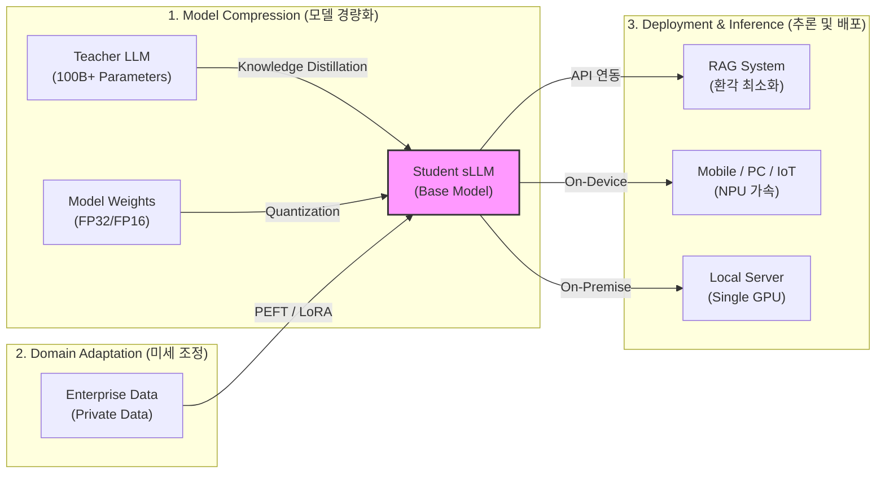

# sLLM (Smaller Large Language Model)

---

## I. 엔터프라이즈 맞춤형 AI 및 온디바이스 AI 실현, sLLM의 개요

* **정의**: 수백억 개 이하(통상 1B ~ 20B 규모)의 매개변수(Parameter)를 가지며, 거대 언어 모델([[초거대 언어 모델|LLM]]) 대비 학습·추론 비용을 최소화하면서도 특정 도메인에서는 유사한 성능을 발휘하도록 경량화 및 최적화된 소형 언어 모델
* **필요성 및 특징**:
* **비용 절감**: 단일 [[GPU]] 또는 [[NPU]] 환경에서 구동 가능하여 클라우드 인프라 운영비 및 전력 소모(TCO) 대폭 절감
* **데이터 보안**: 외부 클라우드 API 의존 없이 온프레미스(On-Premise) 구축이 가능하여 기업 내부 정보 유출 차단
* **초저지연 응답**: 엣지([[EDGE|Edge]]) 디바이스 및 스마트기기에서 직접 연산하여 네트워크 지연(Latency) 없는 실시간 AI 서비스 구현

---

## II. sLLM의 아키텍처 및 핵심 기술 요소

### 가. sLLM의 최적화 파이프라인 및 배포 개념도

* 대규모 LLM의 지식을 증류(Distillation) 및 양자화하여 Base sLLM을 생성하고, LoRA 등 파라미터 효율적 미세조정([[PEFT]])을 통해 도메인 특화 모델로 변환 후 온프레미스/엣지 환경에 배포

### 나. sLLM의 핵심 기술 및 구성 요소

| 구분 | 요소기술 (키워드) | 세부 설명 |
| --- | --- | --- |
| **모델 경량화** | Knowledge Distillation | 교사 모델(Teacher)의 출력 확률 분포를 학생 모델(Student)이 학습하여 지식을 전이하는 기법 |
| **모델 경량화** | Quantization (양자화) | 가중치(Weight)의 부동소수점 정밀도를 FP32에서 INT8 또는 INT4로 낮춰 메모리 사용량 및 연산량 감소 |
| **모델 경량화** | Pruning (가지치기) | 모델의 성능에 미치는 영향이 적은 가중치(파라미터)나 뉴런의 연결을 제거하여 모델 크기 압축 |
| **미세 조정** | PEFT | Parameter-Efficient [[Fine-Tuning]], 전체 가중치를 동결하고 극히 일부의 파라미터만 업데이트하여 학습 자원 최소화 |
| **미세 조정** | LoRA / QLoRA | [[LoRA(Low-rank adaptation)|Low-Rank Adaptation]], 가중치 행렬을 저랭크(Low-Rank) 행렬로 분해하여 학습 파라미터 수를 획기적으로 축소 |
| **추론 최적화** | vLLM (PagedAttention) | OS의 [[가상 메모리]] 페이징 기법을 차용하여 KV [[캐시 메모리]] 파편화를 방지하고 추론 [[처리량]](Throughput) 극대화 |
| **데이터 보강** | RAG (검색 증강 생성) | sLLM의 부족한 지식을 보완하기 위해 외부 벡터 DB에서 관련 문서를 검색·프롬프트에 주입하여 환각(Hallucination) 억제 |
| **하드웨어 가속** | NPU / 신경망 처리 장치 | 스마트폰, PC 등 엣지 디바이스 내부에 탑재되어 저전력으로 sLLM의 행렬 곱 연산을 고속 처리 |

---

## III. LLM과 sLLM 비교 및 향후 전망

### 가. 범용 LLM과 특정 도메인 특화 sLLM 비교

| 비교 항목 | 범용 LLM (Large Language Model) | 특화 sLLM (Smaller Large Language Model) |
| --- | --- | --- |
| **파라미터 규모** | 1,000억 개(100B) 이상 | 통상 10억 ~ 200억 개 (1B ~ 20B) 수준 |
| **구축 및 운영 비용** | 대규모 GPU 클러스터 필요 (천문학적 비용) | 단일 GPU 또는 디바이스 처리 (비용 매우 낮음) |
| **데이터 보안/프라이버시** | 퍼블릭 클라우드 의존 (보안 취약점 존재) | 온프레미스 / 온디바이스 구축 (완벽한 보안) |
| **응답 지연성 (Latency)** | 클라우드 네트워크 왕복 지연 발생 | 로컬 처리로 초저지연 (Real-time) 응답 보장 |
| **주요 모델 사례** | GPT-4, Gemini 1.5 Pro, Claude 3.5 Opus | LLaMA 3 (8B), Phi-3/4, Gemma (2B/7B), Mistral |
| **주요 활용 분야** | [[AGI]] 연구, 복잡한 추론, 범용 챗봇 서비스 | 기업 내부용 특화 AI, 스마트폰 내장 AI, [[Smart Car(자율주행)|자율주행]] |

### 나. 향후 전망 및 산업 적용 동향

* **[[온디바이스 AI]] 패러다임 확산**: 클라우드 통신 없이 기기 자체에서 동작하는 Apple Intelligence, Galaxy AI 등 스마트폰 및 AI PC의 핵심 엔진으로 sLLM 도입 가속화
* **SLM 에이전트(Agent) 기술 융합**: 단순 텍스트 생성을 넘어, [[OS(운영체제)|운영체제]](OS)를 제어하고 애플리케이션 함수(Function Calling)를 호출하는 소형 자율 AI 에이전트로 진화
* **멀티모달(Multi-modal) sLLM의 등장**: 텍스트뿐만 아니라 비전(Vision), 오디오 데이터를 함께 처리할 수 있는 경량 시각-언어 모델(vLLM, Vision-Language Model)의 소형화 연구 활발 (예: LLaVA 모델의 경량화 적용)

---

### 🔗 연관 토픽

- **소속 도메인**: [[00_인공지능_MOC|🤖 인공지능]]
- **세부 분류**: `4. 거대언어모델 (LLM) & 생성형 AI`
- **핵심 연관 토픽**:
  - [[Fine-Tuning]]
  - [[초거대 언어 모델|초거대 언어 모델(Large Language Model)]]
  - [[온디바이스 AI]]
  - [[PEFT|PEFT(Parameter-Efficient Fine-Tuning)]]
  - [[AGI|AGI (Artificial General Intelligence)]]
