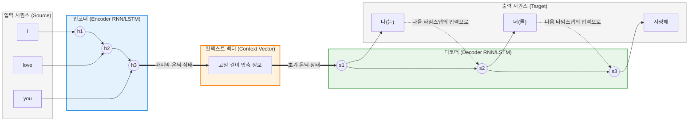

# Seq2Seq (Sequence-to-Sequence)

---

## I. 가변 길이 순차 데이터를 처리하는 기계 번역의 시초, Seq2Seq의 개요

* **정의**: 입력된 데이터 시퀀스(문장, 음성 등)를 받아들여 다른 도메인의 데이터 시퀀스(다른 언어, 요약문 등)로 변환해 주는 **인코더-디코더(Encoder-Decoder) 구조의 [[딥러닝]] 신경망 아키텍처**
* **등장 배경 및 필요성**:
* 기존의 순방향 신경망이나 기본적인 [[RNN (Recurrent Neural Network)|RNN]]은 입력 데이터와 출력 데이터의 길이가 고정되어 있거나 동일해야 한다는 구조적 한계가 존재함
* "I love you(3단어)"가 "나는 너를 사랑해(3단어)" 혹은 "사랑해(1단어)"처럼 입력과 출력의 길이가 다른(Variable-length) 자연어 번역, 텍스트 요약, 챗봇 등의 문제를 해결하기 위한 모델이 필요해짐

* **특징**: 입력 시퀀스 전체의 문맥(Context)을 고정된 크기의 하나의 벡터(Vector)로 압축한 뒤, 이를 바탕으로 출력 시퀀스를 순차적으로 생성합니다.

---

## II. Seq2Seq의 아키텍처 및 핵심 구성요소

### 가. Seq2Seq 기본 아키텍처 개념도

### 나. Seq2Seq의 3대 핵심 구성 요소

| 분류 | 요소명 (키워드) | 세부 설명 및 역할 |
| --- | --- | --- |
| **압축 (입력부)** | **인코더 (Encoder)** | 입력 시퀀스를 순차적으로 읽어 들여 정보를 처리하는 RNN/[[LSTM (Long Short-Term Memory)|LSTM]] 계층. 입력이 끝난 후 생성되는 마지막 은닉 상태(Hidden State)를 디코더로 넘겨줌. |
| **매개체 (병목)** | **컨텍스트 벡터 (Context Vector)** | 인코더가 입력 시퀀스의 전체 의미를 요약하여 담아낸 고정 길이의 1차원 배열(숫자 벡터). 디코더의 '초기 상태'로 작용함. |
| **생성 (출력부)** | **디코더 (Decoder)** | 컨텍스트 벡터를 바탕으로 첫 단어를 예측하고, 예측한 단어를 다시 다음 타임스텝의 입력으로 사용하여 `<EOS>`(End of Sequence) 토큰이 나올 때까지 순차적으로 출력 시퀀스를 생성함. |

---

## III. Seq2Seq의 한계 극복 및 최신 아키텍처 동향

### 가. 기본 Seq2Seq의 치명적 한계 (정보의 병목 현상)

초기 Seq2Seq 모델은 **'고정 길이의 컨텍스트 벡터'** 하나에 모든 정보를 구겨 넣어야 한다는 구조적 한계를 가졌습니다. 입력 문장이 길어질수록(예: 20단어 이상) 앞부분의 정보가 희석되어 소실되는 현상(Long-Term Dependency 문제)이 발생하여, 문장이 긴 기계 번역에서 성능이 급격히 저하되었습니다.

### 나. 어텐션(Attention) 메커니즘의 도입과 시각화

이를 해결하기 위해 등장한 것이 **어텐션(Attention)** 메커니즘입니다. 디코더가 단어를 예측할 때마다 컨텍스트 벡터 하나에만 의존하는 것이 아니라, 인코더의 '모든 입력 단어들의 은닉 상태'를 다시 한 번 훑어보며 현재 출력할 단어와 가장 연관성(가중치)이 높은 단어에 "집중(Attention)"하는 방식입니다.

### 다. 순차 데이터 모델의 진화 (Seq2Seq vs Transformer)

| 비교 항목 | Seq2Seq (Vanilla) | Seq2Seq + Attention | Transformer (현재 주류) |
| --- | --- | --- | --- |
| **기반 아키텍처** | RNN, LSTM, GRU | RNN, LSTM, GRU | **[[어텐션 메커니즘]] 전용 (RNN 제거)** |
| **정보 전달 방식** | 고정 길이 컨텍스트 벡터 | 출력마다 모든 입력 은닉 상태 참조 | **셀프 어텐션 (Self-Attention)** |
| **학습 방식** | 순차적 처리 (병렬화 불가, 느림) | 순차적 처리 (병렬화 불가, 느림) | **전체 시퀀스 동시 입력 (병렬 처리, 빠름)** |
| **문맥 파악 능력** | 문장이 길어질수록 급격히 저하 | 우수함 | **매우 우수함 (장기 의존성 완벽 해결)** |

* 현재의 LLM([[초거대 언어 모델]]) 생태계는 초기 Seq2Seq 모델의 인코더-디코더 개념을 계승하면서도, 내부의 RNN 연산을 완전히 셀프 어텐션으로 대체한 **[[트랜스포머|트랜스포머(Transformer)]]** 아키텍처를 표준으로 채택하고 있습니다.

---

### 🔗 연관 토픽

- **소속 도메인**: [[00_인공지능_MOC|🤖 인공지능]]
- **세부 분류**: `3. 딥러닝 핵심 아키텍처 & 신경망`
- **핵심 연관 토픽**:
  - [[트랜스포머|트랜스포머(Transformer)]]
  - [[어텐션 메커니즘|어텐션 메커니즘(Attention Mechanism)]]
  - [[RNN (Recurrent Neural Network)]]
  - [[초거대 언어 모델|초거대 언어 모델(Large Language Model)]]
  - [[딥러닝]]
