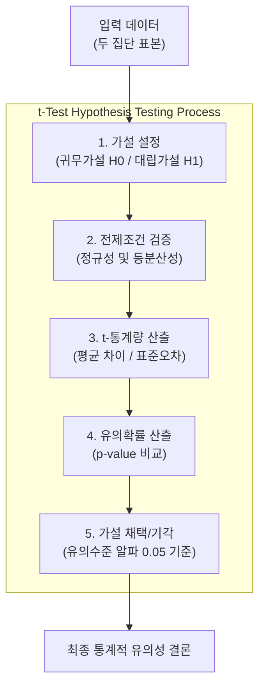

# t-검정 (t-test)

---

## I. 두 집단 간 평균 차이 검증을 위한 모수적 통계 분석 기법, t-검정의 개요

* **정의**: 두 집단의 평균 간 차이가 우연에 의한 것인지, 아니면 통계적으로 유의미한 차이인지를 스튜던트 t-분포(t-distribution)를 이용하여 검증하는 [[가설 검정]] 기법
* 소표본($n < 30$) 데이터 환경에서의 평균 비교, A/B 테스트 성과 검증 및 데이터 기반 의사결정 지원
* 특징: [[정규분포]] 가정 기반, t-통계량 및 p-value 활용, 검정 목적에 따른 독립·대응·단일 표본 분류

---

## II. t-검정의 개념도 및 핵심 구성요소

### 가. t-검정의 수행 프로세스 및 동작 원리

* 귀무가설과 대립가설을 설정하고 정규성·등분산성을 검증한 뒤, t-통계량과 p-value를 산출하여 유의수준 기준으로 가설을 채택하거나 기각하는 [[프로세스]]

### 나. t-검정의 핵심 기술 및 구성 요소

| 구분 | 요소기술(키워드) | 세부 설명 |
| --- | --- | --- |
| 검정 유형 | 독립표본 t-검정 (Independent) | 서로 다른 두 집단 간의 평균 차이를 비교 (예: 대조군 vs 실험군) |
| 검정 유형 | 대응표본 t-검정 (Paired) | 동일 집단의 사전-사후 등 짝을 이룬 관측치의 평균 차이 비교 |
| 검정 유형 | 단일표본 t-검정 (One-Sample) | 하나의 표본 평균이 특정 기준값(모평균)과 같은지 비교 |
| 핵심 지표 | t-통계량 (t-statistic) | 집단 간 평균의 차이를 표준오차(Standard Error)로 나눈 비율 값 |
| 판정 기준 | [[유의확률|유의확률 (p-value)]] | 귀무가설이 참일 때 관측된 통계량이 나타날 확률 ($\alpha < 0.05$) |
| 전제 조건 | 정규성 검정 (Normality) | 데이터가 정규분포를 따르는지 확인 (Shapiro-Wilk, Kolmogorov-Smirnov) |
| 보정 기법 | 웰치 t-검정 (Welch's t-test) | 두 집단의 [[등분산성]] 가정이 만족되지 않을 때 사용하는 보정된 t-검정 |
| 최신 응용 | A/B 테스트 및 [[MLOps]] | 디지털 마케팅 성과 분석 및 AI 모델 성능 비교 자동화 검증에 활용 |

---

## III. t-검정 vs 분산분석(ANOVA) 비교 및 최신 동향

| 비교 항목 | t-검정 (t-test) | 분산분석 (ANOVA, [[ANOVA(Analysis of variance)|Analysis of Variance]]) |
| --- | --- | --- |
| **비교 대상 집단수** | 2개 집단 이하 | 3개 이상의 다수 집단 |
| **사용 통계량** | t-분포 (t-statistic) | F-분포 (F-statistic, Fisher's ratio) |
| **분석 목적** | 두 집단 간 평균의 유의미한 차이 비교 | 세 이상 집단 간 분산 비교를 통한 평균 차이 검증 |
| **주요 활용 분야** | A/B 테스트 성과 비교, 전후 효과 분석 | 다중 모델 성능 비교, 다원 실험 설계(DOE) 분석 |

* 최근 빅데이터 및 MLOps 환경에서는 단순 수동 통계 검정을 넘어, 실시간 A/B 테스트 플랫폼과 연계된 자동화된 t-검정 및 가설 검증 파이프라인 구축이 표준으로 자리 잡고 있음

---

### 🔗 연관 토픽

- **소속 도메인**: [[00_인공지능_MOC|🤖 인공지능]]
- **세부 분류**: `1. 수학 · 통계학 & 데이터 전처리`
- **핵심 연관 토픽**:
  - [[가설 검정]]
  - [[등분산성|등분산성 (Homoscedasticity)]]
  - [[ANOVA(Analysis of variance)]]
  - [[기술 통계|기술 통계(Descriptive statistics)]]
  - [[통계적 가설검정|통계적 가설검정 (Hypothesis Testing)]]
