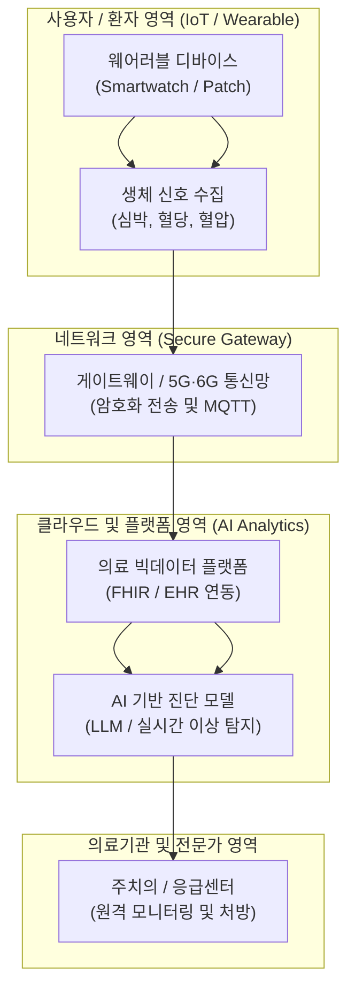

# u-Health 스마트 헬스 (u-Health Smart Health)

---

## I. 유비쿼터스 센서와 ICT 기반 의료 서비스 융합 패러다임, u-Health 스마트 헬스의 개요

* **정의**: 유비쿼터스(Ubiquitous) 컴퓨팅 기술과 정보통신기술(ICT)을 의료·건강 관리 시스템에 융합하여, 시공간 제약 없이 상시 건강 모니터링 및 맞춤형 의료 서비스를 제공하는 지능형 헬스케어 시스템
* 의료 사각지대 해소, 만성질환자의 상시 예방적 관리 및 병원 중심에서 환자·개인 중심의 지능형 의료 체계 전환 목적
* 특징: 웨어러블 센서 기반 생체신호 실시간 수집, 클라우드·AI 기반 원격 진단, 프라이버시 보호형 의료 [[마이데이터]] 연계

---

## II. u-Health 스마트 헬스의 아키텍처 및 핵심 기술 요소

### 가. u-Health 스마트 헬스의 서비스 파이프라인 및 동작 원리

* 사용자의 웨어러블 기기와 센서로부터 수집된 생체 신호가 보안 네트워크를 거쳐 클라우드 의료 플랫폼에 도달하고, AI 기반 이상 탐지 및 전문가 진단으로 이어지는 실시간 파이프라인 구조

### 나. u-Health 스마트 헬스의 핵심 기술 및 구성 요소

| 분류 | 요소기술(키워드) | 세부 설명 |
| --- | --- | --- |
| 수집 기술 | 웨어러블 바이오 센서 | ECG, PPG, 연속혈당측정(CGM) 등 실시간 생체 데이터 측정 디바이스 |
| 전송 규격 | HL7 FHIR (Fast Healthcare Interoperability Resources) | 이기종 의료 시스템 간 의료 데이터 상호운용성 표준 인터페이스 |
| 네트워크 | 5G / IoT 통신 (NB-IoT, [[MQTT (Message Queuing Telemetry Transport)|MQTT]]) | 끊김 없는 고속·저지연 생체 신호 전송 및 경량 메시징 [[프로토콜]] |
| 분석 기술 | AI 기반 헬스케어 애널리틱스 | 시계열 생체 데이터 분석 및 만성질환 악화 예측·이상 징후 조기 경보 |
| 플랫폼 | 의료 클라우드 및 PHR | 개인 건강 기록(Personal Health Record) 중심의 데이터 통합 저장소 |
| 보안 기술 | 영지식 증명 / [[동형 암호]] | 의료 마이데이터 전송 시 프라이버시 보장을 위한 고성능 [[암호화]] 기법 |
| 응급 대응 | 원격 진료 및 자동 알람 시스템 | 위급 상황 발생 시 119 및 지정 병원으로 자동 응급 구조 신호 송출 |
| 최신 트렌드 | 디지털 치료제 (DTx) 연계 | 소프트웨어 기반의 임상적 치료 효과 검증 및 u-Health 처방 통합 |

---

## III. 전통적 원격 의료 vs 최신 AI·클라우드 기반 스마트 헬스 비교 및 동향

| 비교 항목 | 전통적 원격 의료 (Traditional Telehealth) | 최신 AI·클라우드 기반 스마트 헬스 (Smart Health) |
| --- | --- | --- |
| **모니터링 방식** | 환자의 주관적 신고 및 내원 시점의 단발적 측정 | 웨어러블 기기 기반 24시간 실시간 능동 모니터링 |
| **데이터 활용도** | 파편화된 비정형 데이터 및 수동 기록 중심 | FHIR 표준 기반 상호운용성 확보 및 AI 시계열 예측 |
| **서비스 초점** | 대면 진료의 공간적 한계 극복 (단순 화상 진료) | 예방 중심의 개인 맞춤형 건강 관리 및 디지털 치료제 융합 |

* 최근 [[인공지능]](AI)과 헬스케어의 융합이 가속화되면서, 단순 원격 상담을 넘어 **생성형 AI 기반 개인 건강 비서**, **연속혈당측정(CGM) 기반 맞춤형 대사 질환 관리**, 그리고 병원 간 데이터 표준인 **FHIR** 기반의 통합 마이데이터 에코시스템으로 급격히 진화 중

---

### 🔗 연관 토픽

- **소속 도메인**: [[00_디지털서비스_MOC|🚀 디지털서비스]]
- **세부 분류**: `3. 사물인터넷 (IoT) & 스마트 플랫폼 · 메타버스`
- **핵심 연관 토픽**:
  - [[MQTT (Message Queuing Telemetry Transport)]]
  - [[Smart Factory|Smart Factory/스마트 팩토리(공장)]]
  - [[프로토콜]]
  - [[암호화|암호화 (Encryption)]]
  - [[동형 암호|동형 암호 (Homomorphic Encryption)]]
