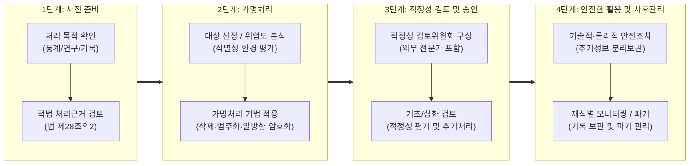

# 가명정보 처리 가이드라인

## I. 데이터 경제 활성화를 위한 가명정보 처리 가이드라인의 개요

### 가. 가명정보 처리 가이드라인의 정의

- 개인정보의 안전한 활용과 정보주체의 권리 보호를 위해, 「개인정보 보호법」에 규정된 가명정보의 처리·결합·안전조치 기준 및 세부 절차를 구체화한 정부 합동 지침

### 나. 가명정보 처리 가이드라인의 등장배경 및 핵심 특징

- 등장배경: [[데이터 3법]] 개정 및 AI·데이터 경제 진입에 따라 동의 기반 규제 완화와 프라이버시 보호의 균형적 이행 체계 필요
- 처리 목적 한정: 통계작성, 과학적 연구, 공익적 기록보존 목적으로 정보주체의 동의 없이 활용 허용
- 절차적 정당성: 사전준비부터 사후관리까지 4단계 표준 프로세스를 제시하여 법적 불확실성 해소
- 엄격한 안전조치: 추가정보(매핑테이블) 분리보관, 특정 개인 재식별 시 즉시 처리 중지 및 형사처벌 규정 적용

## II. 가명정보 처리 절차 및 핵심 기술·관리 요소

### 가. 가명정보 처리 4단계 프로세스

- 처리 목적의 명확화부터 데이터·환경 위험도 기반 기법 적용, 내·외부 전문가 기반 승인 및 기술적 분리보관 체계로 운영

### 나. 가명정보 처리의 핵심 기술 및 관리 요소

|구분|요소기술/항목|세부 설명|
|---|---|---|
|사전준비|목적 타당성 검토|통계작성, 과학적 연구(상업적 연구 포함), 공익적 기록보존 합목적성 판별|
|위험도 분석|데이터·환경 식별성 평가|데이터 공개 여부, 연계 가능 데이터 존재 여부, 공격자의 식별 동기 정량·정성 평가|
|[[가명처리 기법]]|식별자 제거/대체|주민등록번호, 이름 등 고유식별자의 완전 삭제 및 SHA-256 기반 단방향 솔트 [[암호화]]|
|가명처리 기법|프라이버시 모델|특이치 제거, 상·하단 코딩, 부분 삭제를 통한 k-익명성, l-다양성, t-근접성 확보|
|적정성 검토|적정성 검토위원회|법률, 기술, 도메인 전문가 등 외부 인사를 포함한 독립적 적정성 심의기구 운영|
|데이터 결합|결합전문기관|서로 다른 처리자 간 결합 시 전문기관을 통한 결합키 생성, 결합 및 반출 승인|
|안전성 확보|추가정보 분리보관|가명정보와 재식별 매핑테이블(추가정보)의 물리적·논리적 분리 및 접근권한 통제|
|사후관리|재식별 감지 및 기록관리|재식별 징후 시 처리 즉시 중단·회수·파기, 접속로그 및 처리기록 3년 이상 보관 의무|

## III. 가명정보 vs 익명정보 비교 및 제도적 안착 방안

### 가. 가명정보 vs 익명정보 비교

|비교 항목|가명정보 (Pseudonymized Data)|익명정보 (Anonymized Data)|
|---|---|---|
|법적 정의|추가정보 없이는 특정 개인을 알아볼 수 없는 정보|시간·비용·기술을 합리적으로 고려해도 식별 불가한 정보|
|법적 성격|개인정보에 해당 (개인정보 보호법 규제 적용)|개인정보 비적용 (법적 규제 제외)|
|추가정보(키)|보관 및 관리 대상 (원상 복구 가능)|존재하지 않음 (비가역적 처리)|
|이용 목적|통계작성, 과학적 연구, 공익적 기록보존으로 한정|목적 제한 없음 (자유로운 영리 목적 활용 가능)|
|보호 조치|안전성 확보조치 의무, 재식별 금지 및 형사처벌|법적 보호조치 의무 없음|

### 나. 실효적 제도 안착을 위한 발전 방향

- PET(Privacy Enhancing Tech) 융합: [[차분 프라이버시]](Differential Privacy), 동형암호(HE), 합성데이터(Synthetic Data)를 가명처리 프로세스에 도입하여 원본 유출 위험 원천 차단
- [[프로세스]] 자동화: AI 기반 민감 식별자 자동 탐지 및 적정성 평가 자동화 툴 보급을 통한 가명처리 소요 비용 및 시간 절감 필요

---

### 🔗 연관 토픽

- **소속 도메인**: [[00_보안_MOC|🛡️ 보안]]
- **세부 분류**: `6. 개인정보보호 & 프라이버시 강화 기술`
- **핵심 연관 토픽**:
  - [[ISO IEC 20889|ISO/IEC 20889]]
  - [[가명처리 기법|가명처리(Pseudonymization) 기법]]
  - [[비식별화]]
  - [[데이터 3법|데이터 3법 (Data 3 Acts)]]
  - [[암호화|암호화 (Encryption)]]
