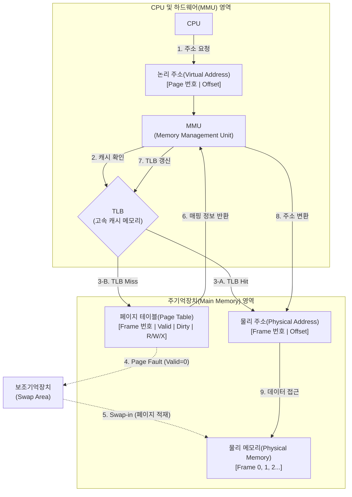

# 가상 메모리

---
## I. 한정된 물리 메모리의 한계 극복, 가상 메모리(Virtual Memory)의 개요
- [[프로세스]] 전체가 메모리 내에 올라오지 않더라도 실행이 가능하도록, 보조기억장치(Disk)의 일부를 주기억장치처럼 사용하여 물리적 메모리 크기 이상의 논리적 주소 공간을 제공하는 [[메모리 관리]] 기법임.
- 물리 메모리 한계 극복: 다중 프로그래밍(Multi-programming) 환경에서 물리적 메모리 용량 부족 문제 해결
- 메모리 활용 효율성: 요구 페이징(Demand Paging)을 통해 실제로 필요한 부분만 적재하여 메모리 낭비 방지
- 메모리 보호 및 고립: 각 프로세스마다 독립적인 가상 주소 공간을 할당하여 프로세스 간 메모리 침범 방지

	---
## II. 가상 메모리의 개념도 및 핵심 기술 요소
### 가. 가상 메모리의 동작 원리 및 개념도

  <svg xmlns="http://www.w3.org/2000/svg" viewBox="0 0 780 340" width="100%" height="auto" style="max-width: 780px; width: 100%; height: auto; display: block; margin: 1.5rem auto;">
  <defs>
    <!-- 화살표 마커 정의 -->
    <marker id="arrow-blue" markerWidth="8" markerHeight="6" refX="7" refY="3" orient="auto">
      <polygon points="0 0, 8 3, 0 6" fill="#3B82F6" />
    </marker>
    <marker id="arrow-red" markerWidth="8" markerHeight="6" refX="7" refY="3" orient="auto">
      <polygon points="0 0, 8 3, 0 6" fill="#EF4444" />
    </marker>
    <marker id="arrow-green" markerWidth="8" markerHeight="6" refX="7" refY="3" orient="auto">
      <polygon points="0 0, 8 3, 0 6" fill="#10B981" />
    </marker>
    <marker id="arrow-orange" markerWidth="8" markerHeight="6" refX="7" refY="3" orient="auto">
      <polygon points="0 0, 8 3, 0 6" fill="#F59E0B" />
    </marker>
    <marker id="arrow-gray" markerWidth="8" markerHeight="6" refX="7" refY="3" orient="auto">
      <polygon points="0 0, 8 3, 0 6" fill="#6B7280" />
    </marker>
    <marker id="arrow-gray-reverse" markerWidth="8" markerHeight="6" refX="1" refY="3" orient="auto">
      <polygon points="8 0, 0 3, 8 6" fill="#6B7280" />
    </marker>
  </defs>

  <!-- 배경 카드 (옵시디언 다크모드 대응 흰색 계열 고정) -->
  <rect width="780" height="340" fill="#F9FAFB" rx="10" stroke="#E5E7EB" stroke-width="1"/>

  <!-- ================= 연결선 (Layer 1) ================= -->
  
  <!-- CPU -> MMU/TLB -->
  <line x1="140" y1="65" x2="262" y2="65" stroke="#3B82F6" stroke-width="2" marker-end="url(#arrow-blue)"/>
  
  <!-- MMU/TLB -> RAM -->
  <line x1="410" y1="65" x2="532" y2="65" stroke="#3B82F6" stroke-width="2" marker-end="url(#arrow-blue)"/>
  
  <!-- MMU/TLB -> OS (Page Fault) -->
  <line x1="300" y1="90" x2="300" y2="222" stroke="#EF4444" stroke-width="2" stroke-dasharray="5 5" marker-end="url(#arrow-red)"/>
  
  <!-- OS -> MMU/TLB (PTE 갱신) -->
  <line x1="380" y1="230" x2="380" y2="98" stroke="#10B981" stroke-width="2" marker-end="url(#arrow-green)"/>
  
  <!-- OS <-> Disk -->
  <line x1="488" y1="265" x2="522" y2="265" stroke="#6B7280" stroke-width="2" marker-start="url(#arrow-gray-reverse)" marker-end="url(#arrow-gray)"/>

  <!-- RAM <-> Disk (Swap Out / Down) -->
  <line x1="600" y1="90" x2="600" y2="222" stroke="#F59E0B" stroke-width="2" marker-end="url(#arrow-orange)"/>
  
  <!-- RAM <-> Disk (Swap In / Up) -->
  <line x1="640" y1="230" x2="640" y2="98" stroke="#F59E0B" stroke-width="2" marker-end="url(#arrow-orange)"/>

  <!-- ================= 노드 (Layer 2) ================= -->
  
  <!-- 1. CPU -->
  <rect x="40" y="40" width="100" height="50" rx="6" fill="#EFF6FF" stroke="#3B82F6" stroke-width="1.5"/>
  <text x="90" y="70" font-family="system-ui, -apple-system, sans-serif" font-size="15" font-weight="bold" fill="#1E40AF" text-anchor="middle">CPU</text>

  <!-- 2. MMU / TLB -->
  <rect x="270" y="40" width="140" height="50" rx="6" fill="#F5F3FF" stroke="#8B5CF6" stroke-width="1.5"/>
  <text x="340" y="70" font-family="system-ui, -apple-system, sans-serif" font-size="15" font-weight="bold" fill="#5B21B6" text-anchor="middle">MMU / TLB</text>

  <!-- 3. RAM -->
  <rect x="540" y="40" width="160" height="50" rx="6" fill="#F0FDF4" stroke="#10B981" stroke-width="1.5"/>
  <text x="620" y="70" font-family="system-ui, -apple-system, sans-serif" font-size="15" font-weight="bold" fill="#065F46" text-anchor="middle">주기억장치 (RAM)</text>

  <!-- 4. OS Memory Manager -->
  <rect x="200" y="230" width="280" height="70" rx="6" fill="#FEF3C7" stroke="#F59E0B" stroke-width="1.5"/>
  <text x="340" y="260" font-family="system-ui, -apple-system, sans-serif" font-size="15" font-weight="bold" fill="#92400E" text-anchor="middle">운영체제(OS)의 Memory Manager</text>
  <text x="340" y="282" font-family="system-ui, -apple-system, sans-serif" font-size="13" font-weight="500" fill="#B45309" text-anchor="middle">(Page Replacement / Demand Paging)</text>

  <!-- 5. Disk -->
  <rect x="530" y="230" width="180" height="70" rx="6" fill="#F3F4F6" stroke="#6B7280" stroke-width="1.5"/>
  <text x="620" y="260" font-family="system-ui, -apple-system, sans-serif" font-size="15" font-weight="bold" fill="#374151" text-anchor="middle">보조기억장치 (Disk)</text>
  <text x="620" y="282" font-family="system-ui, -apple-system, sans-serif" font-size="13" font-weight="500" fill="#4B5563" text-anchor="middle">(Swap Area / Store)</text>

  <!-- ================= 텍스트 라벨 (Layer 3) ================= -->
  
  <text x="201" y="55" font-family="system-ui, -apple-system, sans-serif" font-size="13" font-weight="600" fill="#2563EB" text-anchor="middle">논리 주소</text>
  <text x="471" y="55" font-family="system-ui, -apple-system, sans-serif" font-size="13" font-weight="600" fill="#2563EB" text-anchor="middle">물리 주소</text>
  
  <text x="290" y="165" font-family="system-ui, -apple-system, sans-serif" font-size="13" font-weight="bold" fill="#DC2626" text-anchor="end">(Page Fault)</text>
  
  <text x="390" y="165" font-family="system-ui, -apple-system, sans-serif" font-size="13" font-weight="bold" fill="#059669" text-anchor="start">(PTE 갱신)</text>
  
  <text x="655" y="165" font-family="system-ui, -apple-system, sans-serif" font-size="13" font-weight="bold" fill="#D97706" text-anchor="start">(Swap In/Out)</text>

</svg>
- [[CPU]]가 논리 주소를 요청하면 MMU가 물리 주소로 변환하며, 메모리에 해당 페이지가 없을 경우 OS가 개입(Page Fault)하여 디스크에서 스왑 인(Swap-in) 수행함.
    
### 나. 가상 메모리의 핵심 구성 요소

| 구분      | 요소기술(키워드)                          | 세부 설명                                                  |
| ------- | ---------------------------------- | ------------------------------------------------------ |
| 주소 변환   | MMU (Memory Management Unit)       | 가상 주소(Logical)를 [[물리 주소]](Physical)로 매핑하는 하드웨어 칩           |
|         | TLB (Translation Lookaside Buffer) | 빈번하게 사용되는 주소 변환(PTE) 정보를 저장하는 고속 [[캐시 메모리]]                |
|         | Page Table                         | 논리 주소의 페이지와 물리 주소의 프레임 간 매핑 정보를 저장하는 자료구조              |
| 할당 기법   | 페이징 (Paging)                       | 프로세스와 메모리를 고정 크기(Page/Frame)로 분할 (내부 [[단편화]] 발생)           |
|         | 세그먼테이션 (Segmentation)              | 의미 단위의 가변 크기(Segment)로 분할하여 할당 (외부 단편화 발생)             |
| 운영 매커니즘 | Page Fault                         | CPU가 요청한 페이지가 주기억장치(RAM)에 존재하지 않을 때 발생하는 [[인터럽트]]          |
|         | Demand Paging (요구 페이징)             | 프로세스 시작 시 전체를 적재하지 않고, 실제 참조되는 페이지만 메모리에 적재            |
|         | Page Replacement (페이지 교체)          | 메모리 공간이 부족할 때 기존 페이지를 디스크로 내리는 [[알고리즘]] ([[LRU]], [[LFU]], [[FIFO]] 등) |

---
## III. 가상 메모리 주요 기법 비교 및 최근 동향
### 가. 가상 메모리 주요 할당 기법(페이징 vs 세그먼테이션) 비교

|비교 항목|페이징 (Paging)|세그먼테이션 (Segmentation)|
|---|---|---|
|분할 방식|고정 크기 분할 (Page, Frame)|가변 크기 분할 (논리적 의미 단위)|
|단편화 문제|내부 단편화 (Internal Fragmentation)|외부 단편화 (External Fragmentation)|
|주소 지정|1차원 (페이지 번호, 오프셋)|2차원 (세그먼트 번호, 오프셋)|
|보호/공유|구현이 비교적 복잡함|논리적 단위이므로 보호/공유에 유리함|
- _최근 OS는 두 기법의 장점을 결합한 페이지드 세그먼테이션(Paged Segmentation) 기법을 주로 활용함._
### 나. 가상 메모리의 한계 극복을 위한 최근 동향 (전망)
- ZRAM (Memory Compression): 디스크 I/O 병목(Swap 지연)을 줄이기 위해 물리 메모리의 일부를 압축된 스왑 공간으로 활용 (모바일 OS, macOS 등에서 적극 도입)
- [[CXL|CXL (Compute Express Link)]]: 차세대 인터페이스를 통해 메모리 풀링(Memory Pooling) 및 확장을 구현하여, 디스크 스왑 없이 하드웨어 레벨에서 가상 메모리 공간 확장 지원
- Tiered Memory System: DRAM, CXL 메모리, 고속 NVMe SSD를 계층화하여 Page Fault 시 발생하는 Latency를 최소화하는 아키텍처로 발전 중임.

---
# 가상기억장치 (Virtual Memory)

카테고리: 컴퓨터 구조 / 시스템 소프트웨어

## 가상메모리 (Virtual Memory)

분류: [[OS(운영체제)|운영체제]] > 메모리 관리 (Memory Management)

키워드: 페이징(Paging), [[논리 주소]](Logical Address), 물리 주소(Physical Address), [[MMU(Memory Management Unit)]], TLB, 페이지 부재(Page Fault), 요구 페이징(Demand Paging), 스와핑(Swapping)

---

## I. 가상기억장치(Virtual Memory)의 개요

정의: 주기억장치(RAM)의 물리적 용량 한계를 극복하기 위해, 보조기억장치(HDD/SSD)의 일부 공간을 마치 확장된 주기억장치처럼 사용하는 메모리 관리 기법입니다. 이를 통해 프로세스는 실제 RAM 크기보다 훨씬 더 큰 가상의 연속된 메모리 공간(Logical Memory)을 할당받아 실행될 수 있습니다.

---

## II. 가상메모리의 핵심 구성 요소 및 메커니즘

가상메모리는 일정한 크기의 블록으로 메모리를 나누어 관리하는 페이징(Paging) 기법을 기본으로 사용합니다.

### 1. 주소 변환 (Address Translation) 핵심 요소

| 구분 | 구성 요소 | 상세 설명 및 역할 |
| --- | --- | --- |
| 관리 단위 | Page / Frame | 가상 메모리는 '페이지(Page)'라는 고정 크기로 분할되고, 물리 메모리는 동일한 크기의 '프레임(Frame)'으로 분할되어 1:1로 매핑됨 |
| 매핑 정보 | Page Table (페이지 테이블) | 가상 주소의 페이지 번호가 물리 메모리의 몇 번 프레임에 적재되어 있는지 기록한 표 (Valid 비트를 통해 RAM 존재 여부 표시) |
| 하드웨어 | MMU (Memory Mgmt Unit) | CPU가 요청한 논리 주소(Logical Address)를 페이지 테이블을 참조하여 실제 물리 주소(Physical Address)로 변환하는 하드웨어 칩 |
| 가속기 | TLB (Translation Lookaside Buffer) | 주소 변환을 위해 메모리에 있는 페이지 테이블을 매번 읽으면 느리므로, 최근 변환된 주소를 캐싱(Caching)해두는 고속 버퍼 메모리 |

### 2. 페이지 부재(Page Fault)와 스와핑(Swapping)

CPU가 요청한 페이지가 현재 물리 메모리(RAM)에 없을 때(Valid bit = 0) 발생하는 일련의 복구 과정입니다.

1. Page Fault 발생: MMU가 페이지 부재 인터럽트를 발생시켜 OS [[커널]] 모드로 전환됨.
2. Backing Store 검색: OS는 보조기억장치(디스크)에서 해당 페이지를 찾음.
3. Swap-Out (빈자리 확보): 물리 메모리(RAM)가 가득 차 있다면, '[[페이지 교체 알고리즘]](예: LRU, FIFO)'을 통해 안 쓰는 페이지를 디스크로 내보냄.
4. Swap-In (페이지 적재): 디스크에서 찾은 페이지를 비워진 물리 메모리 프레임에 적재.
5. Page Table 갱신 및 재개: 페이지 테이블의 Frame 번호를 업데이트하고 Valid 비트를 1로 바꾼 뒤, 중단되었던 CPU 명령어를 다시 실행함.

---

## III. 가상메모리의 장점 및 주요 고려사항

가상메모리는 현대 다중 프로그래밍(Multiprogramming) 환경의 근간이 되는 필수 기술입니다.

### 1. 가상메모리의 3대 장점

- 주기억장치 용량의 한계 극복: 실제 RAM 용량보다 큰 대규모 프로그램 실행 가능.
- 효율적인 다중 프로그래밍: 여러 프로그램의 필요한 부분만 RAM에 올려놓으므로, 동시에 더 많은 프로세스를 메모리에 유지하여 CPU 이용률 극대화.
- 메모리 보호 및 공유: 각 프로세스는 독립적인 가상 주소 공간을 가지므로 다른 프로세스의 메모리를 침범할 수 없으며, 공유 라이브러리(DLL) 등은 페이지 테이블 매핑을 통해 효율적으로 공유 가능.

### 2. 적용 시 주요 고려사항 (Thrashing)

- 스래싱 (Thrashing): 물리 메모리(RAM)가 절대적으로 부족하거나 다중 프로그래밍 정도가 너무 높을 경우, CPU가 연산을 하는 시간보다 페이지를 디스크에서 교체(Swap)하는 데 더 많은 시간을 허비하여 시스템 성능이 급격히 저하되는 현상입니다.
- 해결책: 프로세스에 충분한 프레임을 할당해 주는 워킹 셋(Working Set) 모델이나 페이지 부재 빈도(PFF) 조절 기법을 사용하여 스래싱을 방지해야 합니다.
끝.

---

### 🔗 연관 토픽

- **소속 도메인**: [[00_컴퓨터구조_MOC|💻 컴퓨터구조]]
- **세부 분류**: `2. 캐시 & 메모리 계층 구조 · 스토리지`
- **핵심 연관 토픽**:
  - [[메모리 관리]]
  - [[페이지 교체 알고리즘|페이지 교체 알고리즘 (Paging Replacement Algorithm)]]
  - [[커널|커널(Kernel)]]
  - [[OS(운영체제)]]
  - [[논리 주소]]
