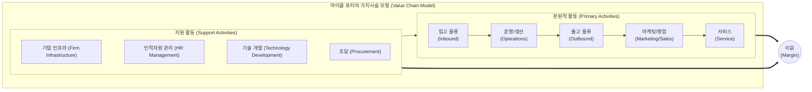

# 가치사슬(Value Chain)

## I. 기업의 본원적 경쟁력 강화를 위한 가치사슬(Value Chain)의 개요

- 정의: 기업이 원자재를 조달하여 제품이나 서비스를 생산, 마케팅, 판매하고 고객에게 전달하기까지 부가가치(Margin)를 창출하는 일련의 활동 집합 (마이클 포터 제안)
- 필요성 및 특징:
    - 경쟁 우위 식별: 각 활동 단위의 비용 구조와 가치 창출 요인을 분석하여 원가 우위(Cost Leadership) 또는 차별화(Differentiation) 전략 도출
    - [[프로세스]] 최적화: 본원적 활동(Primary)과 지원 활동(Support)의 분리를 통한 기업 자원
    - 디지털 융합 진화: 최근 AI, IoT 기술과 결합하여 데이터 기반의 '디지털 가치사슬(Digital Value Chain)' 및 '그린 가치사슬'로 패러다임 전환 중
 ---
## II. 가치사슬의 개념도 및 핵심 구성요소
### 가. 가치사슬의 개념도 및 동작 원리

- 지원 활동과 본원적 활동의 상호작용을 통해 총비용(Cost)을 최소화하고, 고객이 지불하고자 하는 가치를 극대화하여 최종 이윤(Margin)을 창출함.
### 나. 가치사슬의 핵심 구성 요소

|구분|핵심 요소(키워드)|세부 설명|
|---|---|---|
|본원적 활동|입고 물류 (Inbound Logistics)|원자재 수신, 저장, 재고 관리 및 생산 부서로의 자원 배분 활동|
|본원적 활동|운영/생산 (Operations)|투입된 원자재를 고객이 요구하는 최종 제품이나 서비스로 변환하는 기계 가공 및 조립 활동|
|본원적 활동|출고 물류 (Outbound Logistics)|완성된 제품을 창고에 보관하고, 최종 고객이나 유통 채널로 배송하는 활동|
|본원적 활동|마케팅/영업 (Marketing & Sales)|고객의 구매를 유도하기 위한 가격 설정, 프로모션, 광고 및 채널 관리 활동|
|본원적 활동|서비스 (Service)|제품 판매 후 가치를 유지 및 향상시키기 위한 설치, 수리, 부품 공급 및 A/S 지원|
|지원 활동|조달 (Procurement)|제품 생산에 필요한 원자재, 소모품, 기계 장치 등 기업 활동에 필요한 모든 자원 구매|
|지원 활동|기술 개발 (Technology Dev)|제품 설계 개선, 프로세스 혁신, 정보시스템(ERP, [[SCM (Supply Chain Management)|SCM]]) 구축 등 R&D 및 기술 확보 활동|
|지원 활동|인적/조직 인프라 (HR & Infra)|인재 채용/교육/보상 활동(HRM) 및 기획, 재무, 법무, 품질 관리 등 전사적 지원 인프라|

---
## III. 가치사슬의 진화 모델 비교 및 향후 전망
### 가. 전통적 가치사슬과 디지털 가치사슬(Digital Value Chain) 비교

|비교 항목|전통적 가치사슬 (Traditional Value Chain)|디지털 가치사슬 (Digital Value Chain)|
|---|---|---|
|가치 창출 원천|물리적 자산, 노동력, 설비|데이터(Data), 소프트웨어(SW), AI 모델|
|프로세스 구조|선형적(Linear), 파이프라인 형태|비선형적(Non-linear), 생태계(Ecosystem) 중심|
|고객 상호작용|단방향 (생산자 $\rightarrow$ 소비자)|양방향, 실시간 피드백 (Prosumer 참여)|
|주요 핵심 기술|기계화, 자동화 장비 (컨베이어 벨트 등)|IoT, 빅데이터, 클라우드, [[디지털 트윈]](Digital Twin)|
|생산/운영 방식|계획 기반 대량 생산 (Make to Stock)|데이터 기반 온디맨드(On-Demand), 유연/맞춤형 생산|
|의사결정 주체|관리자의 경험 및 직관|AI 기반 수요 예측 및 실시간 자동화 의사결정|

- 전망 및 동향:
    - 최근 글로벌 공급망 위기 및 탄소 중립 규제 강화로 인해, 제품의 생애주기 전체를 추적하는 그린 가치사슬(Green Value Chain) 및 ESG 경영과의 통합이 필수적으로 요구됨.
    - [[초거대 언어 모델|LLM]] 및 자율형 AI 에이전트 기술이 SCM(공급망 관리)에 결합되어, 수요 예측부터 조달, 물류 최적화까지 자율 인지형 가치사슬(Autonomous Value Chain)로 산업 트렌드가 급격히 전환되고 있음.

---

### 🔗 연관 토픽

- **소속 도메인**: [[00_경영전략_MOC|📈 경영전략]]
- **세부 분류**: `1. 경영 환경 분석 & 전략 수립 프레임워크`
- **핵심 연관 토픽**:
  - [[ISP (Information Strategy Plan)]]
  - [[SCM (Supply Chain Management)]]
  - [[ESG 경영]]
  - [[CPND]]
  - [[디지털 전환|디지털 전환(DX)]]
