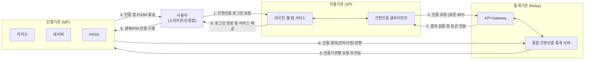

# 간편인증 인터페이스 가이드라인

## I. 다기종 인증수단 통합 연동 표준, 간편인증 인터페이스 가이드라인의 개요

- 정의: 전자서명법 개정(공인인증서 폐지) 이후 등장한 다양한 민간 간편인증 서비스를 공공·민간의 웹/앱 서비스에 일관되고 효율적으로 연동하기 위해 규정한 표준 API 및 아키텍처 지침
- 여러 인증기관(카카오, 네이버, 패스 등)과 이용기관 간의 N:N 개별 연동으로 인한 복잡도와 비용 증가 문제를 해결하기 위해 중계기관(Hub) 기반의 연동 구조를 채택함
- 특징: 중계기관 기반 통합 아키텍처, RESTful API 기반 표준화, JWS/JWE 기반 메시지 보안성 확보
---
## II. 간편인증 인터페이스 아키텍처 및 핵심 기술 요소
### 가. 간편인증 인터페이스 구성도 및 동작 원리

- 이용기관이 중계기관의 표준 API를 호출하면, 중계기관이 사용자가 선택한 인증기관으로 요청을 분기(라우팅)하는 허브 앤 스포크(Hub & Spoke) 방식의 동작 흐름

### 나. 간편인증 인터페이스 핵심 기술 및 구성 요소

| 분류     | 요소기술(키워드)             | 세부 설명                                    |
| ---------- | ------------------------- | -------------------------------------------- |
| 참여 주체  | 이용기관 (SP)                 | 사용자에게 실제 서비스를 제공하며 중계기관 API를 호출하는 기관         |
|            | 중계기관 (Relay)              | 이용기관과 인증기관 사이에서 API 변환, 라우팅, 메시지 중계를 담당      |
|            | 인증기관 (IdP)                | 실제 본인 인증(생체, PIN 등)을 수행하고 전자서명 값을 생성하는 민간 기업 |
| 표준 API | 인증 요청 API                 | 이용기관이 중계기관으로 특정 인증기관의 간편인증을 요구하는 인터페이스       |
|            | 인증 상태조회 API               | PUSH 알림 후 사용자의 인증 진행 상태를 폴링(Polling) 방식으로 확인 |
|            | 인증 결과확인 API               | 인증 완료 시 전자서명 원문 및 사용자 식별 정보(CI/DI)를 수신하는 API |
| 보안/규격  | JWS ([[JSON]] Web Signature)  | 인증 데이터의 [[무결성]] 보장 및 송신자 인증을 위한 JSON 기반 전자서명     |
|            | JWE (JSON Web Encryption) | 사용자 개인정보 등 민감 데이터 노출 방지를 위한 JSON 기반 메시지 [[암호화]]  |

---
## III. 간편인증 연동 방식 비교 및 향후 전망
### 가. 개별 연동 방식과 중계기관 기반 통합 연동 방식 비교

|비교 항목|N:N 개별 연동 방식|간편인증 가이드라인 (중계기관 연동 방식)|
|---|---|---|
|연동 구조|이용기관 ↔ 각 인증기관 직접 연계 (Mesh)|이용기관 ↔ 중계기관 ↔ 인증기관 (Hub & Spoke)|
|인터페이스|인증기관별 독자 규격 (다수 API 구현 필요)|중계기관의 단일 표준 API 규격|
|개발/[[유지보수]]|인증수단 추가/변경 시마다 시스템 수정 필요|중계기관 단에서 처리하여 이용기관 수정 최소화|
|확장성|신규 인증수단 도입 시 리드타임이 김|모듈 업데이트만으로 즉각적인 신규 인증수단 수용|

### 나. 전망 및 동향
- 모바일 신분증(DID) 통합: 민간 간편인증을 넘어 국가 모바일 운전면허증, 주민등록증 등 [[01_IT Tech/블록체인]] 기반 DID(Decentralized Identity) 수단까지 포괄하는 통합 인증 인터페이스로 진화 중
- 제로 트러스트([[제로 트러스트 보안모델|Zero Trust]]) 연계: 단순 로그인 시점의 1회성 인증을 넘어, [[세션]] 유지 기간 동안 행위 기반의 지속적 인증(Continuous Authentication)과 결합하여 보안 모델 고도화 추세
- FIDO2 및 생체인증 확장: 비밀번호 없는(Passwordless) 환경 구축을 위해 WebAuthn 및 FIDO2 표준과의 브릿지 역할 강화

---

### 🔗 연관 토픽

- **소속 도메인**: [[00_보안_MOC|🛡️ 보안]]
- **세부 분류**: `2. 현대 암호학 & 키 관리 · 전자서명`
- **핵심 연관 토픽**:
  - [[무결성]]
  - [[제로 트러스트 보안모델|제로 트러스트 (Zero Trust) 보안모델]]
  - [[암호화|암호화 (Encryption)]]
  - [[01_IT Tech/블록체인|블록체인 (Block Chain)]]
  - [[RSA (Rivest Shamir Adleman)]]
