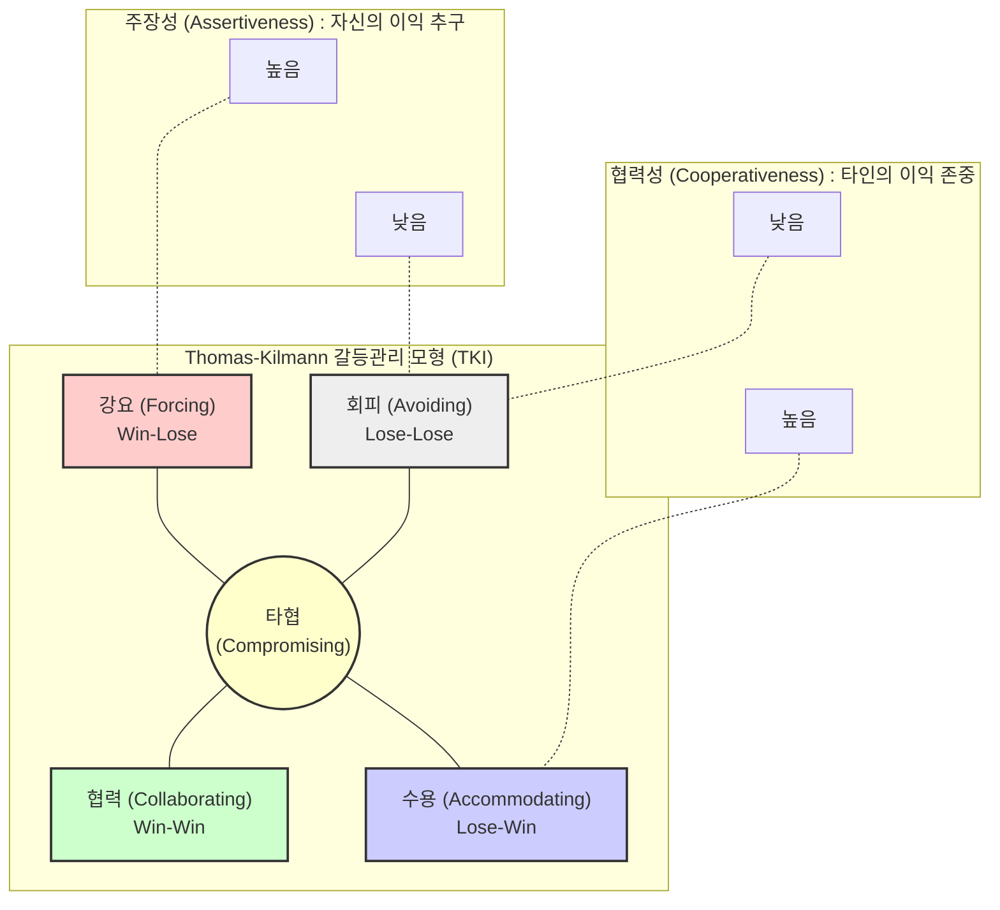

# 갈등관리

## I. 성공적인 프로젝트 완수를 위한, 갈등관리의 개요

- 정의: 프로젝트 수행 중 이해관계자 간 발생하는 목표, 자원, 의견의 불일치(Conflict)를 식별하고, 조직의 목표 달성과 팀 성과 향상에 유리한 방향으로 조율 및 해소하는 일련의 관리 활동
- 특징 및 원인:
    - 원인: 희소 자원의 경합, 일정 압박, 역할/책임의 모호성, 기술적 이견, 개인적 성향 차이
    - 양면성: 방치 시 프로젝트 실패를 초래하는 파괴적 갈등(Destructive)과, 적절히 통제 시 혁신과 대안을 창출하는 건설적 갈등(Constructive)의 양면성을 지님
- 최신 동향: [[PMBOK 7판 (Project Management Body of Knowledge 7th Ed.)|PMBOK 7판]] 및 애자일([[Agile]]) 환경에서는 갈등을 부정적 요소가 아닌 '자연스러운 현상'으로 인식하며, 감성지능(EI)을 활용한 팀 주도의 문제 해결을 강조함
---
## II. 갈등관리 모델 및 핵심 해결 기법

### 가. 갈등관리 개념도 (Thomas-Kilmann 5대 해결 모형)

- 주장성(자신 이익)과 협력성(타인 이익)의 강도에 따라 5가지 대응 전략으로 분류
    
      
    
- 상황적합성 이론에 따라 특정 기법이 절대적으로 우수하지 않으며, 상황(시간, 중요도, 관계)에 맞는 기법 선택이 핵심
    
      
    

### 나. 갈등관리 핵심 해결 기법 및 특징

|구분 (기법명)|영문명 / 승패 구조|핵심 특징 및 적용 상황|
|---|---|---|
|강요/경쟁|Forcing (Win-Lose)|권력, 직위를 사용하여 자신의 의견을 관철시키는 방식- 적용: 긴급한 위기 상황, 인기 없는 결정의 신속한 집행 시|
|협력/문제해결|Collaborating (Win-Win)|양측의 의견을 종합하여 근본 원인을 제거하고 최선의 대안 도출- 적용: 양측의 목표가 모두 중요하여 타협할 수 없는 경우|
|회피/철회|Avoiding (Lose-Lose)|갈등 상황에서 물러나거나 문제를 연기하여 직접적 대립을 피함- 적용: 사안이 사소하거나, 정보 수집 및 냉각기가 필요한 경우|
|수용/원만|Accommodating (Lose-Win)|자신의 의견을 굽히고 타인의 요구를 수용하여 관계를 유지함- 적용: 자신이 틀렸음을 알거나, 장기적인 관계 유지가 중요할 때|
|타협|Compromising (양보)|양측이 일정 부분씩 양보하여 상호 수용 가능한 결론에 도달- 적용: 양측 권력이 동등하고, 기한 내 잠정적 합의가 필요할 때|

## III. 갈등관리 방식의 패러다임 변화 및 대응 전략

### 가. 전통적 환경과 애자일(Agile) 환경의 갈등관리 비교

|비교 항목|전통적 프로젝트 환경 (Waterfall)|애자일 프로젝트 환경 (Agile)|
|---|---|---|
|갈등에 대한 인식|부정적 요소, 최소화 및 제거 대상|혁신의 원동력, 자연스러운 현상 (건설적 갈등)|
|해결의 주체|프로젝트 관리자(PM) 중심의 중재 및 지시|자가조직화 팀(Self-Organizing Team) 주도의 자율 해결|
|해결 기법/[[프로세스]]|규정, 에스컬레이션(Escalation), 공식적 절차|일일 스탠드업(Daily Stand-up), 회고(Retrospective)|
|리더의 역할|통제자 (Controller), 권한 기반의 문제 해결|서번트 리더 (Servant Leader), 문제 해결을 위한 환경 조성/촉진|

- 향후 전망 및 전략:
    - 현대 IT 프로젝트는 복잡성 증가로 인해 팀 내 갈등이 필연적이므로, PM은 감성지능(Emotional Intelligence) 과 적극적 경청(Active Listening) 역량을 내재화해야 함
    - 리모트(Remote) 근무 환경 확산에 따라 Jira, Confluence 등 협업 도구를 활용한 데이터 기반(Data-driven) 의사결정을 통해 감정적 대립을 최소화하고 투명성을 확보하는 전략이 요구됨

---

### 🔗 연관 토픽

- **소속 도메인**: [[00_프로젝트관리_MOC|📋 프로젝트관리]]
- **세부 분류**: `1. PMBOK 표준 & 프로젝트 거버넌스`
- **핵심 연관 토픽**:
  - [[PMBOK 7판 (Project Management Body of Knowledge 7th Ed.)]]
  - [[Agile]]
  - [[PMBOK 프로세스 그룹 (5단계)]]
  - [[PMO|(E)PMO]]
  - [[애자일 선언문]]
