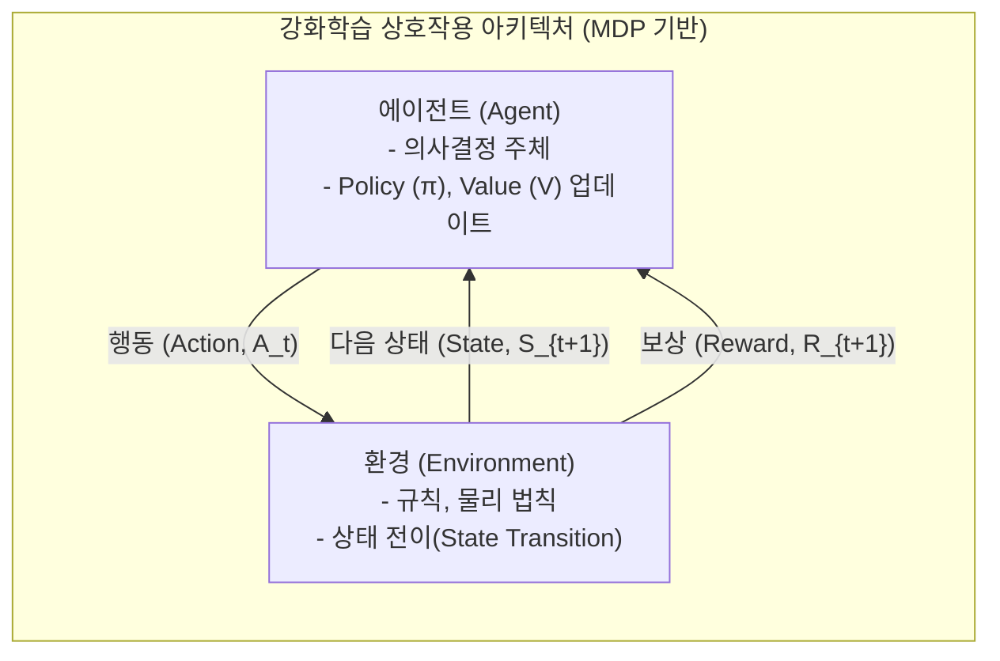

# 강화학습 (Reinforcement Learning)

## I. 인공일반지능(AGI)과 자율형 시스템의 핵심 기반, 강화학습의 개요

- **정의**: 에이전트(Agent)가 주어진 환경(Environment)과 상호작용하며, 시행착오(Trial and Error)를 통해 누적 보상(Reward)을 최대화하는 최적의 행동 정책(Policy)을 학습하는 기계학습 기법
- **필요성 및 등장배경**: 정답 레이블(Label) 확보가 어려운 동적 환경에서의 최적화 문제 해결 필요, 알파고(AlphaGo) 이후 [[Smart Car(자율주행)|자율주행]] 및 로보틱스 제어 기술의 고도화 요구
- **특징**: MDP(Markov Decision Process) 기반 수학적 모델링, 탐험(Exploration)과 활용(Exploitation)의 딜레마, 지연된 보상(Delayed Reward) 처리 체계

	---
## II. 강화학습의 아키텍처 및 핵심 기술 요소
### 가. 강화학습의 개념도 및 동작 원리

- 에이전트가 현재 상태($S_t$)에서 특정 행동($A_t$)을 수행하면, 환경은 상태를 갱신($S_{t+1}$)하고 스칼라 형태의 보상($R_{t+1}$)을 에이전트에게 반환하여 정책을 최적화함
### 나. 강화학습의 핵심 기술 요소

|**분류**|**요소기술(키워드)**|**세부 설명**|
|---|---|---|
|**이론 기반**|MDP (Markov Decision Process)|의사결정 과정을 상태(S), 행동(A), 전이확률(P), 보상(R), 할인율(γ)로 수학적 모델링|
|**학습 모델**|Policy ($\pi$)|특정 상태(State)에서 에이전트가 취해야 할 행동(Action)의 확률 분포 또는 매핑 함수|
|**학습 모델**|Value / Q-Function|특정 상태(V) 또는 상태-행동 쌍(Q)에서 미래에 얻을 수 있는 기대 누적 보상값|
|**학습 기법**|TD (Temporal Difference)|에피소드 종료 전, 매 타임스텝마다 현재와 다음 상태의 가치 차이를 이용해 학습하는 기법|
|**최적화 기법**|Exploration vs Exploitation|새로운 행동을 시도(탐험)할 것인지, 기 학습된 지식을 이용(활용)할 것인지의 비율 조정 ($\epsilon$-greedy)|
|**[[딥러닝]] 융합**|DQN (Deep Q-Network)|차원의 저주 극복을 위해 Q-Table 대신 심층신경망(DNN)과 경험 리플레이(Experience Replay)를 적용|
|**최신 [[알고리즘]]**|PPO (Proximal Policy Optimization)|정책 업데이트 시 발산을 막기 위해 변화폭을 클리핑(Clipping)하여 학습 안정성을 높인 Actor-Critic 기반 알고리즘|
|**응용 기술**|RLHF (RL from Human Feedback)|인간의 선호도 피드백을 보상 모델로 학습시켜 대규모 언어 모델([[초거대 언어 모델|LLM]])의 출력 품질과 윤리성을 미세조정(Alignment)|

---
## III. 기계학습 패러다임 비교 및 강화학습의 향후 전망

### 가. 기계학습 패러다임 3요소 비교 (지도학습 vs 비지도학습 vs 강화학습)

|**비교 항목**|**[[지도학습]] (Supervised Learning)**|**비지도학습 (Unsupervised Learning)**|**강화학습 (Reinforcement Learning)**|
|---|---|---|---|
|**학습 목적**|정답(Label)에 대한 예측 및 분류|데이터 내 숨겨진 패턴/구조 발견|환경 내에서의 **최적 행동 정책(Policy) 학습**|
|**데이터 형태**|입력 데이터 + 정답 (Labeled Data)|입력 데이터 (Unlabeled Data)|**상태(S), 행동(A), 보상(R)** (시계열 상호작용)|
|**피드백 방식**|모델 출력과 정답 간의 오차 (즉각적)|피드백 없음 (알고리즘 자체 군집 기준)|환경으로부터 주어지는 **지연된 스칼라 보상**|
|**주요 알고리즘**|[[CNN]], [[RNN (Recurrent Neural Network)|RNN]], [[서포트 벡터 머신|SVM]], Transformer|K-Means Clustering, [[PCA(Principal Component Analysis)|PCA]], [[GAN (Generative Adversarial Network)|GAN]]|Q-Learning, DQN, DDPG, **PPO**|
|**주요 활용 분야**|이미지 인식, 텍스트 번역, 시계열 예측|고객 세분화, 이상 탐지(FDS), [[차원 축소]]|자율주행, 로보틱스, **LLM 미세조정(RLHF)**|
### 나. 강화학습의 최신 동향 및 향후 전망
- **오프라인 강화학습(Offline RL)**: 환경과의 실시간 상호작용 없이 기존에 수집된 정적 데이터셋만으로 정책을 학습하여 물리적 로봇/자율주행의 안전성 문제 해결
- **초거대 AI와의 결합(RLHF/RLAIF)**: 인간의 피드백(RLHF)을 넘어 AI가 AI를 평가하는 RLAIF(Reinforcement Learning from AI Feedback)로 진화하며 확장성 한계 극복
- **다중 에이전트 강화학습(MARL)**: 스마트 팩토리, 군집 [[드론]] 제어 등 여러 에이전트가 협력 및 경쟁하는 복잡계 시스템 최적화 기술로 발전 중

---
# 강화학습

---

상과 벌이라는 보상을 주며 상을 최대화하고 벌을 최소화하도록 학습하는 방식이며, 알파고가 이 방법으로 학습되었으며 주로 게임에서 최적의 동작을 찾는데 사용하는 학습 방식, 아이가 시행착오를 거쳐 걷는 것을 배우는 것과 같은 학습 방법이라 할 수 있음[^1]

---
[^1]: 쉽게 활용하는 [[인공지능]] 비즈니스

## 활용 및 발전방향

- **실무 적용**: 강화학습 개념을 실제 프로젝트나 업무 상황에 직접 적용해 이해를 심화한다.
- **연관 개념 학습**: 관련 노트와 연결하여 맥락을 넓히고 응용 범위를 확장한다.
- **비교 분석**: 유사한 방법론·도구와 비교하며 장단점을 파악한다.
- **참고 자료 탐색**: 공식 문서나 전문 서적을 통해 더 깊은 이해를 추구한다.
- **사례 수집**: 실제 사례를 꾸준히 수집하여 이 노트를 발전시킨다.

---

### 🔗 연관 토픽

- **소속 도메인**: [[00_인공지능_MOC|🤖 인공지능]]
- **세부 분류**: `2. 머신러닝 기초 & 핵심 알고리즘`
- **핵심 연관 토픽**:
  - [[지도학습]]
  - [[인공지능]]
  - [[초거대 언어 모델|초거대 언어 모델(Large Language Model)]]
  - [[Smart Car(자율주행)]]
  - [[Q러닝]]
