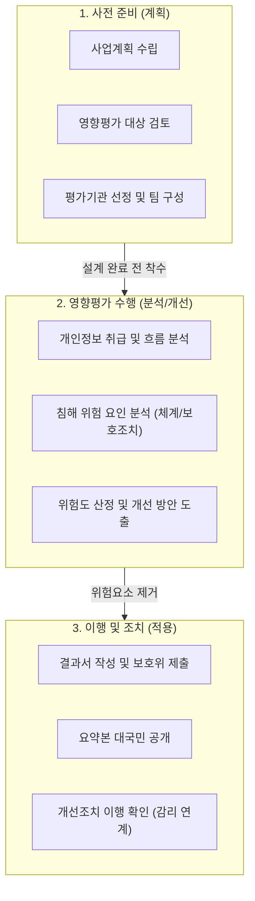

# 개인정보 영향평가 (PIA)

## I. 개인정보 침해 선제적 예방, 개인정보 영향평가의 개요

- **정의**: 공공기관 등이 개인정보처리시스템을 신규 구축하거나 중대한 변경 시, 발생할 수 있는 개인정보 침해 위험 요인을 사전에 분석하고 개선 방안을 도출하는 평가 제도
- **필요성 및 등장배경**: [[개인정보보호 중심 설계|Privacy by Design]] 기반 시스템 설계 단계의 개인정보보호 내재화, 정보주체 권리 보장 강화, 자동화된 의사결정 및 AI 시스템 도입 확산에 따른 신규 프라이버시 [[위험 대응]]
- **특징**: 의무 기준(5만/50만/100만) 초과 시 필수 수행(미이행 시 3천만원 이하 과태료), 사전 준비-수행-이행 단계의 체계적 [[프로세스]], 공공기관 중심에서 민간으로의 자율적 확산 유도

## II. 개인정보 영향평가의 수행 체계 및 핵심 평가 요소

### 가. 개인정보 영향평가 수행 절차 및 개념도

- 대상 시스템의 설계 완료 전에 전문 평가기관을 통해 평가를 수행하고, 도출된 개선 방안을 시스템 개발 및 감리 단계에서 필수적으로 이행/검증함

### 나. 개인정보 영향평가의 핵심 평가 기준 및 기술 요소

|분류|요소기술(키워드)|세부 설명|
|---|---|---|
|**의무 대상**|5만 / 50만 / 100만 기준|5만(민감/고유식별 처리), 50만(타 파일 연계), 100만(개인정보파일 구축) 명 이상 시 법적 의무|
|**관리 체계**|관리적/물리적 보호조치|내부관리계획 수립, 개인정보 취급자 접근통제 및 교육, 물리적 출입 통제 구역 설정 점검|
|**데이터 흐름**|수집/보유/이용/파기 통제|개인정보 수집 최소화, 목적 외 이용/제공 방지, 보유기간 경과 시 지체 없는 파기 및 분리 보관|
|**기술 보호**|[[암호화]] 및 로깅 검증|고유식별정보 전송·저장 시 암호화 적용, 가명/익명 처리, 접속 기록(로그) 위변조 방지|
|**정보주체**|권리 보장 체계|동의 획득 방식의 적절성, 정보주체의 열람/정정/삭제/처리정지 요구권 보장 및 절차 마련|
|**신규(AI)**|AI 학습 데이터 적법성|25년 개정 가이드 반영, AI 모델 학습에 사용되는 개인정보의 적법성 및 최소화 여부 점검|
|**신규(AI)**|자동화 결정 투명성|AI 추론 및 자동화된 의사결정의 투명성, 설명 가능성, [[알고리즘]] 편향성 및 재식별 위험 검증|
|**이행 점검**|감리 연계 조치|평가에서 도출된 개선 방안이 실제 시스템 개발 및 감리 과정에 반영되었는지 확인 강화|

## III. 개인정보 영향평가(PIA)와 정보보호 관리체계(ISMS-P) 비교 및 향후 전망

### 가. PIA와 ISMS-P 주요 항목 비교

|비교 항목|개인정보 영향평가 (PIA)|정보보호 및 개인정보보호 관리체계 ([[ISMS-P]])|
|---|---|---|
|**평가 목적**|신규 시스템 도입에 따른 **사전 침해 위험 예방**|조직 전체 정보보호 관리체계의 **지속적 유지/인증**|
|**평가 대상**|특정 개인정보처리시스템 단위 (구축/중대한 변경 시)|조직 전체의 정보/개인정보 처리 인프라 및 서비스|
|**수행 시기**|시스템 **설계 단계** (사전 검토, 1회성 기반)|시스템 운영 중 **정기적** (최초 1회, 사후/갱신 심사)|
|**주요 대상자**|공공기관 (일정 규모 이상 개인정보파일 취급 시)|일정 규모 이상의 민간 기업 ([[ISP (Information Strategy Plan)|ISP]], IDC, 매출액/이용자 기준)|

### 나. 최근 동향 및 향후 고려사항

- **AI 및 자동화 처리 위험 관리 고도화**: 2025년 10월 개정된 수행안내서에 따라, 생성형 AI 및 자동화된 의사결정 알고리즘을 도입하는 사업은 데이터셋 재식별 가능성 및 설명 가능성을 평가 항목에 반드시 포함해야 함
- **투명성 강화 및 [[DevSecOps]] 연계**: 공공기관의 영향평가 요약본 대국민 공개가 의무화되었으며, 실효성 확보를 위해 향후 CI/CD 파이프라인 내 코드 레벨의 프라이버시 점검(Privacy as Code) 도구를 연동하는 자동화된 영향평가 체계로 발전할 전망임

---

### 🔗 연관 토픽

- **소속 도메인**: [[00_보안_MOC|🛡️ 보안]]
- **세부 분류**: `2. 현대 암호학 & 키 관리 · 전자서명`
- **핵심 연관 토픽**:
  - [[개인정보보호 중심 설계|개인정보보호 중심 설계(Privacy by Design)]]
  - [[개인정보 프라이버시 8원칙]]
  - [[ISMS-P]]
  - [[암호화|암호화 (Encryption)]]
  - [[STRIDE]]
