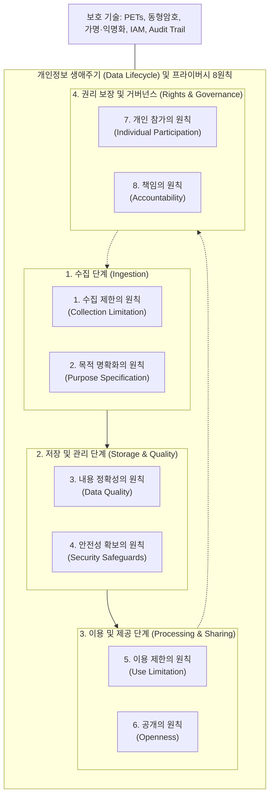

# 개인정보 프라이버시 8원칙

## I. 글로벌 데이터 보호 규범, OECD 개인정보 프라이버시 8원칙의 개요

- **정의**: 개인정보 처리 전주기(수집~파기)에 걸쳐 정보주체의 사생활 보호와 국가 간 데이터의 자유롭고 안전한 유통을 조화시키기 위해 OECD가 정립한 국제 표준 가이드라인
- **등장배경 및 특징**
    - 국경 간 데이터 이동(CBDF, Cross-Border Data Flows) 활성화에 따른 프라이버시 침해 방지 표준 필요
    - 국내 **개인정보 보호법 제3조(개인정보 보호 원칙)** 및 EU GDPR(General Data Protection Regulation)의 핵심 철학적 기틀 제공
    - 수집·처리·관리·권리 구제 전 영역을 포괄하는 실효적 8대 통제 원칙 제시

## II. 개인정보 프라이버시 8원칙의 프레임워크 및 핵심 구성요소

### 가. 개인정보 생애주기 기반 프라이버시 8원칙 개념도

- 개인정보의 수집부터 활용, 파기까지 전 주기에 걸쳐 무단 유출을 통제하고 정보주체의 자기결정권을 통제·보장하는 순환형 거버넌스 체계
### 나. 개인정보 프라이버시 8원칙 세부 기술 요소

|**구분**|**핵심 원칙**|**세부 설명**|
|---|---|---|
|**수집 단계**|수집 제한의 원칙_(Collection Limitation)_|· 적법하고 공정한 수단에 의한 수집 최소화(Data Minimization)· 정보주체의 인지 또는 사전 동의 획득 필수|
|**수집 단계**|목적 명확화의 원칙_(Purpose Specification)_|· 수집 이전 처리 목적 명시 및 목적 범위의 구체화· 목적 변경 시 정보주체의 재동의 및 법적 근거 확보|
|**보유/관리**|내용 정확성의 원칙_(Data Quality)_|· 명시된 이용 목적에 부합하는 데이터 완전성 및 [[신뢰성]] 유지· 개인정보의 최신성(Accuracy), 유효성 유지 및 오류 데이터 정정|
|**보유/관리**|안전성 확보의 원칙_(Security Safeguards)_|· 분실, 도난, 누출, 변조, 훼손 방지를 위한 보호조치 수립· 기술적([[암호화]]/접근통제), 관리적(보안서약), 물리적 보안 체계 적용|
|**활용/제공**|이용 제한의 원칙_(Use Limitation)_|· 명시된 목적 외 이용 및 제3자 무단 제공 원천 금지· 정보주체의 별도 사전 동의 또는 법률상 명확한 규정 시에만 예외 허용|
|**활용/제공**|공개의 원칙_(Openness)_|· 개인정보 처리방침의 상시 투명한 공개· 관리자 신원, 소재지, 데이터 처리 목적 및 보유 기간 공표|
|**권리 보장**|개인 참가의 원칙_(Individual Participation)_|· 정보주체의 자기결정권(열람, 확인, 정정, 삭제 청구권) 보장· 처리 거부권, 전송요구권(MyData) 등 주체적 통제권 행사 수단 제공|
|**거버넌스**|책임의 원칙_(Accountability)_|· 7대 원칙 준수를 보장하기 위한 관리자의 법적·기술적 입증 책임· CPO 지정, 내부관리계획 수립, [[개인정보 영향평가]](PIA) 수행|

## III. 글로벌 규범 간 비교 및 AI 환경에서의 발전 방향

### 가. OECD 8원칙 vs EU GDPR vs 국내 개인정보 보호법 비교

|**비교 항목**|**OECD 프라이버시 8원칙**|**EU GDPR**|**대한민국 개인정보 보호법**|
|---|---|---|---|
|**법적 성격**|권고적 가이드라인 (Soft Law)|직접 적용 법률 (강제적 과징금)|법률 및 처벌 규정 (강행 법률)|
|**핵심 권리**|열람, 정정, 삭제 요구권|잊힐 권리(삭제), 이동권, 처리 제한권|열람·정정·삭제·처리정지, 전송요구권|
|**책임성 확보**|원칙 준수 노력 및 체계 구축|PbD(설계 기반 프라이버시), DPIA 의무화|보호책임자(CPO), 영향평가(PIA), [[ISMS-P]]|
|**국외 이전**|규제 완화 및 조화 중심|적정성 결정(Adequacy Decision), SCC|국외 이전 제한, 안전성 확보 및 동의|

- 생성형 AI 및 빅데이터 환경 확산에 따라 합성데이터(Synthetic Data), [[차분 프라이버시]](Differential Privacy), 영지식 증명([[영지식증명|ZKP]]) 등 프라이버시 강화 기술(PETs)을 결합하여 책임성(Accountability)과 설계 기반 프라이버시([[개인정보보호 중심 설계|Privacy by Design]]) 체계 고도화 필요

---

### 🔗 연관 토픽

- **소속 도메인**: [[00_보안_MOC|🛡️ 보안]]
- **세부 분류**: `2. 현대 암호학 & 키 관리 · 전자서명`
- **핵심 연관 토픽**:
  - [[개인정보보호 중심 설계|개인정보보호 중심 설계(Privacy by Design)]]
  - [[개인정보 영향평가|개인정보 영향평가(Privacy Impact Assessment)]]
  - [[영지식증명|영지식증명(Zero Knowledge Proof)]]
  - [[암호화|암호화 (Encryption)]]
  - [[ISMS-P]]
