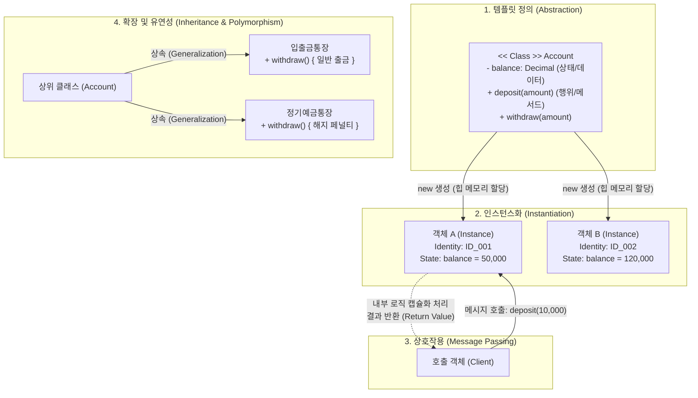

# 객체지향 (Object-Orientation)
## I. 현실 세계 모델링 기반의 SW 개발 패러다임, 객체지향의 개요
- 정의: 현실 세계의 업무 및 개체(Entity)를 속성(State)과 행위(Behavior)가 결합된 독립적인 객체(Object)로 모델링하고, 객체 간 메시지 교환(Message Passing)을 통해 시스템을 구성하는 소프트웨어 개발 패러다임
- 등장배경: 대규모 시스템의 복잡도 증가에 따른 소프트웨어 위기(Software Crisis) 극복, 절차지향 프로그래밍의 유지보수성 및 코드 재사용성 한계 개선, 요구사항 변경에 유연한 확장성 확보  
- 핵심특징: 실세계 개념과 소프트웨어 간 의미적 간극(Semantic Gap) 최소화, 캡슐화를 통한 정보은닉, 상속과 다형성을 통한 재사용성 극대화
## II. 객체지향의 개념도 및 핵심 기술 요소
### 가. 객체지향의 개념도 및 동작 원리

- [[클래스]] 기반으로 메모리상에 독립된 상태를 지닌 인스턴스를 생성하고, 외부 공개 인터페이스를 통한 메시지 송수신으로 연산 수행 및 상태 은닉 보호
### 나. 객체지향의 핵심 기술 및 구성 요소
|구분|요소기술 (키워드)|세부 설명|
|---|---|---|
|구성 요소|클래스 (Class)|· 객체를 생성하기 위한 틀이자 추상 데이터 타입(ADT)· 속성(필드/변수)과 행위(메서드/함수)의 명세 정의 구조|
|구성 요소|객체 / [[인스턴스]] (Object)|· 클래스를 기반으로 힙(Heap) 메모리에 실체화된 데이터 인스턴스· 고유의 식별성(Identity)과 라이프사이클을 보유한 실행 주체|
|구성 요소|메시지 (Message)|· 객체 간 협력 및 행위 유발을 위한 유일한 의사소통 수단· 수신 객체, 메서드 식별자, 인자(Arguments)로 구성된 호출 규약|
|핵심 특징|[[캡슐화]] (Encapsulation)|· 데이터와 이를 처리하는 메서드를 하나의 단위로 결합· 높은 [[응집도]](High Cohesion) 달성 및 [[결합도]](Low Coupling) 완화|
|핵심 특징|[[정보은닉|정보은닉 (Information Hiding)]]|· 접근 제어자(private, protected, public)를 통한 내부 상태 은폐· 객체 내부 구현 변경 시 외부 인터페이스에 미치는 파급 효과 차단|
|핵심 특징|[[상속성|상속성 (Inheritance)]]|· 상위 클래스의 속성과 메서드를 하위 클래스가 [[재사용]] 및 확장· [[일반화]](Generalization)와 [[특수화]](Specialization) 관계 정립 (IS-A)|
|핵심 특징|[[다형성|다형성 (Polymorphism)]]|· 동일한 메시지 호출에 대해 객체마다 상이하게 동작하는 특성· 오버로딩(정적 바인딩), 오버라이딩 및 인터페이스(동적 바인딩)로 구현|
|핵심 특징|[[추상화|추상화 (Abstraction)]]|· 복잡한 실세계 개체의 본질적 특성만을 추출하여 모델링· 제어 추상화, 데이터 추상화 및 추상 클래스/인터페이스 설계|
|설계 원칙|SOLID 원칙|· 객체지향 5대 설계 원칙: SRP, OCP, LSP, [[ISP (Information Strategy Plan)|ISP]], DIP· 소프트웨어의 변경 유연성, 유지보수성, 테스트 용이성 보장 체계|
## III. 절차지향 vs 객체지향 비교 및 현대적 발전 동향
### 가. 절차지향(POP) vs 객체지향(OOP) 비교
|비교 항목|절차지향 프로그래밍 (POP)|객체지향 프로그래밍 (OOP)|
|---|---|---|
|패러다임 중심|[[알고리즘]], 함수(순차적 실행 흐름) 중심|데이터와 행위가 결합된 객체(상호 협력) 중심|
|데이터 접근성|전역/공용 데이터 직접 접근 (사이드 이펙트 위험)|캡슐화 및 정보은닉을 통한 제어된 인터페이스 접근|
|재사용성/확장성|코드 복사/수정에 의존, [[유지보수]] 복잡도 높음|상속, 다형성, 컴포지션 기반 높은 재사용성 및 확장성|
|모델링 방식|하향식(Top-Down) 기능 분해 기법|상향식(Bottom-Up) 객체 도메인 모델링 기법|
|초기 설계 비용|단순하고 빠름, 직관적 구현 가능|객체 관계 설계 및 추상화로 인한 높은 초기 비용|
|대표 언어|C, Pascal, Fortran|Java, C++, Kotlin, C#|
### 나. 현대 소프트웨어 아키텍처 관점의 발전 동향
- 도메인 주도 설계([[DDD (Domain Driven Design)|DDD]])와의 연계: 객체지향의 풍부한 도메인 모델(Rich Domain Model)을 바탕으로 엔터티(Entity), 값 객체(VO), 애그리게잇(Aggregate)을 도출하여 마이크로서비스([[MSA (Micro Service Architecture)|MSA]])의 서비스 경계(Bounded Context) 수립에 핵심 기여
- 함수형 프로그래밍(FP)과의 하이브리드 결합: 객체 내부 상태 변경(State Mutation)의 부작용을 억제하기 위해 불변 객체(Immutable Object), 레코드(Record) 패턴 및 스트림(Stream/Lambda) API를 수용한 멀티 패러다임 언어 진화 확산
OOP
    - Object-Oriented Programming
    - Object Oriented Programming
- 프로그램을 '객체'라는 기본 단위를 나누고 이 객체들의 상호작용으로 서술하는 프로그램 설계 방법
- 구성요소
    - 클래스
            - class
        - 데이터 추상화 단계
        - 공통된 특성
        - 속성은 변수 행위는 메서드
    - 객체
            - Object
        - 행위 공유 = 메모리 모듈
        - 객체들간의 상태와 식별성
    - 메서드
            - Method
        - 객체 사용법 메시지로 인한 구성
    - 메시지
            - Message
        - 객체간 상호작용
    - 인스턴스
            - Instance
        - 클래스에 속한 객체, 실제 메모리에 할당
    - 속성
            - Property
        - 데이터 값들은 단위별로 정리 성질, 분류, 식별, 수량, 현재상태
- 기법
    - 캡슐화
    - 상속성
    - 다형성
    - 추상화
    - [[정보은닉]]
    - [[관계성]]

---

### 🔗 연관 토픽

- **소속 도메인**: [[00_소프트웨어공학_MOC|🏗️ 소프트웨어공학]]
- **세부 분류**: `3. 요구사항 공학 & UML 객체지향 분석/설계`
- **핵심 연관 토픽**:
  - [[클래스]]
  - [[추상화|추상화 (Abstraction)]]
  - [[캡슐화|캡슐화 (encapsulation)]]
  - [[결합도]]
  - [[다형성|다형성 (Polymorphism)]]
