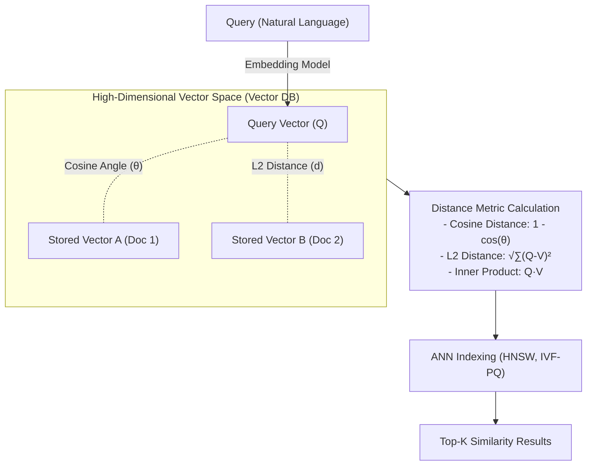

# 거리 공식 (Distance Metric)
## I. 다차원 데이터 유사도 측정 척도, 거리 공식의 개요
- 정의: 다차원 벡터 공간(Vector Space) 상에 존재하는 두 개체(데이터 포인트, 벡터) 간의 유사성(Similarity) 또는 상이성(Dissimilarity)을 정량적 수치로 산출하는 수학적 함수 및 척도
- 등장배경: 고차원 비정형 데이터(텍스트, 이미지)의 임베딩 활용 증가, 기계학습(KNN, K-Means) 및 [[초거대 언어 모델|LLM]]/RAG 환경의 의미론적 검색(Semantic Search)을 위한 정확한 [[유사도]] 측정 필요성 대두
- 특징: 거리 공간 4대 공리(비음성, 동일성, 대칭성, 삼각 부등식) 준수, AI 모델 목적(분류, 군집화, 벡터 검색)에 맞춘 이종 수학적 척도 선택 적용

## II. 거리 공식의 핵심 아키텍처 및 세부 기술 요소
### 가. 벡터 검색(Vector Search)을 위한 거리 공식 동작 원리
코드 스니펫

- LLM 기반의 질의 임베딩 벡터와 Vector DB 내부에 저장된 대상 벡터들 간의 공간적 거리 및 사잇각을 수학적으로 산출
- HNSW(Hierarchical Navigable Small World) 등 ANN 알고리즘과 거리 공식을 결합하여 밀리초(ms) 단위의 고속 Top-K 근접 문맥 추출 수행
### 나. 거리 공식의 핵심 구성 요소 (기술 및 산출식)
| 분류      | 요소기술(척도)     | 세부 설명 및 특징                                                                                                                         |
| ----------- | ---------------- | -------------------------------------------------------------------------------------------------------------------------------------- |
| 기하학적 거리 | 유클리드 거리 (L2)     | - 두 벡터 간 최단 직선 거리 산출 ($d = \sqrt{\sum (A_i - B_i)^2}$) - 연속형 데이터 구조 파악, K-Means 군집화, 이미지 픽셀 분류에 활용                                  |
| 기하학적 거리 | 맨해튼 거리 (L1)      | - 격자 경로를 따라 이동한 절대값 거리의 총합 ($d = \sum \Vert{}A_i - B_i\Vert{}$) - 고차원 데이터 환경에서 [[이상치]](Outlier)에 의한 데이터 왜곡 현상 완화                        |
| 기하학적 거리 | 민코프스키 거리         | - L1, L2 거리 등을 Norm 차수(p값)에 따라 [[일반화]] 및 가변 적용하는 통합 척도                                                                                     |
| 기하학적 거리 | 체비셰프 거리          | - 다차원 벡터 공간의 각 차원별 값 차이(절대값) 중 가장 큰 최댓값 (체스보드 거리)                                                                                      |
| 의미적 유사도 | 코사인 유사도          | - 두 벡터의 사잇각(θ)을 기반으로 방향성 측정 ($sim = \frac{A \cdot B}{\Vert{}A\Vert{} \Vert{}B\Vert{}}$) - 벡터의 크기(단어 출현 빈도 등)에 무관하여 NLP, 텍스트 임베딩에 특화 |
| 의미적 유사도 | 내적 (Dot Product) | - 두 벡터의 크기와 방향을 동시에 고려하는 곱셈 연산 합 ($A \cdot B$) - 데이터 정규화(Normalized) 상태에서 코사인 연산과 순위가 동일하며 연산 속도 빠름                                 |
| 통계적 거리  | 마할라노비스 거리        | - 단순 거리가 아닌 데이터의 공분산 행렬을 고려하여 변수 간 상관관계와 확률 분포 반영                                                                                      |
| 범주형 거리  | 해밍 거리 (Hamming)  | - 길이가 동일한 두 이진(Binary) 문자열 데이터에서 서로 다른 값을 가진 요소의 이격 개수                                                                                 |
## III. 거리 공식 비교 및 LLM/RAG 환경의 최신 동향
### 가. 기하학적 거리(L2)와 의미적 유사도(Cosine) 비교
|비교 항목|유클리디안 거리 (L2 Norm)|코사인 유사도 (Cosine Similarity)|
|---|---|---|
|측정 초점|두 데이터 포인트 간의 기하학적 크기(Magnitude/Distance)|두 데이터 벡터 간의 의미적 방향(Angle/Direction)|
|크기 민감도|매우 민감 (문서 길이가 길수록 거리가 멀어짐)|둔감 (벡터의 크기에 무관하게 의미 방향성 유지)|
|차원 한계|다차원으로 갈수록 외곽으로 밀집하는 차원의 저주에 취약|차원의 저주를 부분 극복하며 텍스트 의미 뉘앙스 보존|
|주요 활용 분야|머신러닝 회귀/분류, LBS 좌표, 이미지 유사도 측정|LLM RAG 기반 문서 검색, 사용자 기반 협업 필터링(추천)|
### 나. 벡터 데이터베이스(Vector DB) 관점의 최신 기술 적용 동향
- 내적(Inner Product) 기반 연산 고속화: OpenAI(ada-002 등)의 최신 텍스트 임베딩 모델 산출물은 기본적으로 L2 정규화(Normalization)가 적용됨. 따라서, 복잡한 나눗셈과 제곱근 연산이 필요한 코사인/유클리드 유사도 대신 시스템 연산량이 가장 적은 내적(Dot Product)을 척도로 활용하여 쿼리 지연시간(Latency)을 최소화하는 추세.
- 다차원 인덱싱의 진화: 1024차원 이상의 초고차원 벡터 거리 계산 시 발생하는 컴퓨팅 병목 현상을 극복하기 위해, 완전 탐색(Exact Search, KNN) 대신 그래프 기반 ANN(HNSW) 인덱싱 및 양자화(Product Quantization) 기법을 거리 공식과 결합하여 시스템 리소스 효율성과 정확도(Recall)를 최적화.

---

### 🔗 연관 토픽

- **소속 도메인**: [[00_인공지능_MOC|🤖 인공지능]]
- **세부 분류**: `1. 수학 · 통계학 & 데이터 전처리`
- **핵심 연관 토픽**:
  - [[유사도|유사도(Similarity)]]
  - [[이상치]]
  - [[거리함수]]
  - [[상관 관계 분석|상관 관계 분석 (Correlation Analysis)]]
  - [[초거대 언어 모델|초거대 언어 모델(Large Language Model)]]
